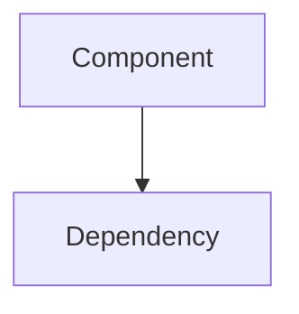

# CLAUDE.md

This file provides guidance to Claude Code (claude.ai/code) when working with code in this repository.

## Project Overview

This is an Obsidian vault for programming, coding, and architecture knowledge. It contains markdown-based notes using Obsidian conventions.

**Communication preference:** Keep responses concise.

## Obsidian Conventions

### Wiki Links
- Internal links use double brackets: `[[Note Name]]`
- Links can include aliases: `[[Note Name|Display Text]]`
- Links can point to headings: `[[Note Name#Heading]]`
- Links can point to blocks: `[[Note Name#^block-id]]`

### Tags
- Tags use hash syntax: `#tag` or `#nested/tag`
- Tags can appear inline or in frontmatter

### Frontmatter
Notes may include YAML frontmatter for metadata:
```yaml
---
tags: [programming, architecture]
created: 2026-02-14
---
```

### File Organization
- Notes are markdown files (`.md`)
- Obsidian supports nested folders for organization
- Links work regardless of file location (use `[[filename]]` not paths)

## Working with This Vault

### Using the Obsidian CLI

**Prefer the Obsidian CLI (`obsidian:obsidian-cli` skill) over filesystem operations for vault-wide tasks.**

The CLI uses Obsidian's pre-built indexes and is dramatically more efficient:
- **54× faster** for orphan detection (15.6s → 0.26s)
- **6× faster** for vault search (1.95s → 0.32s)
- **70,000× cheaper** in tokens (7M → 100 tokens)

**Use CLI for:**
- Searching vault content across multiple files
- Finding orphaned notes
- Querying tags, properties, and backlinks
- Vault statistics and analysis
- Finding notes by tag combinations
- Detecting broken links

**Use filesystem tools (Read/Write/Edit) for:**
- Reading specific file contents
- Editing individual files
- Creating new files
- Working with file content once identified

### Creating Notes
- Use descriptive, specific titles
- Link related concepts together
- Add relevant tags for discoverability
- Include examples and code snippets in markdown code blocks

### Linking Strategy
- Create bidirectional links between related concepts
- Link to specific sections when referencing detailed topics
- Build up concept hierarchies with parent/child relationships

### Code Snippets
Use triple backticks with language identifiers:
````markdown
```python
def example():
    pass
```
````

### Diagrams
Obsidian supports Mermaid diagrams:
````markdown

````

### Skills Plugin
This vault uses the [Obsidian Skills](https://github.com/kepano/obsidian-skills) plugin for skill tracking and progression.

## Structure

- **Topic files** (root level): Organized by subject (e.g., `design-patterns.md`, `algorithms.md`, `databases.md`, `taskmaster.md`). Use lowercase filenames with hyphens for persistent, reference-style technical knowledge.
- **examples/**: Code examples and sample implementations.
- **diagrams/**: Architecture diagrams and visual references.
- **tools/**: Scripts for analysis, code generation, or automation.

## Knowledge Routing

When creating or adding content, route it to exactly one place:

- **Existing topic file?** Add to that file (e.g., `rust-concurrency.md`, `design-patterns.md`)
- **New concept that will grow?** Create new topic file with proper naming (lowercase-with-hyphens)
- **Example/code snippet?** Goes in `examples/` directory
- **Tool/script?** Goes in `tools/` directory
- **Unsure or one-off note?** Create in root, let it prove it deserves structure

**If you find duplicate content, consolidate immediately.**

## Naming Conventions

### Topic Files
- Use lowercase with hyphens: `design-patterns.md`, `data-structures.md`, `taskmaster.md`
- Keep names concise but descriptive
- Focus on the concept/topic, not the date
- Use folders to organize related topics when needed

## Creating Notes - Required Elements

When creating or editing notes in this vault, ALWAYS include:

### 1. Frontmatter with Tags and Properties

Every note should start with YAML frontmatter:

```yaml
---
tags: [category1, category2, category3]
created: YYYY-MM-DD
difficulty: beginner|intermediate|advanced
status: draft|complete|needs-review
---
```

**Tag categories to use (2-5 tags per note):**
- **Language**: `rust`, `python`, `typescript`, `go`, etc.
- **Domain**: `architecture`, `algorithms`, `databases`, `networking`, `concurrency`, etc.
- **Type**: `pattern`, `concept`, `example`, `tool`, `best-practice`, etc.

**Property fields:**
- `created`: Date note was created (YYYY-MM-DD format)
- `difficulty`: Complexity level
- `status`: Current state of the note
- `topic`: High-level topic area (optional)

### 2. Links to Related Concepts

Create links to related notes when appropriate:

**Do link when:**
- Referencing a prerequisite concept: `Requires understanding of [[Ownership]]`
- Pointing to related topics: `See also [[Event Loop]]`, `[[Async Runtime]]`
- Referencing implementations: `Example: [[Thread Pool Implementation]]`
- Building on previous concepts: `Extends [[Basic Traits]]`

**Don't link when:**
- The target note doesn't exist yet (avoid empty links)
- The relationship is too vague or distant
- Over-linking makes text hard to read

### 3. Well-Structured Content

- **Clear heading hierarchy**: Use ## for main sections, ### for subsections
- **Code examples**: Use triple backticks with language identifiers
- **Concrete examples**: Include practical code snippets and use cases
- **Diagrams when useful**: Use Mermaid for architecture/flow diagrams

## Vault Maintenance

When adding or editing content:

- **Merge duplicates immediately** - Don't let duplicate content accumulate across files
- **Move misplaced content** - If something belongs in a different file, move it right away
- **Split large files** - If a topic file exceeds ~500 lines, consider splitting into sub-topics
- **Compress, move, or promote** - Never just delete knowledge; reorganize it to a better location

The vault should get denser and more organized over time, not messier.

## Example Well-Formed Note

```markdown
---
tags: [rust, concurrency, async]
created: 2026-02-14
difficulty: intermediate
status: complete
---

# Async/Await in Rust

Brief description of the concept.

## Prerequisites

Requires understanding of [[Ownership]] and [[Lifetimes]].

## Core Concepts

Explanation with examples...

## Related Topics

- [[Tokio Runtime]]
- [[Future Trait]]
- [[async-std]]

## References

- External links and sources
```

## Benefits of This Approach

This structure enables:
- **Tag-based filtering**: Find all `rust` + `concurrency` notes
- **Difficulty queries**: List all `beginner` topics for learning paths
- **Relationship discovery**: Navigate concept dependencies via links
- **Status tracking**: Find incomplete notes needing work
- **Graph visualization**: See knowledge network in Obsidian graph view

## Working with Claude

**Write learnings immediately when they happen, not at end of session.**

Every insight, example, or pattern gets captured right away. If correcting a mistake, add the lesson to the relevant topic file immediately. One crash or context compaction can lose uncaptured knowledge.

**Optional:** Consider creating a `current-focus.md` file to track active learning topics and what needs review, providing continuity between sessions.
