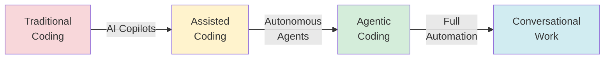

# Agentic Coding

Documentation, patterns, and tools for AI-assisted software development where autonomous agents handle implementation while humans focus on objectives and orchestration.

## Overview

Agentic coding represents a paradigm shift from traditional software engineering:

**Traditional:** Human writes code → Tests → Ships
**Agentic:** Human defines objectives → Agent implements → Human validates outcomes

## Core Concepts

### Patterns & Anti-Patterns

- [[patterns]] - Best practices for agentic workflows
- [[anti-patterns]] - Common mistakes to avoid
- [[tooling]] - Tools and integrations for agentic development

### Agent Systems

- [[openclaw]] - OpenClaw AI agent deployment and patterns
- [[code-factory]] - Repository architecture for autonomous agents
- [[taskmaster]] - AI-powered task management via MCP
- [[ralph-looping]] - Simple autonomous coding loops

### Workflows & Integration

- [[conversational-work]] - Async agent orchestration paradigm
- [[prd]] - Writing PRDs for AI-coded projects
- [[webmcp]] - Web MCP for browser-based AI agents
- [[obsidian-claude-system]] - Knowledge management with AI agents

## Key Principles

### 1. Spec Outcomes, Not Process
Define what success looks like, not how to achieve it. Agents figure out implementation.

### 2. Review Output, Not Code
Test against objectives. If it works, ship it. Don't read every line.

### 3. Optimize for Time, Not Tokens
Your time is expensive. Compute is cheap. Let agents work.

### 4. Think in Systems
Automate after the second repetition. Build feedback loops.

### 5. Kill Old Ways Immediately
Delete dead code instantly. The codebase is agent context.

## Getting Started

### For Individual Developers

1. **Learn patterns**: Start with [[patterns]] and [[anti-patterns]]
2. **Choose tools**: Explore [[tooling]] for Claude Code, Cursor, etc.
3. **Start simple**: Try [[ralph-looping]] for autonomous task completion
4. **Scale up**: Graduate to [[taskmaster]] for complex projects

### For Teams

1. **Align on objectives**: Use [[prd]] patterns for clear requirements
2. **Set up infrastructure**: Implement [[code-factory]] patterns
3. **Deploy agents**: Use [[openclaw]] for 24/7 autonomous work
4. **Monitor outcomes**: Focus on deliverables, not code reviews

## Philosophy

> "The bottleneck is human decision-making time, not compute cost."

Agentic coding inverts traditional software development priorities:

- **Less time coding** → More time defining objectives
- **Less code review** → More outcome validation
- **Less implementation skill** → More system design thinking
- **Less manual work** → More automation and orchestration

## Evolution of Development

1. **Traditional Coding** - Human writes every line
2. **Assisted Coding** - Copilots suggest completions
3. **Agentic Coding** - Agents implement entire features
4. **Conversational Work** - Async agents work while you sleep

## Common Use Cases

### Development Tasks
- Feature implementation from specs
- Bug fixing with automated debugging
- Refactoring and code modernization
- Test generation and coverage

### Automation Tasks
- CI/CD pipeline implementation
- Documentation generation
- Code review automation
- Deployment orchestration

### Research Tasks
- Codebase exploration and analysis
- Competitive research
- Technology evaluation
- Architecture planning

## Tools Ecosystem

### AI Code Editors
- **Claude Code** - Full-featured agentic coding environment
- **Cursor** - AI-first code editor
- **Windsurf** - Collaborative AI coding
- **Lovable** - Rapid prototyping with AI

### Agent Frameworks
- **OpenClaw** - Autonomous agent platform with skills
- **Taskmaster** - MCP-based task orchestration
- **Ralph Loop** - Simple bash-based agent loops

### Integration Standards
- **MCP (Model Context Protocol)** - Tool and context sharing
- **WebMCP** - Browser-based agent interactions
- **Skills System** - Reusable agent capabilities

## Success Metrics

Traditional metrics don't apply. Track these instead:

- **Time to objective** - How fast from idea to working feature
- **Agent utilization** - Hours of autonomous work per day
- **Outcome quality** - Does it meet success criteria?
- **Iteration speed** - How quickly can you pivot?

**Don't track:**
- Lines of code written
- Commits per day
- Code complexity metrics
- Token usage or cost

## Learning Path

1. **Week 1**: Read [[patterns]] and [[anti-patterns]]
2. **Week 2**: Set up [[ralph-looping]] or [[taskmaster]]
3. **Week 3**: Practice writing outcome-focused specs ([[prd]])
4. **Week 4**: Deploy 24/7 autonomous agents ([[openclaw]])
5. **Month 2+**: Build [[code-factory]] patterns for your team

## Related Topics

- [[../cloudflare]] - Deploying agents on Cloudflare Workers
- [[../obsidian]] - Knowledge management for agent workflows
- [[../github-actions]] - CI/CD for agentic repositories

## References

- [No Coding Before 10am](https://x.com/michaelxbloch/status/2022678437362598163) - Michael Bloch on objective-first development
- [Code Factory Pattern](https://x.com/ryancarson/status/2023468856220807539) - Ryan Carson's autonomous coding architecture
- [The Ralph Wiggum Technique](https://docs.cursor.com/advanced/ralph-loop) - Iterative agent loops
- [OpenClaw Documentation](https://docs.openclaw.ai) - Agent platform docs

---

**Start here:** [[patterns]] → [[anti-patterns]] → [[tooling]]
