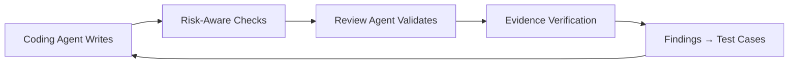
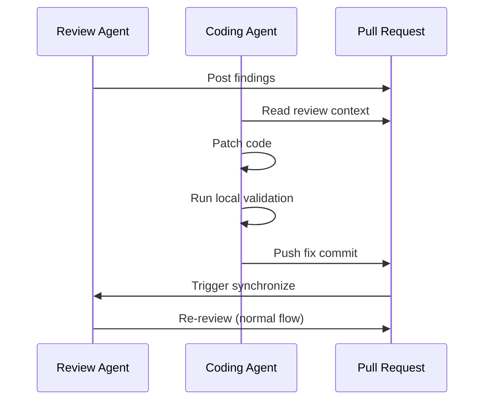
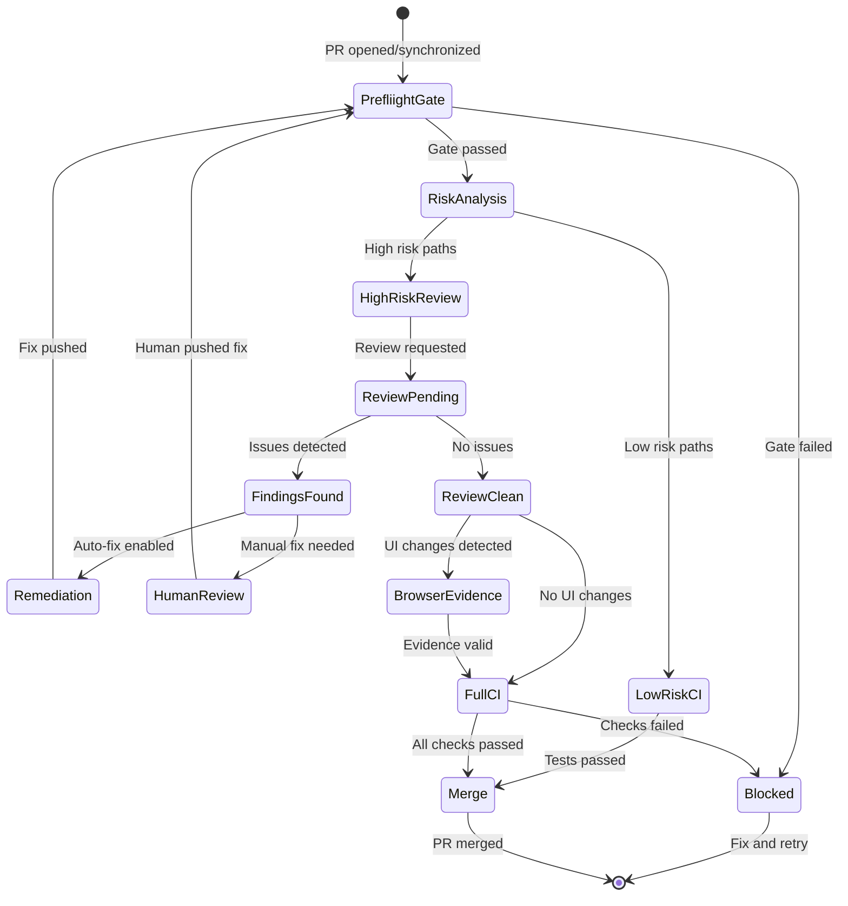

# Code Factory Pattern

Code Factory is a repo setup where AI agents write and review all the code automatically, with strict rules and checks to ensure quality. It's like a factory assembly line, but for software—agents do the work, automated systems verify it, and you just define what needs to be built.

## Core Loop



**Key principle**: Machine-verifiable evidence at every stage, no human bottlenecks.

## 1. Single Machine-Readable Contract

Define risk tiers, merge policies, and required checks in one canonical config file:

```json
{
  "version": "1",
  "riskTierRules": {
    "high": [
      "app/api/legal-chat/**",
      "lib/tools/**",
      "db/schema.ts"
    ],
    "low": ["**"]
  },
  "mergePolicy": {
    "high": {
      "requiredChecks": [
        "risk-policy-gate",
        "harness-smoke",
        "Browser Evidence",
        "CI Pipeline"
      ]
    },
    "low": {
      "requiredChecks": ["risk-policy-gate", "CI Pipeline"]
    }
  }
}
```

**Why it matters**: Eliminates ambiguity and drift between scripts, workflows, and documentation.

## 2. Preflight Gate Pattern

Run cheap, deterministic checks **before** expensive CI:

```typescript
// 1. Compute required checks based on changed files
const requiredChecks = computeRequiredChecks(changedFiles, riskTier);

// 2. Verify docs drift rules
await assertDocsDriftRules(changedFiles);

// 3. Wait for required checks
await assertRequiredChecksSuccessful(requiredChecks);

// 4. If high-risk, wait for review agent
if (needsCodeReviewAgent(changedFiles, riskTier)) {
  await waitForCodeReviewCompletion({ headSha, timeoutMinutes: 20 });
  await assertNoActionableFindingsForHead(headSha);
}
```

**Benefit**: Avoid wasting CI minutes on PRs already blocked by policy.

## 3. Current-Head SHA Discipline

**Critical lesson**: Treat review state as valid ONLY for current PR head commit.

```typescript
// ✅ Correct: tie review to specific SHA
await waitForReviewCheckRun(headSha);
await assertNoActionableFindingsForHead(headSha);

// ❌ Wrong: use stale review from old commit
const lastReview = await getLatestReview(); // might be outdated
```

**Rules**:
- Wait for review check run on `headSha`
- Ignore stale summary comments from older SHAs
- Fail if latest review run is non-success or times out
- Require reruns after each `synchronize`/push
- Clear stale failures by rerunning policy gate on same head

**Why**: Without this, you can merge PRs using stale "clean" evidence.

## 4. Rerun Deduplication

When multiple workflows can trigger reruns, prevent duplicate bot comments:

```typescript
const marker = '<!-- review-agent-auto-rerun -->';
const trigger = `sha:${headSha}`;

// Check if already requested for this SHA
const alreadyRequested = comments.some((c) =>
  c.body.includes(marker) && c.body.includes(trigger),
);

if (!alreadyRequested) {
  postComment(`${marker}\n@review-agent please re-review\n${trigger}`);
}
```

**Pattern**: Single canonical workflow as rerun requester, dedupe by marker + SHA.

## 5. Automated Remediation Loop

If review findings are actionable, let coding agent fix them:



**Guardrails**:
- Pin model + effort level for reproducibility
- Skip stale comments not matching current head
- Never bypass policy gates
- Keep deterministic: same input → same output

## 6. Auto-Resolve Bot-Only Threads

After a clean current-head rerun:

```typescript
// Only resolve threads where ALL comments are from bot
const botOnlyThreads = threads.filter(t =>
  t.comments.every(c => c.author.isBot)
);

if (reviewPassedForCurrentHead) {
  await resolveThreads(botOnlyThreads);
  await rerunPolicyGate(); // reflect new conversation state
}
```

**Never** auto-resolve threads with human participation.

## 7. Browser Evidence as First-Class Proof

For UI/user-flow changes, require machine-verifiable evidence:

```bash
# Capture evidence
npm run harness:ui:capture-browser-evidence

# Verify evidence
npm run harness:ui:verify-browser-evidence
```

**Evidence manifest checks**:
- Required flows exist
- Expected entrypoint was used
- Expected account identity present (for logged-in flows)
- Artifacts are fresh and valid

**Not enough**: Screenshots in PR description (not machine-verifiable).

## 8. Harness-Gap Loop

Convert production incidents into test cases:

```
Production Regression → Harness Gap Issue → Case Added → SLA Tracked
```

**Prevents**: One-off patches that don't improve long-term coverage.

**Example workflow**:
1. Production bug found
2. Create "harness-gap" issue
3. Add test case reproducing the bug
4. Track time-to-harness metric
5. Fix becomes part of regression suite

## 9. Key Lessons from Production

### Deterministic Ordering
Preflight gate MUST complete before CI fanout. Otherwise race conditions.

### SHA Matching is Non-Negotiable
Stale review evidence on old commits is worse than no evidence.

### One Canonical Rerun Writer
Multiple workflows requesting reruns → duplicate comments, confusion.

### Summary Parsing Strictness
Treat vulnerability language and weak-confidence summaries as actionable findings.

### Bot Thread Auto-Resolve Timing
Only after clean current-head evidence, reduces friction without sacrificing rigor.

### Remediation Agent Guardrails
Can shorten loop time significantly IF guardrails stay strict.

## 10. Implementation vs Pattern

### General Pattern (reusable)
- **Code review agent**: Any automated code reviewer
- **Remediation agent**: Any coding agent that fixes findings
- **Risk policy gate**: Deterministic preflight checks
- **Evidence verification**: Machine-readable proof (tests, screenshots, etc.)

### One Concrete Stack (example)
- Code review: Greptile
- Remediation: Codex Action
- Rerun workflow: `greptile-rerun.yml`
- Thread cleanup: `greptile-auto-resolve-threads.yml`
- Preflight: `risk-policy-gate.yml`

**Key**: Keep control-plane semantics, swap integration points.

## Useful Command Pattern

```bash
# Type checking
npm run typecheck

# Tests
npm test

# Build (CI mode)
npm run build:ci

# Domain-specific smoke tests
npm run harness:legal-chat:smoke

# UI evidence capture
npm run harness:ui:pre-pr

# Risk tier computation
npm run harness:risk-tier

# Metrics
npm run harness:weekly-metrics
```

## Copy-Paste Pattern

To implement Code Factory in your repo:

1. **Put risk + merge policy into one contract** (JSON/YAML config)
2. **Enforce preflight gate before expensive CI** (cheap checks first)
3. **Require clean review state for current head SHA** (no stale evidence)
4. **If findings exist, remediate in-branch** (agent fixes, pushes)
5. **Rerun deterministically** (single writer, SHA deduplication)
6. **Auto-resolve only bot-only stale threads** (after clean rerun)
7. **Require browser evidence for UI/flow changes** (machine-verifiable)
8. **Convert incidents into harness cases** (track loop SLOs)

**Result**: Repo where agents implement, validate, and review with deterministic, auditable standards.

## Workflow State Machine



## Anti-Patterns

### ❌ Stale Evidence Acceptance
Merging PR based on review of commit `abc123` when current head is `def456`.

### ❌ Human-in-Loop for Every Decision
Defeats purpose of autonomous agents. Use risk tiers instead.

### ❌ Screenshot-Only Evidence
"Here's a screenshot showing it works" → not machine-verifiable, not reproducible.

### ❌ Bypassing Gates During Incidents
"We'll fix the process later" → never happens, creates technical debt.

### ❌ Multiple Sources of Truth
Policy in JSON, different policy in GitHub rules, different in docs.

## Related Patterns

- [[patterns]] - General agent design patterns
- [[mcp]] - Model Context Protocol for tool integration
- [[taskmaster]] - Task management for agent workflows

## References

- [Ryan Carson's Code Factory thread](https://x.com/ryancarson/status/2023468856220807539)
- Inspired by [@_lopopolo's blog post](https://x.com/_lopopolo)
- Tools mentioned: [@greptile](https://x.com/greptile), [@coderabbitai](https://x.com/coderabbitai), CodeQL
