# Conversational Work

Conversational work means AI agents work for you in the background and check in when they need input, instead of you sitting there chatting with them step-by-step. You wake up to completed tasks rather than spending your day prompting bots.

## The Paradigm Shift

### From Apps to Conversation to Async Agents

**Phase 1: Traditional Apps** (Desktop-bound, manual)


**Phase 2: Synchronous Chat** (We check in with bot)

```mermaid
graph LR
    A[👤 Prompt] --> B[⏳ Wait]
    B --> C[🤖 Response]
    C --> D[👤 Next Prompt]
    D --> B

    Note[Human always in loop<br/>Work stops when human stops]

    style A fill:#fff3cd
    style B fill:#fff3cd
    style C fill:#fff3cd
    style D fill:#fff3cd
```



**Phase 3: Async Agents + Chat** (Bot checks in with us)

```mermaid
graph TB
    subgraph Human["👤 Human (Minutes/Day)"]
        H1[Launch: Set Goals]
        H2[Monitor: Check Chat]
        H3[Unblock: Answer Questions]
        H4[Review: Accept/Redirect]
    end

    subgraph Agents["🤖 Agents (24/7 Continuous)"]
        A1[Execute Tasks]
        A2[Post Questions to Chat]
        A3[Continue Parallel Work]
        A4[Complete & Deploy]
    end

    H1 -->|Evening| A1
    A1 -.->|Overnight| A2
    A2 -.->|Async notification| H2
    H2 -->|Morning commute| H3
    H3 -->|Quick response| A3
    A3 -->|While you work| A4
    A4 -.->|Notification| H4

    style Human fill:#d4edda
    style Agents fill:#d4edda
```



## Daily Cycle Example

```
Evening (9pm): "Build auth system overnight"
Overnight: Agent works, posts async questions
Morning (7am): Check phone during commute, answer questions
Office (9am): "Auth complete, deployed to staging"
```

**Key benefits:**
- 24-hour work cycles vs 8-hour human cycles
- Commute time becomes productive
- Mental model: Managing agents, not using tools

## Async Chat Patterns

**Morning standup:**
```
You: "Status?"
Agent: "Completed: Auth system, user profiles
        In progress: Email verification
        Blocked: Need decision on password requirements"
You: "Min 12 chars, special char required. Continue."
```

**Redirect mid-flight:**
```
Agent: "50% done with payment integration"
You: "Actually, pause that. Priority shifted to notifications."
Agent: "Switching to notifications. Saving payment work for later."
```

**Evening check-in:**
```
You: "What can you work on overnight?"
Agent: "Can finish: notifications, email templates, API docs
        Need input: Billing tier structure"
You: "3 tiers: Free, Pro ($20), Enterprise (contact sales). Go."
```

## Core Insights from OpenClaw Implementation

### 1. Chat as Universal Interface

**Traditional:** Open multiple apps, navigate UIs, context-switch constantly
**Conversational:** Describe what you need in natural language, AI handles execution

**Example:** Sales team messages bot after call → AI finds meeting notes, queries CRM, asks clarifying questions, generates ROI spreadsheet + pitch deck → Delivers files in chat

### 2. Mobile-First Knowledge Work

**Breakthrough:** Can do serious work from phone via conversational interface

**Implication:**
- No longer desktop-bound for complex tasks
- Work during commutes, travel, downtime
- Removes friction of "need to get to my computer"

### 3. Tool Integration via Standards

**Pattern:** MCP (Model Context Protocol) + APIs connect services
- Meeting notes (Granola)
- CRM (HubSpot)
- File generation (spreadsheets, presentations)
- Communication (Slack)

**Architecture:**


### 4. Projects Become Reusable Skills

**Pattern:** Build once, package as skill, entire team benefits

**Workflow:**
1. Complete a project (e.g., ROI analysis automation)
2. Extract into reusable skill
3. Any team member can invoke with natural language
4. No technical knowledge required

**Implication:** Compound returns on automation effort

### 5. Shared Configuration (SOUL File)

**Pattern:** Team-editable overarching rules that govern AI behavior

**Examples of SOUL rules:**
- Always ask for clarification before destructive actions
- Use company tone/voice in communications
- Prefer certain tools over others
- Follow compliance requirements
- Escalation criteria

**Benefit:** Democratized AI customization without code

### 6. Self-Improving Systems

**Pattern:** System gets more useful over time
- More skills accumulate
- SOUL rules get refined
- Integration catalog grows
- Team learns better prompting

**Compound effect:** Each addition makes everything more valuable

### 7. Iterative Refinement with Sub-Agents

**Pattern:** Conversational error correction that spawns specialized agents

**Example:**
```
User: "The formatting is wrong in the pitch deck"
AI: [Spawns document-editing sub-agent]
     [Analyzes current formatting]
     [Applies corrections]
     [Returns updated file]
```

**No need to:**
- Describe exact fix
- Open editing tools
- Manually iterate
- Re-upload

### 8. Non-Technical Users Do Technical Work

**Democratization:** Sales team (non-technical) triggers:
- Multi-system data retrieval
- Complex document generation
- Custom calculations
- Professional formatting

**Previously required:** Developer + designer + analyst

**Now requires:** Natural language description

## Skill System Pattern


## Implications

### What Dies
- Complex multi-screen UIs for routine tasks
- Synchronous-only AI assistants
- Integration platforms (Zapier, Make) for simple workflows
- Form-based interfaces
- Training manuals for software
- "Desktop-first" software (must have full keyboard)

### What Thrives
- Async agent orchestration platforms
- Chat-based status monitoring
- Tool protocols (MCP, function calling)
- Agent coordination systems
- Skill marketplaces
- Context management systems

### Design Principles

**Old paradigm:**
- Design UI flows
- Minimize clicks
- Optimize for discoverability
- Mobile-responsive layouts

**New paradigm:**
- Design agent capabilities
- Minimize ambiguity in natural language
- Optimize for agent comprehension
- Mobile-first = chat-first

## The "Phone Test"

**Question:** Can this work be done entirely from a phone via chat?

**If No:**
- Requires desktop UI
- Multiple app switches
- Complex visual manipulation
- Traditional software

**If Yes:**
- Conversational interface suffices
- Agent can orchestrate
- Results delivered in chat
- Future-proof approach

## Business Impact

### Productivity Gains
- **Elimination of app-switching overhead**
- **Work from anywhere** (including phone)
- **Non-technical users do technical work**
- **Compound returns on skill creation**

### Team Dynamics
- **Shared skills** benefit everyone
- **SOUL file** creates organizational knowledge
- **Iterative refinement** becomes conversational
- **Less training required** for new tools

### Competitive Advantage
- **Faster execution** on routine tasks
- **More accessibility** to powerful workflows
- **Compounding capability** as skills accumulate
- **Lower technical barriers** for entire team

## Challenges

### 1. Reliability
**Issue:** AI must be reliable enough for production use
**Solution:** Built-in verification, human-in-loop for high-stakes

### 2. Security
**Issue:** Agent has broad access to systems
**Solution:** Granular permissions, audit logs, SOUL rules for constraints

### 3. Context Management
**Issue:** Agent needs right context without overwhelming tokens
**Solution:** Smart retrieval, conversation memory, skill encapsulation

### 4. Cost
**Issue:** Token consumption for complex workflows
**Solution:** Optimize for human time, not compute cost (see [[patterns]])

## Real-World Example: Sales ROI Analysis

**Before:**
1. Find meeting recording/notes manually
2. Open CRM, locate deal
3. Ask sales rep for details
4. Open Excel, create spreadsheet
5. Manual calculations
6. Open PowerPoint, create deck
7. Format everything professionally
8. Email files to rep
**Time:** 2-3 hours

**After (Conversational):**
1. Message bot: "Create ROI analysis from last call"
2. Answer 1-2 clarifying questions
3. Receive polished xlsx + pptx in chat
**Time:** 5 minutes

**Enabler:** AI orchestration + MCP tools + skill system

## Future Timeline

### Short Term (2026)
- Async agent platforms emerge (OpenClaw, similar)
- "Background agents" become standard feature
- Chat shifts from synchronous to async monitoring
- MCP becomes standard for tool integration
- Work hours expand: "overnight agents" normal

### Medium Term (2027-2028)
- Most knowledge work uses async agents
- "Check-ins" replace active sessions
- Mobile becomes primary management interface
- Skill marketplaces explode (agent capability stores)
- Teams measured by agent utilization, not engineer hours
- Global coordination via continuous agent handoffs

### Long Term (2029+)
- Async agents are default; synchronous chat is legacy
- Human time spent on:
  - Morning: Review overnight work, set direction
  - Day: Respond to blocking questions, adjust priorities
  - Evening: Launch next wave of agents
- "Software engineer" means "agent orchestrator"
- Work = managing agent teams, not writing code
- 24/7 productivity is expectation, not exception

## Related Patterns

- [[patterns]] - Maximize agent utilization
- [[tooling]] - MCP and integration standards
- [[openclaw]] - OpenClaw implementation details
- [[taskmaster]] - Task orchestration for agents

## Key Principles

1. **Async > Sync** - Background agents working 24/7, not turn-based chat
2. **Chat = Management Interface** - Monitor, redirect, unblock; not execute
3. **Phone-native operations** - Quick check-ins from anywhere, not desktop sessions
4. **Maximize agent utilization** - Agents work while you sleep/commute/meet
5. **Skills compound** - Each addition makes system more valuable
6. **Democratize complexity** - Non-technical users orchestrate multi-system workflows
7. **Shared intelligence** - Team knowledge in SOUL file, reusable skills
8. **Parallel by default** - Multiple agents on independent tasks simultaneously

### Operating Model

**Morning:** Review overnight work, set priorities for day
**Daytime:** Respond to blocking questions, adjust direction
**Evening:** Launch agents for overnight work
**Anytime:** Quick mobile check-ins, redirects, approvals

## Source

- [Twitter: @anothercohen on OpenClaw workflow](https://x.com/anothercohen/status/2023134773418610767)
