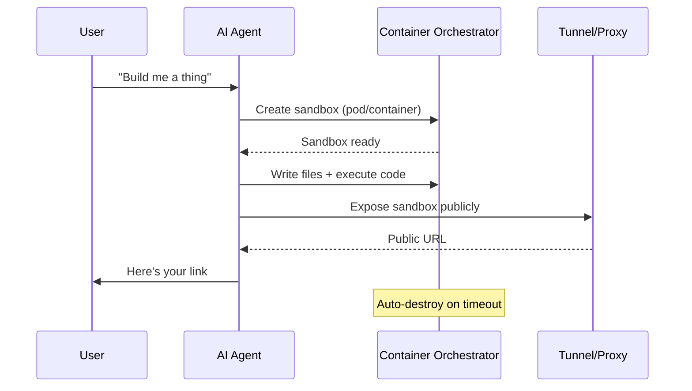

# Ephemeral Sandboxes

Ephemeral sandboxes are throwaway computing environments that AI agents can spin up, write code into, run, and tear down—all without human intervention. Think of them as scratch paper for agents: use it, show the result, then throw it away.

> Inspired by Thomas Ankcorn's [sandbox demo](https://sandbox-demo.ankcorn.dev/) running on home Raspberry Pis, and Cloudflare engineer Naresh Ravishankar's related demos.

## Why Agents Need Sandboxes

Agents that can only generate text are limited. Agents that can *execute* code in isolated environments unlock a different class of capability:

- **Verification** — run the code, don't just hope it works
- **Safety** — sandboxed execution can't damage the host or other workloads
- **Sharing** — generate a public URL so humans can see the result instantly
- **Cleanup** — everything disappears when the task is done, no cruft accumulates

## How It Works

The general pattern is straightforward regardless of the specific infrastructure:

### Key Steps

1. **Create** — agent requests a new isolated environment (container, pod, VM)
2. **Write** — agent writes files into the sandbox filesystem
3. **Execute** — agent runs commands inside the sandbox (build, start server, run tests)
4. **Expose** — a tunnel or proxy gives the sandbox a public URL
5. **Destroy** — sandbox self-destructs after a timeout or when the agent is done

## DIY: Raspberry Pi + k3s

Ankcorn's demo proves you don't need cloud infrastructure to do this. His setup:

- **2 Raspberry Pis** running k3s (lightweight Kubernetes)
- **Bun runtime** pre-installed in each pod (ARM64 Linux)
- **Cloudflare Tunnel** for public URL routing via wildcard DNS
- **WhatsApp integration** — message the agent, get back a live URL
- **Resource limits** — 512MB RAM, 0.5 CPU per sandbox

This is notable because it's entirely self-hosted on ~$100 of hardware. The agent has three tools: `create_sandbox`, `sandbox_write_file` / `sandbox_exec`, and `sandbox_preview`.

## Production Approaches

### Cloudflare Sandbox SDK

Cloudflare offers a [[../cloudflare/sandbox-sdk|Sandbox SDK]] purpose-built for this pattern — managed containers with file I/O, command execution, and preview URLs, without managing your own cluster.

### Other Options

| Approach | Tradeoff |
|----------|----------|
| **k3s on home hardware** | Cheap, full control, limited scale |
| **Cloud Kubernetes** | Scales easily, costs money per pod |
| **Firecracker microVMs** | Fastest startup, more operational complexity |
| **Docker-in-Docker** | Simple to set up, weaker isolation |
| **Managed sandbox APIs** (Cloudflare, E2B, Modal) | Zero ops, pay per use |

## Design Considerations

### Resource Limits Are Features

Tight resource caps (512MB RAM, fractional CPU) aren't just cost saving — they force agents to write efficient code and prevent runaway processes from impacting the host.

### Self-Destruction is the Default

Sandboxes should auto-destroy. The question is *when*:
- **Timeout-based** — destroy after N minutes of inactivity
- **Agent-triggered** — agent explicitly tears down when done
- **Session-scoped** — tied to the conversation lifecycle

### Tunnel Exposure

Public URLs turn "I built a thing" into "here, look at this thing." Cloudflare Tunnel, ngrok, or Tailscale Funnel all work. Wildcard DNS (e.g., `*.yourdomain.dev`) makes routing automatic.

## Use Cases

- **Prototyping on demand** — "build me a landing page" → live URL in 30 seconds
- **Code verification** — agent runs tests in a clean environment before reporting results
- **Interactive demos** — share working apps from a chat conversation
- **Safe experimentation** — try npm packages, test APIs, run untrusted code

## Related

- [[patterns|Agentic Patterns]]
- [[red-green-tdd|Red/Green TDD]] — sandboxes give agents a place to actually run tests
- [[tooling|Agentic Tooling]]
