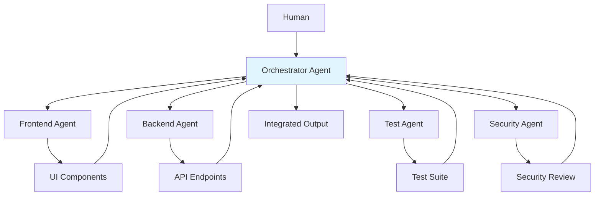
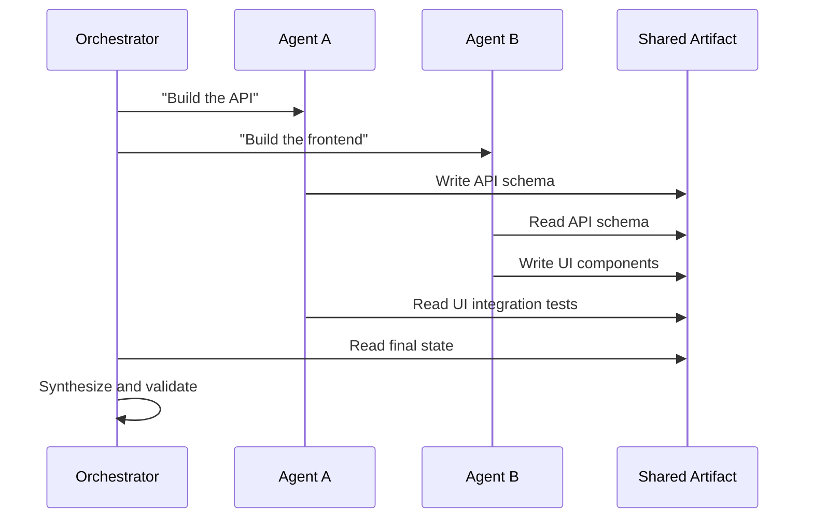
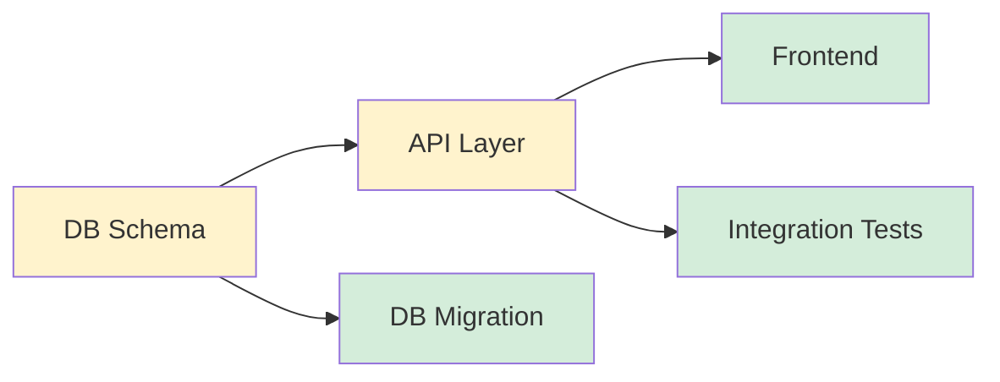
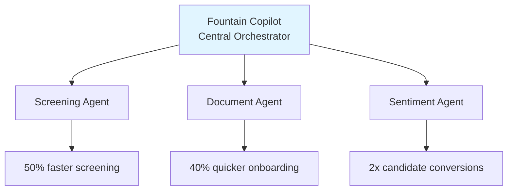

# Multi-Agent Orchestration

Multi-agent orchestration is when you split a complex task across several specialized AI agents instead of cramming everything into one conversation. Each agent gets its own context window, its own focus area, and they coordinate through an orchestrator — like a team of specialists instead of one generalist.

## Why Not Just One Agent?

Single agents hit limits:

| Constraint | Single agent | Multi-agent |
|---|---|---|
| Context window | One window holds everything | Each agent gets a focused window |
| Specialization | Jack of all trades | Each agent tuned for its role |
| Parallelism | Sequential processing | Agents work simultaneously |
| Failure isolation | One error derails everything | Failed agent doesn't block others |
| Task complexity | Degrades on large tasks | Decomposes into manageable pieces |

The key insight: **splitting work across independent context windows** lets agents reason deeply about their piece without being polluted by unrelated context.

## The Orchestrator Pattern



The orchestrator:
1. **Decomposes** the task into independent subtasks
2. **Assigns** each subtask to a specialized agent
3. **Coordinates** dependencies between agents
4. **Synthesizes** results into a coherent output

## Agent Specialization Patterns

### By Domain

Each agent is an expert in one area:

```
Orchestrator
├── Frontend Agent     (React, CSS, accessibility)
├── Backend Agent      (APIs, business logic, database)
├── Infra Agent        (Terraform, CI/CD, deployment)
└── Security Agent     (vulnerability scanning, auth review)
```

### By Lifecycle Phase

Each agent handles one phase of the SDLC:

```
Orchestrator
├── Planning Agent     (task decomposition, architecture)
├── Implementation Agent (code writing)
├── Review Agent       (code review, style checks)
└── Test Agent         (test generation, coverage analysis)
```

### By Risk Tier

From [[code-factory]]:

```
Orchestrator
├── Fast-Path Agent    (low-risk changes, auto-merge)
└── Careful-Path Agent (high-risk changes, evidence required)
```

## Coordination Protocols

### Shared Artifact

Agents communicate through a shared file or document:



**Shared artifacts**: Git branches, spec files, OpenAPI schemas, test suites.

### Message Passing

Agents communicate through structured messages:

```typescript
interface AgentMessage {
  from: string;      // agent ID
  to: string;        // target agent or "orchestrator"
  type: "result" | "question" | "dependency" | "error";
  content: any;
}
```

### Dependency Graph

Orchestrator builds a DAG and executes in topological order:



Agents on the same level run in parallel. Agents with dependencies wait.

## Task Decomposition

The orchestrator's hardest job is splitting work correctly:

### Good Decomposition
- Each subtask is **independently completable**
- Interfaces between tasks are **well-defined** (API contracts, schemas)
- Subtasks can be **validated independently**
- Failure in one subtask doesn't cascade

### Bad Decomposition
- Subtasks have **circular dependencies**
- Shared mutable state between agents
- One agent's output format is ambiguous to the consuming agent
- No way to verify subtask output without seeing the whole

## Practical: Claude Code Multi-Agent

In Claude Code, multi-agent looks like:

- **Task tool**: Spawns subagents with focused prompts and isolated context
- **Worktree isolation**: Each agent gets its own git worktree to avoid conflicts
- **Parallel execution**: Independent agents run simultaneously
- **Background agents**: Long-running tasks execute while you continue working

```
Main agent (orchestrator)
├── Task: "Research auth patterns" (Explore agent)
├── Task: "Implement auth middleware" (Bash agent, worktree)
├── Task: "Write auth tests" (Bash agent, worktree)
└── Task: "Review for security issues" (general-purpose agent)
```

## Real-World Example: Fountain

From the Anthropic trends report: Fountain (workforce management platform) uses hierarchical multi-agent orchestration:



Result: staffing a new fulfillment center went from 1+ weeks to under 72 hours.

## When to Use Multi-Agent vs Single Agent

| Scenario | Use single agent | Use multi-agent |
|---|---|---|
| Simple bug fix | Yes | No |
| Feature with clear scope | Yes | No |
| Cross-cutting feature (frontend + backend + tests) | No | Yes |
| Large codebase changes | No | Yes |
| Tasks requiring different expertise | No | Yes |
| Time-sensitive parallel work | No | Yes |

Rule of thumb: if you'd assign it to one person, use one agent. If you'd assign it to a team, use multiple agents.

## Related

- [[code-factory]] - Automated review pipeline (coding agent + review agent)
- [[patterns]] - Core agentic workflow patterns
- [[conversational-work]] - Async agent orchestration
- [[ralph-looping]] - Simple single-agent loops

## References

- [2026 Agentic Coding Trends Report](https://resources.anthropic.com/hubfs/2026%20Agentic%20Coding%20Trends%20Report.pdf?hsLang=en) - Anthropic, Trend 2: Single agents evolve into coordinated teams
