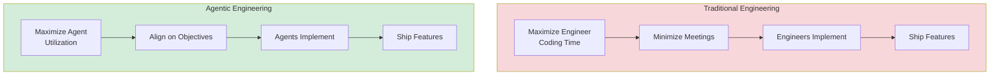
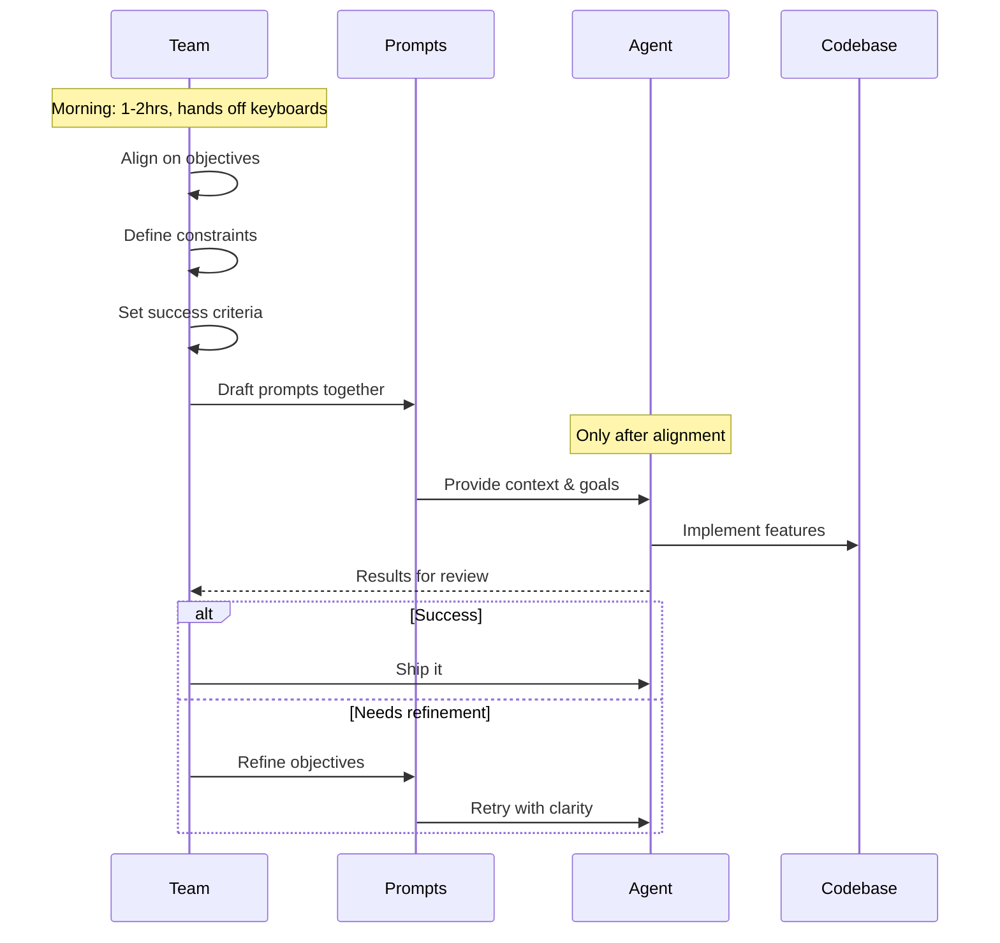
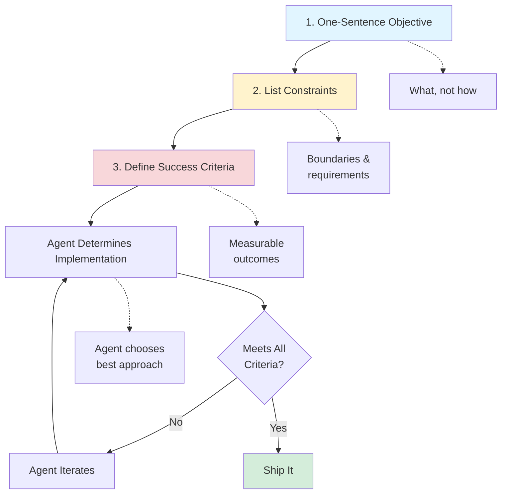
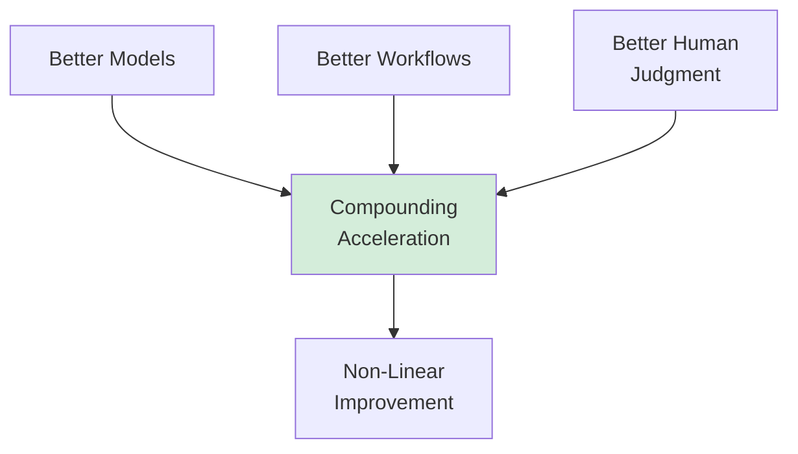

# Agentic Patterns

Agentic patterns flip traditional software development: instead of engineers writing code, AI agents do the implementation while engineers define what success looks like. Think of it as managing a team where you set objectives and the agents figure out how to build it.

## Core Philosophy

**Inversion of Roles**: Agents execute work, engineers define objectives and provide context for agents to succeed.



Traditional engineering: Maximize engineer coding time → minimize meetings → ship features
Agentic engineering: Maximize agent utilization → align on objectives → let agents ship features

## Workflow Patterns

### Pair Prompting

**Pattern**: Engineers collaborate on prompt drafting before any coding begins.



**Implementation**:
- First 1-2 hours each morning: hands off keyboards
- Team aligns on objectives, constraints, success criteria
- Draft prompts together to set agents up for success
- Only after alignment do agents start working

**Rationale**: Rushing into coding without alignment creates context switches and rework. Time spent on clear objectives saves exponentially more time in execution.

**Anti-pattern**: "No coding before 10am" rule - avoid jumping straight to implementation

### Maximize Agent Utilization

**Pattern**: Treat idle agent/compute time as waste, like idle GPU time in ML training.

**Implementation**:
- Agents work overnight while engineers sleep
- Agents work during commutes and meetings
- Asynchronous agent execution as default
- Queue work so agents always have tasks

**Rationale**: The most expensive thing is now idle compute waiting for human input. If you're commuting and nothing is running, that's waste.

**Metrics**: Track agent utilization % like you'd track GPU utilization

### Objective-First Specification

**Pattern**: Define objectives and constraints before any implementation.



**Implementation**:
1. Write objective in one sentence
2. List constraints
3. Define success criteria
4. Let agent determine implementation

**Example**:
```markdown
Objective: New users receive welcome email within 5 minutes of signup
Constraints:
- Use existing email service (SendGrid)
- Must handle 10k signups/hour
- Include user's name and signup timestamp
Success criteria:
- 99.9% delivery rate
- <5min latency p99
- Zero duplicate sends
```

**Rationale**: "If you can't state the objective in one sentence, you don't understand the problem well enough to build it."

**Replaces**: Traditional PRDs with implementation details

### Spec Outcomes, Not Process

**Pattern**: Define what success looks like, let agents figure out how to get there.

**Traditional approach**: "Use React, create a UserList component, fetch from /api/users, map over results..."

**Agentic approach**: "Display paginated user list with search and filters. Load <500ms. Mobile responsive."

**Rationale**: Agents are better at implementation details than humans now. Your value is defining the right outcome.

### Review Output, Not Code

**Pattern**: Test code against objectives rather than line-by-line review.

**Implementation**:
- Run tests/checks against success criteria
- If it passes → ship it
- If it fails → refine objectives & constraints, retry
- Skip detailed code review for agent-generated code

**Rationale**: "Code review as we knew it is overhead the system no longer needs." Focus human time on objectives, not implementation verification.

**When to review code manually**:
- Security-critical paths
- Novel architectural decisions
- When output fails repeatedly

### Kill Old Ways Immediately

**Pattern**: When you build a new implementation, delete the old one immediately—no parallel paths.

**Rationale**: "The codebase is agent context. Every dead path is noise that degrades agent performance."

**Implementation**:
- No feature flags for old implementations
- No commented-out code
- No "TODO: remove this after migration"
- Delete, don't disable

**Trade-off**: Higher risk if new implementation fails, but cleaner context for agents

### Think in Systems

**Pattern**: If you're doing something manually more than twice, automate it.

**Principle**: "If a human is repeating a task, the system isn't set up right."

**Goal**: Set things up → let them run → check output → move on

**Examples**:
- Manual testing → automated test generation
- Manual deployment → CI/CD pipelines
- Manual code review → automated objective verification
- Manual prompt tweaking → prompt optimization loops

## Code Patterns

### Code as Context, Not Library

**Pattern**: Write code to be comprehensible to agents, not reusable across humans.

**Traditional**: DRY (Don't Repeat Yourself), build reusable abstractions
**Agentic**: Code is read by agents who regenerate their own version

**Implications**:
- Optimize for clarity over cleverness
- Inline explanations in comments for agent context
- Descriptive variable/function names
- Code itself is now the documentation

**Example**:
```python
# Traditional: clever but opaque
def proc(x): return [i for i in x if i%2]

# Agentic: clear intent for agent comprehension
def filter_odd_numbers(numbers):
    """Returns only odd numbers from the input list."""
    return [num for num in numbers if num % 2 != 0]
```

### Data-Driven Interfaces

**Pattern**: Use well-structured data as the interface between components, not function calls.

**Traditional approach**: Define API with explicit function signatures
```typescript
interface UserService {
  createUser(name: string, email: string, role: Role): Promise<User>
  updateUser(id: string, updates: Partial<User>): Promise<User>
}
```

**Agentic approach**: Define data structure and rules
```typescript
// Define clear data structure with validation rules
interface UserData {
  name: string        // Required, 1-100 chars
  email: string       // Required, valid email format
  role: 'admin' | 'user' | 'guest'  // Required, enum
  created: ISO8601    // Auto-generated
  modified: ISO8601   // Auto-generated on updates
}
// Agent composes operations based on data structure
```

**Rationale**: "Clean data lets agents compose systems without being told how."

### Define Rules, Not Structure

**Pattern**: Set naming conventions and constraints, let agents figure out implementation details.

**Instead of**: Rigid JSON schema with every field specified
**Do**: High-level rules like "all timestamps use ISO8601", "all IDs are UUIDs", "metadata is key-value pairs"

**Example**:
```markdown
Rules:
- All entity files use kebab-case: user-profile.ts
- All timestamps: ISO8601 format
- All IDs: UUID v4
- Metadata: flat key-value, prefix with underscore
- Versioning: semantic versioning in version field

Let agent determine:
- Exact field names (as long as descriptive)
- Whether to nest objects or flatten
- Additional helper fields
```

## Team Patterns

### Individual Autonomy, Shared Interfaces

**Pattern**: Engineers choose their own tools and workflows, but standardize on data patterns and component responsibilities.

**Standardized**:
- Data structures and naming conventions
- Objective specifications format
- Component responsibilities and boundaries

**Personal choice**:
- IDE (Cursor, Windsurf, Claude Code, etc.)
- Prompting style
- Local workflows
- Agent configuration

**Rationale**: Tool preference is personal, but interfaces must be consistent for agents to compose systems.

### Immediate Anti-Pattern Flagging

**Pattern**: Call out old habits the moment you see them—in yourself or teammates.

**Common anti-patterns to flag**:
- Building for humans instead of agents
- Accumulating dead code
- Skipping objective specs
- Optimizing for human readability over agent comprehension
- Detailed implementation planning before defining outcomes

**Culture**: Make it safe to flag anti-patterns immediately, even your own

### Optimize for Time, Not Tokens

**Pattern**: If 10x more tokens saves a day, spend the tokens.

**Traditional**: Minimize API costs, optimize token usage
**Agentic**: Human decision-making time is the bottleneck, not compute cost

**Examples**:
- Send full file contents instead of snippets if it avoids back-and-forth
- Include redundant context to avoid ambiguity
- Re-index everything instead of tracking deltas
- Generate multiple implementations in parallel, pick best

**When tokens matter**: At scale (millions of requests), but optimize for human time during development

### Assume 3-Month Expiration

**Pattern**: Every decision you make today will be wrong in 3 months as technology shifts.

**Implications**:
- Build modular systems
- Minimize vendor lock-in
- Prefer composition over tight coupling
- Document assumptions that will change
- Accept that rewrites are normal

**Anti-pattern**: "Future-proof architecture" - you can't predict what changes, so optimize for changeability

## Agent as Primary User

**Principle**: "Build for agents, not humans. Every system, data store, naming convention, and knowledge artifact should be designed for an AI agent as the primary consumer."

**Implications**:
- Documentation written for agent consumption first
- APIs designed for agent discoverability
- Error messages that agents can act on
- Code comments that provide context for regeneration
- System logs that agents can parse for debugging

**Humans interact through agents**: Rather than humans directly manipulating systems, humans tell agents what they want, agents interact with systems.

## Onboarding Collapse

### Pattern: Weeks to Hours

Agents compress codebase onboarding from weeks to hours. An engineer joining a new project can have an agent:
- Summarize architecture and key abstractions
- Explain conventions, patterns, and where things live
- Walk through the critical paths (auth, data flow, deployment)
- Answer "why is this done this way?" questions with full repo context

**Implication: Surge Staffing**

When onboarding takes hours instead of weeks, fixed project teams become less necessary:
- Pull in a database expert for a week, then rotate them back — no ramp-up penalty
- Spin up a "tiger team" for an urgent deadline without anyone spending days reading code
- Rebalance headcount across projects quarterly instead of annually

The org chart stops being a constraint on who can work on what.

### Pattern: Agent as Onboarding Buddy

```
New engineer → Agent with full repo context → Productive in hours
                    ↓
              Answers architecture questions
              Explains conventions and history
              Guides through first contribution
              Reviews first PRs with extra context
```

**Anti-pattern**: Writing onboarding docs manually that go stale. Let the agent generate context from the living codebase.

## Productivity Economics

### Output Volume, Not Just Speed

The common framing is "agents make you faster." The more accurate framing from Anthropic's internal research: **agents increase output volume**.

| Metric | What people expect | What actually happens |
|---|---|---|
| Time per task | Decreases | Decreases (but modest) |
| Tasks completed | Same | Significantly increases |
| New work unlocked | Same | Roughly a quarter of agent-assisted output is work nobody would have prioritized before |

That last row is the real story. Engineers don't just do the same work faster — they tackle things that used to die in the backlog:
- Internal tooling that makes everyone's life better but never justified a sprint
- Minor UX friction and small bugs that accumulate into death-by-a-thousand-cuts
- Quick prototypes to validate ideas before committing to a full build
- Cleaning up years of technical debt that nobody had bandwidth for

### Compounding Gains

Productivity gains aren't linear — three forces reinforce each other:



1. **Models get more capable** — longer context, better tool use, fewer hallucinations
2. **Workflows get smarter** — engineers learn to decompose tasks, run agents in parallel, write better specs
3. **Human judgment sharpens** — you get better at knowing what to delegate, when to intervene, and how to evaluate output

These aren't independent. Smarter workflows only matter if the models can execute them. Better models are wasted if you don't know how to direct them. The flywheel accelerates as all three improve together.

### Timeline Compression Changes What's Viable

When a feature that used to take two sprints ships in two days, the calculus changes:
- Projects that never survived prioritization become worth doing
- Technical debt cleanup stops being "someday" work — agents can grind through backlogs
- You can prototype three approaches and pick the best one instead of committing upfront
- Competitors who still operate on sprint cycles can't keep up

**The economics shift**: The question changes from "can we afford to build this?" to "can we afford not to?"

## References

- [No Coding Before 10am - Michael Bloch](https://x.com/michaelxbloch/status/2022678437362598163)
- [2026 Agentic Coding Trends Report](https://resources.anthropic.com/hubfs/2026%20Agentic%20Coding%20Trends%20Report.pdf?hsLang=en) - Anthropic
- [[anti-patterns]]
- [[multi-agent]]
- [[security]]
- [[tooling]]
