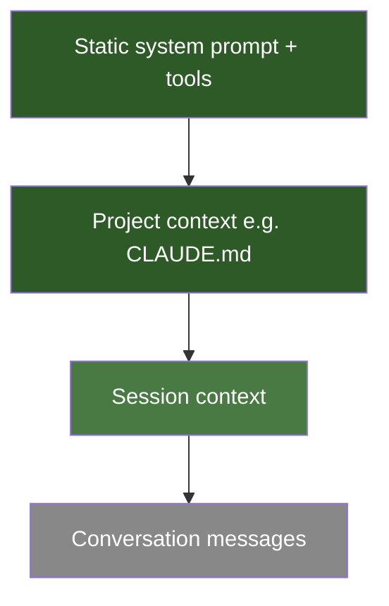

# Prompt Caching

Prompt caching lets AI APIs reuse computation from previous requests, dramatically cutting cost and latency for long-running agents. Instead of reprocessing your entire 100k-token system prompt on every turn, the API serves it from cache — often at 90% lower cost and 5x faster.

Source: [Lessons from Building Claude Code: Prompt Caching Is Everything](https://x.com/trq212/status/2024574133011673516)

## How It Works

Caching is **prefix-based**: the API caches everything from the start of the request up to each `cache_control` breakpoint. Any change to the prefix invalidates everything after it.



Green = cached, gray = always computed fresh.

## Core Rules

### 1. Static content first, dynamic content last

Order your prompt so the most-shared content comes first:

| Layer | Cached Across |
|-------|--------------|
| System prompt + tool definitions | All sessions globally |
| Project files (CLAUDE.md) | All sessions in a project |
| Session context | Current session |
| Conversation messages | Never cached |

### 2. Use system messages for dynamic updates, not prompt edits

When something changes mid-session (time, file content, mode), don't modify the system prompt — that busts the cache. Instead, inject a `<system-reminder>` tag into the next user message or tool result.

```
# Bad: editing system prompt
system_prompt = f"You are a helpful assistant. Current time: {now}"

# Good: pass updates via messages
user_message = f"<system-reminder>It is now {now}</system-reminder>\n\n{actual_user_message}"
```

### 3. Never change tools or models mid-session

- **Tools** are part of the cached prefix. Adding or removing any tool invalidates the entire cache.
- **Models** have separate caches. Switching from Opus to Haiku mid-session means paying full price to rebuild the Haiku cache — even if Haiku is cheaper per token.

If you need a cheaper model for a subtask, use a **subagent** with a handoff message rather than switching the main session.

### 4. Model state transitions as tools, not tool swaps

**Bad approach (breaks cache):**
- Enter plan mode → swap tool set to read-only tools

**Good approach (cache-safe):**
- Keep all tools loaded always
- Add `EnterPlanMode` / `ExitPlanMode` as tools themselves
- When entering plan mode, send a system message explaining constraints

Bonus: because plan mode is a tool, the model can autonomously enter it when it detects a hard problem.

### 5. Defer tool loading instead of removing tools

For large MCP tool sets, don't remove tools mid-session. Instead, send **lightweight stubs** with `defer_loading: true`. The model can discover and load full schemas via a `ToolSearch` tool when needed. Stubs are always present in the same order — stable prefix.

### 6. Fork operations must share the parent's prefix

**Compaction** (summarizing when context window fills) is a common cache trap. A naive implementation:
1. Sends a separate API call with different system prompt + no tools
2. Gets zero cache hits on the parent's 100k token history
3. Pays full price to summarize

**Cache-safe compaction:**
- Use the exact same system prompt, tools, and conversation history as the parent
- Append the compaction instruction as a new user message at the end
- From the API's view, it looks like the next turn → cache hits on the entire prefix

The only new tokens are the compaction prompt itself. Save a "compaction buffer" (reserve space) so you have room for the summary output.

## Anti-Patterns That Break Caching

| Anti-Pattern | Why It Breaks Cache |
|-------------|-------------------|
| Timestamp in static system prompt | Prefix changes every second |
| Non-deterministic tool ordering | Different prefix each request |
| Removing tools when not needed | Prefix changes |
| Switching models for "cheap" subtasks | Different model = no shared cache |
| Naive compaction with different system prompt | Zero hits on parent history |
| Updating tool parameters dynamically | Prefix changes |

## Monitoring

Treat cache hit rate like uptime. At Claude Code, they run **alerts on cache hit rate and declare SEVs if it drops**. A few percentage points of cache miss can dramatically affect cost and latency at scale.

## Related

- [[agentic-coding/patterns]] — general agentic patterns
- [[agentic-coding/anti-patterns]] — what to avoid
- [[agentic-coding/tooling]] — tool management
