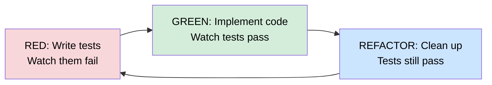

# Red/Green TDD for Agents

Red/green TDD is one of the highest-leverage instructions you can give a coding agent. In just four words—"use red/green TDD"—you dramatically improve code quality, prevent wasted work, and end up with a safety net of tests.

> Concepts on this page are drawn from Simon Willison's [Agentic Engineering Patterns: Red/Green TDD](https://simonwillison.net/guides/agentic-engineering-patterns/red-green-tdd/).

## Why It Works So Well with Agents

Coding agents have two failure modes that TDD directly addresses:

1. **Writing code that doesn't work** — tests catch this immediately
2. **Building unnecessary code that never gets used** — tests force you to define what's actually needed upfront

Traditional TDD is already valuable for human developers, but agents benefit even more because they lack the intuition to "smell" broken code. Tests give them a concrete, machine-verifiable signal.



## The Red Phase Matters

Skipping the red phase is the most common mistake. If you jump straight to implementation and then write tests, you risk:

- Tests that pass trivially without exercising real logic
- False confidence from a green test suite that doesn't actually validate anything
- Missing edge cases the implementation silently ignores

Watching a test fail first proves it's actually testing something meaningful.

## How to Use It

The prompt is simple:

```
Build a function that parses frontmatter from a markdown string. Use red/green TDD.
```

Every major model understands this shorthand. The agent will:

1. Write test cases covering expected behavior and edge cases
2. Run the tests, confirm they fail (red)
3. Implement the code
4. Run the tests again, confirm they pass (green)
5. Optionally refactor while keeping tests green

## Benefits Beyond Correctness

- **Regression protection** — as the project grows, existing tests catch when new changes break old features
- **Living documentation** — tests describe what the code is supposed to do
- **Agent guardrails** — gives agents a tight feedback loop instead of open-ended implementation
- **Easier code review** — you can read the tests to understand intent before reading the implementation

## Related

- [[patterns|Agentic Patterns]]
- [[anti-patterns|Agentic Anti-Patterns]]
