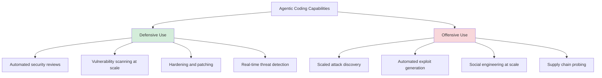
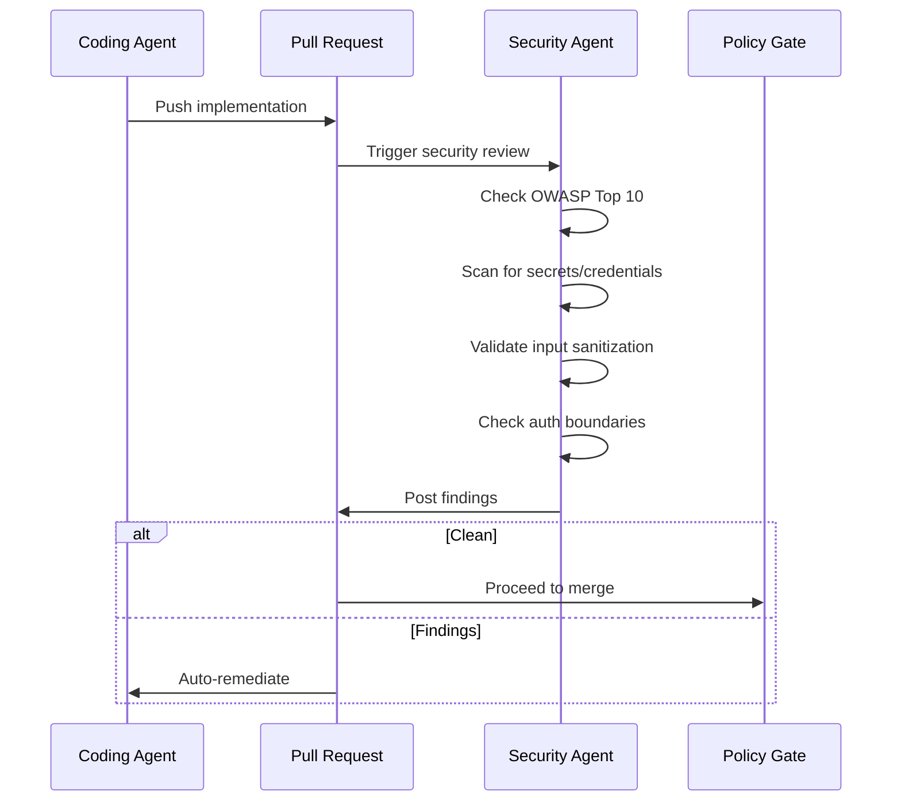
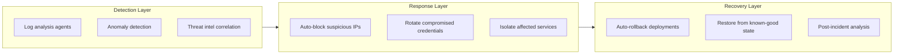

# Agentic Security

Coding agents are a dual-use technology: the same capabilities that help you find and fix vulnerabilities also help attackers find and exploit them. The organizations that bake security in from the start are better positioned than those that bolt it on later.

## The Dual-Use Problem



The same agent that reviews your code for SQL injection can review someone else's code for exploitable SQL injection. The difference is intent and access.

## Defensive: Every Engineer Becomes a Security Engineer

Before agents, security reviews required specialized expertise. Most teams had one security person reviewing everything, creating a bottleneck. Now any engineer can leverage agents to:

- **Run in-depth security reviews** on every PR, not just the ones the security team has time for
- **Harden configurations** by having agents audit infrastructure-as-code against best practices
- **Monitor for vulnerabilities** in dependencies continuously, not just when someone remembers to run `npm audit`
- **Generate threat models** for new features before implementation begins

### Pattern: Security Agent in the Code Factory

Integrate a security-focused agent into your [[code-factory|Code Factory]] pipeline:



### What Agents Check That Humans Miss

| Category | What the agent catches |
|---|---|
| Input validation | Missing sanitization on every path, not just the obvious ones |
| Auth boundaries | Endpoints that forgot access control checks |
| Secret leaks | API keys, tokens, credentials in code, logs, or error messages |
| Dependency vulns | Transitive dependencies with known CVEs |
| Config drift | Security headers missing, CORS too permissive, debug mode in production |

## Offensive: What Threat Actors Get

The uncomfortable truth: attackers benefit from the same capabilities.

- **Scale**: Automated vulnerability scanning across thousands of targets simultaneously
- **Speed**: Exploits generated and tested faster than manual research
- **Breadth**: Agents can probe codebases, APIs, and infrastructure in parallel
- **Persistence**: Long-running agents that continuously probe for new attack surfaces

This isn't hypothetical. The same timeline compression that lets defenders ship security patches faster lets attackers find and exploit vulnerabilities faster.

## Agentic Cyber Defense

The response to automated attacks is automated defense:



Key principle: **respond at machine speed**. If attacks are automated, manual incident response is too slow.

## Security-First Architecture for Agent Systems

### 1. Least Privilege by Default

Agents should have the minimum permissions needed for their task. A coding agent doesn't need production database access. A review agent doesn't need write access to the repo.

```
Agent: coding-agent
  Read: source code, tests, docs
  Write: feature branches only
  No access: production, secrets, main branch

Agent: security-review-agent
  Read: source code, dependency manifests
  Write: PR comments only
  No access: anything else
```

### 2. Audit Everything

Every agent action should be logged and traceable:
- What agent took what action
- What context/prompt triggered it
- What files were read/modified
- What external services were called

### 3. Sandboxed Execution

Agent-generated code runs in isolated environments before it touches anything real:
- [[ephemeral-sandboxes|Ephemeral sandboxes]] for code execution
- No network access unless explicitly granted
- No access to secrets or credentials in the sandbox

### 4. Human Checkpoints for High-Stakes Actions

Not everything should be automated. Define clear escalation points:

| Action | Agent can do autonomously | Requires human approval |
|---|---|---|
| Security review | Yes | No |
| Patch dependency | Yes (non-breaking) | Yes (major version) |
| Rotate credentials | Yes (automated rotation) | Yes (manual rotation) |
| Deploy to staging | Yes | No |
| Deploy to production | No | Yes |
| Modify auth/access control | No | Yes |

## The Balance

The report's conclusion: **prepared organizations win**. If your security posture already assumes automated probing, you're ahead. If you're still treating security as a final review step, agents on both sides will expose that gap fast.

The gap between "security as an afterthought" and "security as a first-class concern" widens when both sides have agents.

## Related

- [[code-factory]] - Automated code review and remediation pipeline
- [[patterns]] - Agentic workflow patterns
- [[anti-patterns]] - Common mistakes in agentic workflows
- [[ephemeral-sandboxes]] - Isolated execution environments

## References

- [2026 Agentic Coding Trends Report](https://resources.anthropic.com/hubfs/2026%20Agentic%20Coding%20Trends%20Report.pdf?hsLang=en) - Anthropic, Trend 8: Dual-use risk requires security-first architecture
