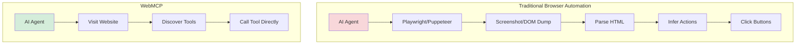

# WebMCP

WebMCP lets websites tell AI agents exactly what actions they can perform—like "add item to cart" or "send message"—without the AI having to screenshot the page or parse HTML. It's like giving AI agents an instruction manual for your website built right into the webpage.

## What is WebMCP?

WebMCP is a new browser specification for surfacing tools and ways to interact with websites **via the website itself** - without additional MCP servers or infrastructure.

**Key difference from MCP servers:**
- No separate server infrastructure needed
- Tools defined directly in your website's HTML or JavaScript
- Browser discovers tools when visiting the page
- Works with existing authentication (user already logged in)

## How It Works

WebMCP allows you to publish your app's functionality in two ways:

### 1. Imperatively with JavaScript

Register tools programmatically using the browser API:

```javascript
window.navigator.modelContext.registerTool({
  name: 'add_item',
  description: 'Add an item to a grocery list',
  inputSchema: {
    type: 'object',
    properties: {
      item: { type: 'string', description: 'Item to add' },
      store: { type: 'string', description: 'Store name' }
    },
    required: ['item', 'store']
  },
  outputSchema: {
    type: 'object',
    properties: {
      success: { type: 'boolean' },
      itemId: { type: 'string' }
    }
  },
  handler: async ({ item, store }) => {
    // Your implementation
    return { success: true, itemId: '123' };
  }
});
```

### 2. Declaratively with HTML Forms

**This is genius** - use form attributes to define tools without writing schemas:

```html
<form
  tool-name="add_item"
  tool-description="Add an item to grocery list">

  <input
    name="item"
    tool-param-title="Item"
    tool-param-description="Item to add"
    required>

  <input
    name="store"
    tool-param-title="Store"
    tool-param-description="Which store to add to"
    required>

  <button type="submit">Add Item</button>
</form>
```

**Benefits of form-based approach:**
- No manual schema writing - inferred from form structure
- Works with existing forms - just add attributes
- Validation rules already defined in HTML

## Example: Grocery List App

Demo app with these capabilities:
- Add/remove stores
- Add/remove items from stores
- Move items between stores
- Mark items as completed
- Reorder items

**Natural language interactions:**
```
User: "Please add bananas to Costco shopping list"
→ Calls add_item tool with { item: "bananas", store: "Costco" }

User: "Move bananas from Costco to Whole Foods"
→ Calls move_item tool

User: "Add all items for chicken noodle soup to Whole Foods"
→ AI determines ingredients, calls add_item multiple times
→ Result: chicken broth, chicken breast, egg noodles, carrots, celery, onion

User: "Mark off anything with chicken, I already have it"
→ Calls complete_item for matching items
```

**Speed:** ~5 seconds to add new store and item - much faster than browser automation.

## Architecture Comparison



## Benefits

### 1. Mixed UI Approach

Users get **both** traditional UI and natural language:
- Visit website normally for visual experience
- Use AI for complex operations ("add all vegetables from last week")
- Companies keep users on their platform (upsell opportunities, branding)

### 2. Speed

**Much faster than browser automation:**
- No HTML parsing or screenshot analysis
- No "figure out which button to click" step
- Direct tool invocation
- **Example:** 5 seconds vs 30+ seconds for traditional automation

### 3. Token Efficiency

**Drastically reduces token usage:**
- Sends tool schemas instead of entire DOM tree
- No screenshots to analyze
- Structured input/output instead of unstructured HTML

### 4. Developer Experience

**Easy to implement:**
- Frameworks can auto-generate tools from existing schemas
- Use existing validation and form definitions
- No additional hosting beyond your website
- Similar to responsive design - small changes, big impact

## WebMCP vs Alternatives

| Approach | Infrastructure | Speed | Token Usage | User Experience |
|----------|---------------|-------|-------------|-----------------|
| **WebMCP** | Website only | Fast (~5s) | Low (schemas only) | Mixed (UI + AI) |
| **MCP Server** | Separate server | Fast | Low | Chat-only |
| **Browser Automation** | Playwright/Puppeteer | Very slow (30s+) | High (DOM/screenshots) | Website visited but automated |
| **MCP UI/Apps** | MCP server | Fast | Low | Embedded widgets in chat |

## Framework Integration

WebMCP is **ripe for framework adoption** because:

- Frameworks already have form schemas
- Validation logic already defined
- UI layer already structured
- Just need to expose tools via one more API

**Potential integrations:**
```typescript
// Next.js/React example
export const actions = {
  addItem: action(addItemSchema, async (data) => {
    // Implementation
  })
};
// Framework auto-generates WebMCP tools

// SvelteKit example
export const actions = {
  add_item: async ({ request }) => {
    // Implementation
  }
} satisfies Actions;
// Auto-publishes as WebMCP tool
```

## Open Questions

### Cross-App Interactions?

**Likely yes** - AI chat could:
1. Visit your calendar app
2. Discover tools and see you're logged in
3. Visit your grocery app
4. Move data between both apps

**Not just single-app isolation** - compose multiple web apps together.

### Headless Mode?

**Probably** - AI agents could:
- Open browser headlessly
- Discover tools from multiple sites
- Execute actions without UI rendering
- Compose workflows across apps

## Historical Context: The API Problem

**Early web (2000s-2010s):**
- Every site had free, open APIs
- Mashups everywhere
- 100+ Twitter clients
- Developer ecosystem thrived

**Modern web (2020s):**
- Reddit API: gone
- Twitter API: $40,000/month → $5/1000 requests
- Instagram API: nearly impossible
- Companies want users on their platforms

**WebMCP's position:**
- Middle ground between closed platforms and open APIs
- Companies keep users on site (control, monetization, branding)
- AI can still interact via structured tools
- Similar to responsive design: adapt to new paradigm without rebuilding

## Adoption Outlook

**This may be how the web adapts to AI:**
- Lower barrier than publishing MCP servers
- Keeps business incentives aligned (users on site)
- Progressive enhancement (works with or without AI)
- Familiar patterns (forms, schemas)

**Not everyone will adopt** (just like APIs), but provides path forward for those who want AI interaction.

## Implementation Status

- **Status:** Early preview (released Feb 2026)
- **Browser:** Chrome experimental
- **Sign up:** WebMCP early access program
- **Spec:** Under development

## Use Cases

**Perfect for:**
- To-do lists and task managers
- Habit trackers
- Grocery/shopping lists
- Accounting/expense tracking (paste transactions → auto-categorize)
- Form-heavy applications
- CRUD apps with clear actions

**Maybe not ideal for:**
- Apps requiring complex visual interaction
- Video/image editing
- Real-time collaboration needing visual feedback
- Apps where UI/branding is core value prop

## Related Topics

- [[mcp]] - Model Context Protocol servers
- [[ai-agents]] - Building autonomous agents
- [[browser-automation]] - Playwright, Puppeteer alternatives

## Resources

- [Syntax Podcast Episode](https://www.youtube.com/watch?v=sOPhVSeimtI)
- WebMCP Early Preview (sign up via Chrome)
- [Chrome Extension Demo](https://github.com/chrome/webmcp-extension) (likely)

## Key Takeaway

**WebMCP is to AI interaction what responsive design was to mobile:**

A way to adapt existing web apps to a new paradigm with minimal changes, keeping users on your platform while enabling new interaction modes.
