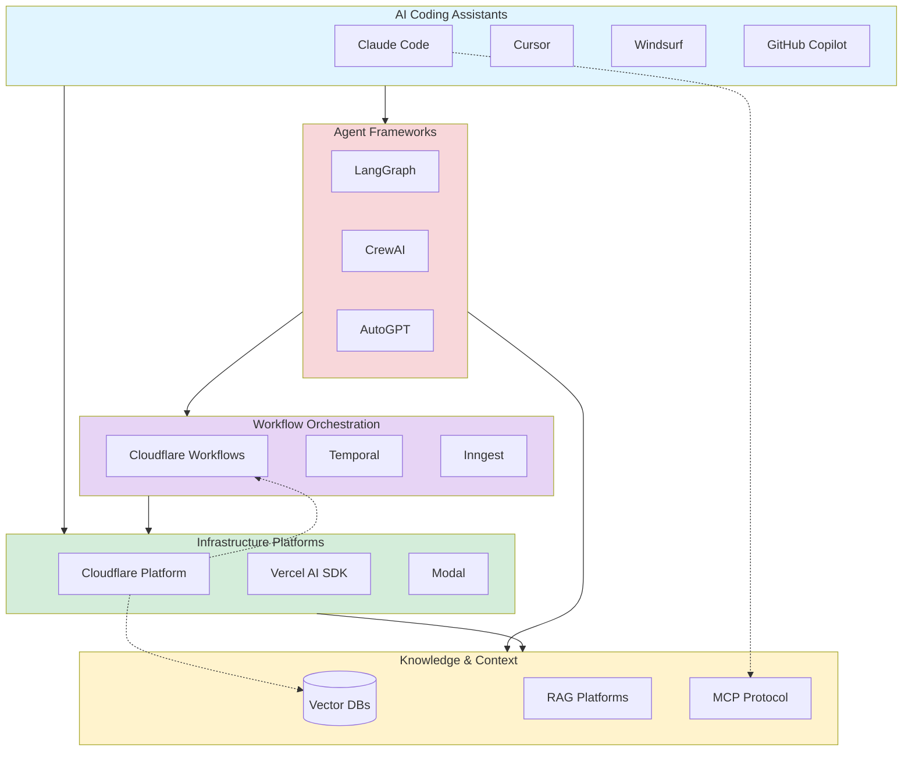

# Agentic Tooling

Tools, platforms, and frameworks that enable AI agents to build software with humans in supportive/directive roles rather than implementation roles.

## Tool Ecosystem Overview

## AI Coding Assistants

### Claude Code
- **Type**: CLI-based autonomous coding agent
- **Strengths**: Full project context, autonomous multi-step tasks, tool use
- **Use cases**: Complex refactoring, feature implementation, system-wide changes
- **Platform**: Anthropic
- **Access**: claude.ai/code

### Cursor
- **Type**: AI-first code editor (VSCode fork)
- **Strengths**: Codebase-aware completions, chat with codebase, multi-file edits
- **Use cases**: Rapid prototyping, inline code generation, codebase exploration
- **Integration**: Native IDE experience
- **Access**: cursor.sh

### Windsurf
- **Type**: AI-native code editor
- **Strengths**: Flow state optimization, contextual suggestions, collaborative editing
- **Use cases**: Daily development workflow, iterative refinement
- **Integration**: Standalone editor
- **Access**: windsurf.ai

### GitHub Copilot
- **Type**: AI pair programmer (inline suggestions)
- **Strengths**: Ubiquitous, fast completions, wide language support
- **Use cases**: Function completion, boilerplate generation, simple implementations
- **Integration**: VSCode, JetBrains, vim, etc.
- **Access**: github.com/features/copilot

### Comparison

| Tool | Autonomy Level | Best For | Context Window |
|------|---------------|----------|----------------|
| Claude Code | High - multi-step tasks | Complex features, refactoring | Very large (200k tokens) |
| Cursor | Medium - guided multi-file | Daily development, prototyping | Large |
| Windsurf | Medium - flow-optimized | Iterative development | Medium-Large |
| Copilot | Low - single completions | Inline suggestions, boilerplate | Small-Medium |

## Workflow Orchestration

### Cloudflare Workflows
- **Type**: Durable execution platform
- **Strengths**: Serverless, automatic retries, long-running tasks (days/weeks)
- **Use cases**: Multi-step AI agents, approval workflows, scheduled operations
- **Integration**: Cloudflare Workers, Durable Objects, Workers AI
- **Pricing**: Available on Free and Paid plans
- **Reference**: [[cloudflare#Workflows]]

### Temporal
- **Type**: Durable execution engine
- **Strengths**: Language-agnostic, proven at scale, complex state machines
- **Use cases**: Mission-critical workflows, distributed systems, saga patterns
- **Integration**: Self-hosted or cloud, SDKs for Go/Java/Python/TypeScript
- **Access**: temporal.io

### Inngest
- **Type**: Serverless workflow orchestration
- **Strengths**: Event-driven, simple API, good DX
- **Use cases**: Background jobs, event processing, scheduled tasks
- **Integration**: Works with any serverless platform
- **Access**: inngest.com

## Agent Frameworks

### LangGraph
- **Type**: Agent workflow framework (from LangChain)
- **Strengths**: Graph-based agent flows, cyclic workflows, human-in-loop
- **Use cases**: Complex multi-agent systems, research agents, tool-calling chains
- **Language**: Python, JavaScript
- **Access**: github.com/langchain-ai/langgraph

### CrewAI
- **Type**: Multi-agent orchestration framework
- **Strengths**: Role-based agents, collaborative tasks, sequential/parallel execution
- **Use cases**: Team-like agent collaboration, task delegation
- **Language**: Python
- **Access**: github.com/joaomdmoura/crewAI

### AutoGPT
- **Type**: Autonomous agent framework
- **Strengths**: Goal-oriented, self-prompting, tool use
- **Use cases**: Research, web automation, autonomous task completion
- **Language**: Python
- **Access**: github.com/Significant-Gravitas/AutoGPT

### Smol Developer
- **Type**: Minimal agent for code generation
- **Strengths**: Simple, transparent, easy to understand/modify
- **Use cases**: Learning agents, small projects, experimentation
- **Language**: Python
- **Access**: github.com/smol-ai/developer

## Infrastructure Platforms

### Cloudflare Platform

Integrated platform for running AI agents at the edge.

**Components**:
- **Workers AI**: Serverless LLM inference (50+ models)
- **Workflows**: Durable execution for multi-step agents
- **Durable Objects**: Stateful agents with persistent memory
- **Vectorize**: Vector database for RAG
- **AI Search**: Managed RAG/search
- **Sandbox**: Containerized execution environments
- **AI Gateway**: Proxy/cache/router for external LLMs

**Use case**: Full-stack AI agent deployment
**Reference**: [[cloudflare]]

### Vercel AI SDK
- **Type**: AI application framework
- **Strengths**: Streaming, UI primitives, multi-provider support
- **Use cases**: Chat interfaces, streaming responses, React integration
- **Integration**: Works with OpenAI, Anthropic, Cloudflare, etc.
- **Access**: sdk.vercel.ai/docs

### Modal
- **Type**: Serverless compute for AI/ML
- **Strengths**: GPU access, containerized functions, scheduled jobs
- **Use cases**: Model inference, batch processing, agent compute
- **Access**: modal.com

### Replicate
- **Type**: Hosted model inference
- **Strengths**: Easy model deployment, pay-per-use, GPU autoscaling
- **Use cases**: Image generation, model serving, agent tools
- **Access**: replicate.com

## Development Tools

### MCP (Model Context Protocol)
- **Type**: Standard for agent-tool communication
- **Purpose**: Connect LLMs to external tools/data sources
- **Use cases**: Tool calling, data retrieval, system integration
- **Implementations**: Claude Desktop, Claude Code, custom integrations
- **Access**: modelcontextprotocol.io

### Prompt Management

**LangSmith**
- Prompt versioning, testing, monitoring
- LangChain integration
- langsmith.com

**Humanloop**
- Prompt engineering, evaluation, monitoring
- humanloop.com

**Weights & Biases Prompts**
- Experiment tracking for prompts
- wandb.ai/site/prompts

### Testing & Evaluation

**Braintrust**
- Agent evaluation, testing, monitoring
- braintrustdata.com

**LangSmith**
- Tracing, debugging, evaluation
- langsmith.com

## Knowledge & Context

### Vector Databases

**Cloudflare Vectorize**
- Serverless vector database
- Integrated with Workers AI
- [[cloudflare#Workers AI]]

**Pinecone**
- Managed vector database
- Fast similarity search
- pinecone.io

**Weaviate**
- Open-source vector database
- GraphQL API
- weaviate.io

**Qdrant**
- High-performance vector search
- Open-source, self-hostable
- qdrant.tech

### RAG Platforms

**Cloudflare AI Search**
- Managed RAG infrastructure
- Automatic indexing, continuous updates
- [[cloudflare#Cloudflare AI Search]]

**LlamaIndex**
- Data framework for LLM apps
- RAG orchestration
- llamaindex.ai

**Hebbia**
- AI-powered search/analysis
- Enterprise RAG
- hebbia.ai

## Communication Interfaces

### Conversational

**Twilio**
- SMS, WhatsApp, Voice
- Agent communication channels
- twilio.com

**Slack API**
- Chat-based agent interfaces
- Workflow automation
- api.slack.com

**Discord.js / discord.py**
- Discord bot development
- Community agents
- discord.js.org

### Email

**Cloudflare Email Workers**
- Serverless email handling
- Agent email interfaces
- [[cloudflare#Cloudflare Agents]]

**SendGrid / Resend**
- Transactional email
- Agent notifications

## Monitoring & Observability

### LLM Observability

**LangSmith**
- Trace agent executions
- Debug prompt chains
- langsmith.com

**Helicone**
- LLM request monitoring
- Cost tracking, caching
- helicone.ai

**LangFuse**
- Open-source LLM observability
- Self-hostable
- langfuse.com

### Application Monitoring

**Sentry**
- Error tracking
- Performance monitoring
- sentry.io

**Datadog**
- Full-stack observability
- APM, logs, traces
- datadoghq.com

## Code Generation Tools

### Code Interpreters

**Cloudflare Sandbox**
- Run code in isolated containers
- Python/JavaScript execution with visual output
- [[cloudflare#Cloudflare Sandbox]]

**E2B**
- Cloud development environments
- Agent code execution
- e2b.dev

**Jupyter / IPython**
- Interactive computing
- Agent experimentation

## Best Practices for Tool Selection

### For Starting Out
- **AI Assistant**: Claude Code or Cursor
- **Workflows**: Start simple (Inngest or Cloudflare Workflows)
- **Vector DB**: Managed service (Pinecone or Cloudflare Vectorize)
- **Monitoring**: LangSmith for debugging

### For Production
- **AI Assistant**: Multiple tools (team choice)
- **Workflows**: Temporal (complex) or Cloudflare Workflows (simple)
- **Vector DB**: Based on scale (Pinecone for ease, Qdrant for control)
- **Monitoring**: LangSmith + Sentry + Datadog

### For Experimentation
- **AI Assistant**: Claude Code (best autonomy)
- **Agent Framework**: LangGraph or build your own
- **Execution**: Cloudflare Sandbox or Modal
- **Monitoring**: LangSmith

## Emerging Tools

The agentic tooling landscape changes rapidly. Tools to watch:

- **Devin**: Autonomous software engineering agent
- **Factory**: AI product team platform
- **Poolside**: AI developer assistant
- **Cognition Labs**: AI software engineers
- **Magic.dev**: AI pair programmer with massive context

## Tool Categories to Ignore

### Don't Need Anymore (In Agentic Workflows)

**Complicated abstraction layers**
- Traditional ORMs (agents can write SQL)
- Heavy frameworks (Next.js still useful, but less critical)
- Complex state management (agents regenerate anyway)

**Human-focused tooling**
- Elaborate documentation sites (agents read code)
- UI component libraries (agents can generate components)
- Code formatting tools (agents output clean code)

**Traditional CI/CD complexity**
- Multi-stage pipelines (agents can write appropriate tests)
- Code quality gates (objective validation replaces)
- Coverage requirements (agents achieve high coverage naturally)

## Related

- [[agentic-patterns]]
- [[agentic-anti-patterns]]
- [[cloudflare]]

## References

- [Model Context Protocol](https://modelcontextprotocol.io)
- [Vercel AI SDK](https://sdk.vercel.ai/docs)
- [LangChain](https://langchain.com)
- [No Coding Before 10am - Michael Bloch](https://x.com/michaelxbloch/status/2022678437362598163)
