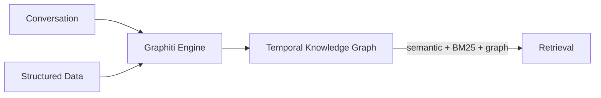
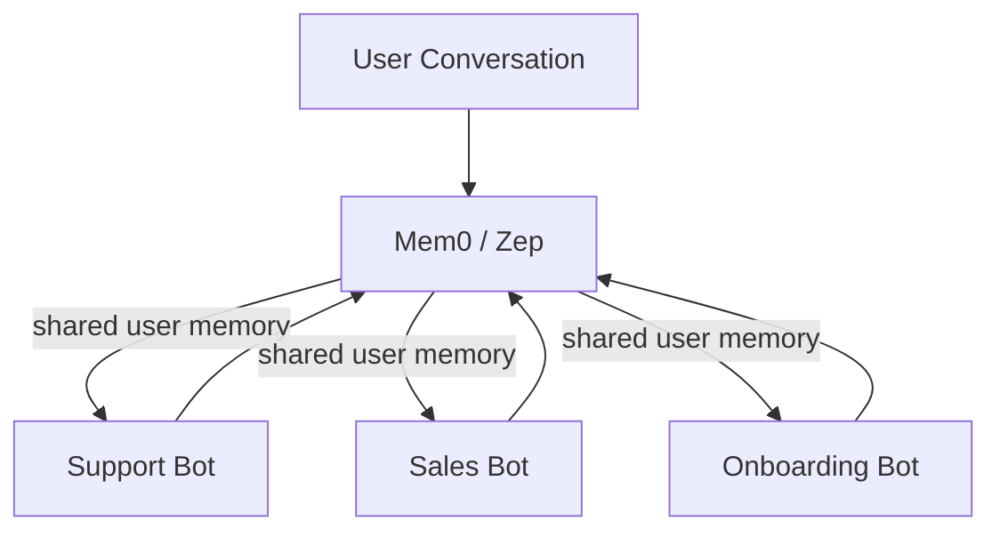

# AI Memory for Bots and Agents

Memory solutions let AI bots and agents remember things across conversations—user preferences, past interactions, facts—so they don't start fresh every time. Choosing the right one depends on how much control you need, your scale, and whether you're building for one user or many bots sharing knowledge.

## The Memory Problem

Without persistent memory:
- Bots repeat the same questions
- No personalization over time
- Agents can't collaborate on shared knowledge
- Context window fills up fast with history

## Memory Scopes

Most solutions support these scopes:

| Scope | What it covers |
|-------|----------------|
| **User** | Facts about a specific user across all sessions |
| **Session** | Short-term context within one conversation |
| **Agent** | Knowledge specific to one bot/agent |
| **Shared** | Memory accessible across multiple agents |

---

## Major Solutions

### Mem0

**Best for: production apps, multi-agent shared memory, fastest path to deployment**

[Mem0](https://mem0.ai) ("mem-zero") is the most widely adopted solution (43K+ GitHub stars). It sits as an orchestration layer between agents and storage, managing the full memory lifecycle.

**Key features:**
- Supports user, session, and agent memory scopes — multiple bots can share or isolate user knowledge
- Multiple memory types: long-term, short-term, semantic, episodic
- Add memory to an agent with a single line of code
- 26% accuracy boost, 90% token savings, 91% lower p95 latency vs baseline
- Integrates with OpenAI, LangGraph, CrewAI, AutoGen
- Managed cloud service + open source

**Excels at:** Production deployments, cost reduction, multi-agent memory sharing, rapid integration

```python
from mem0 import Memory

m = Memory()
m.add("User prefers dark mode", user_id="alice")
results = m.search("UI preferences", user_id="alice")
```

---

### Zep

**Best for: fact-tracking over time, enterprise data + conversation hybrid, research-grade accuracy**

[Zep](https://getzep.com) uses a **Temporal Knowledge Graph** (via its [Graphiti](https://github.com/getzep/graphiti) engine) that tracks how facts *change over time* — not just what's true now, but when things became true or stopped being true.

**Key features:**
- Bi-temporal data modeling: tracks when events happened AND when they were ingested
- Combines semantic embeddings + BM25 keyword search + graph traversal
- Real-time incremental updates (no batch recomputation)
- Merges structured business data with conversational history
- 18.5% accuracy improvement, 90% latency reduction vs baseline
- Outperforms MemGPT on Deep Memory Retrieval benchmark

**Excels at:** Long-horizon accuracy, facts that evolve over time, CRM-style memory, agents needing rich relationship graphs



---

### Supermemory

**Best for: speed-critical apps, document ingestion, automatic context injection**

[Supermemory](https://supermemory.ai) prioritizes raw retrieval speed and automatic context injection — developers write less memory management logic.

**Key features:**
- Sub-300ms recall — up to 10× faster than Zep, 25× faster than Mem0
- Dual indexing: vector store + graph database on every ingest
- Built-in connectors: Google Drive, Notion, OneDrive, PDFs, images, videos
- Analyzes and infers relationships automatically across all ingested content
- Abstracts memory into user profiles vs explicit memory objects

**Excels at:** Speed-sensitive retrieval, knowledge base ingestion, apps where you want memory to "just work" with minimal code

**Trade-off:** Less developer control over memory lifecycle than Mem0; smaller community (13K vs 43K stars)

---

### Letta (formerly MemGPT)

**Best for: agents that manage their own memory, full agent frameworks, research**

[Letta](https://letta.com) is an **agent runtime** built around self-editing memory. Agents themselves decide what stays in active context vs what gets archived — memory management is a first-class agent capability.

**Key features:**
- Agents use dedicated memory tools to promote/demote information
- Complete agent framework with REST API
- In-context memory + archival storage tiers
- Open source, self-hostable
- Community-led development

**Excels at:** Agents with complex, long-running tasks; building custom agent frameworks; research and experimentation

---

## Comparison

| | **Mem0** | **Zep** | **Supermemory** | **Letta** |
|---|---|---|---|---|
| **GitHub Stars** | 43K+ | — | 13K | — |
| **Retrieval Speed** | baseline | 90% faster vs baseline | 25× faster than Mem0 | — |
| **Accuracy Gain** | +26% | +18.5% | SOTA claims | — |
| **Memory Model** | Explicit objects | Temporal knowledge graph | User profiles + graph | Self-editing in-context |
| **Shared agent memory** | Yes (scopes) | Yes | Yes | Limited |
| **Managed cloud** | Yes | Yes | Yes | Self-hosted |
| **Best for** | Production, scale | Temporal facts, enterprise | Speed, ingestion | Agent frameworks |
| **Developer control** | High | High | Lower (auto) | Full |

---

## For Bots Sharing Memory

If multiple bots need to share what they know about users:

1. **Mem0** — easiest: built-in user/agent scopes, widely supported, managed service
2. **Zep** — best if you need shared facts to be temporally consistent (e.g., bot A learns user changed jobs, bot B sees updated fact)
3. **Supermemory** — good if speed is paramount and you want ingested documents to be accessible across agents automatically



---

## Also Worth Knowing

- **LangMem** — LangChain's built-in memory layer, good if you're already in the LangChain ecosystem
- **LlamaIndex** — not a memory layer, but the right tool if you need to search a corpus of documents; see [[rag]]
- **Graphiti** — the open-source knowledge graph engine powering Zep, usable standalone
- **OpenAI Memory** — built into ChatGPT, not available for external agents

## References

- [Mem0 docs](https://docs.mem0.ai/platform/overview)
- [Zep paper: Temporal Knowledge Graph Architecture](https://arxiv.org/abs/2501.13956)
- [Graphiti GitHub](https://github.com/getzep/graphiti)
- [Mem0 vs Supermemory - LogRocket](https://blog.logrocket.com/building-ai-apps-mem0-supermemory/)
- [Picking between Letta, Mem0, Zep - Medium](https://medium.com/asymptotic-spaghetti-integration/from-beta-to-battle-tested-picking-between-letta-mem0-zep-for-ai-memory-6850ca8703d1)
- [Graph Memory for AI Agents - Mem0 blog](https://mem0.ai/blog/graph-memory-solutions-ai-agents)
