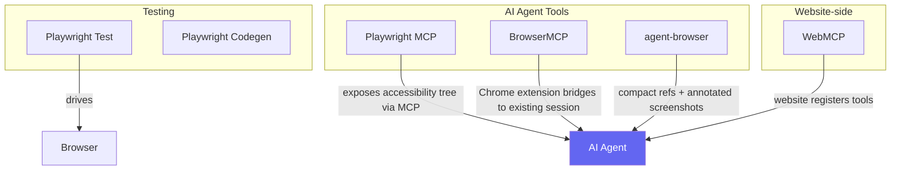
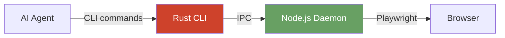
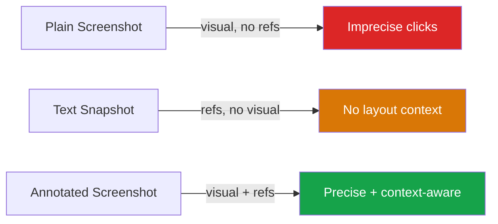

# Browser Automation

Browser automation means controlling a web browser programmatically—clicking buttons, filling forms, navigating pages—either for testing your own app or for building AI agents that browse the web. There are two main use cases: **testing** (verify your app works) and **agentic browsing** (let an AI do things on the web).

## Landscape



---

## Playwright

Playwright is the gold standard for browser automation and testing. It drives Chromium, Firefox, and WebKit with a clean async API.

### CLI

```bash
# Install browsers
npx playwright install
npx playwright install chromium          # specific browser
npx playwright install --with-deps       # include OS deps (CI)

# Run tests
npx playwright test
npx playwright test -g "login"           # filter by name
npx playwright test --project=chromium
npx playwright test --headed             # show browser UI
npx playwright test --debug              # Playwright Inspector
npx playwright test --ui                 # interactive UI mode
npx playwright test -j 4                # 4 parallel workers
npx playwright test -x                   # stop on first failure
npx playwright test --retries 2
npx playwright test --trace on

# Reports
npx playwright show-report               # open last run's HTML report
npx playwright show-trace trace.zip      # open trace viewer
```

### Codegen — Record & Generate Tests

```bash
npx playwright codegen https://example.com
npx playwright codegen -b firefox https://example.com
npx playwright codegen --device "Pixel 5" https://example.com

# Save/restore auth state
npx playwright codegen --save-storage auth.json
npx playwright codegen --load-storage auth.json
```

Opens a browser with a toolbar. As you interact, it generates test code in real time using resilient text-based selectors.

### Trace Viewer

The trace viewer is invaluable for debugging CI failures—it shows a full timeline with actions, network requests, and DOM snapshots for each step.

```bash
npx playwright test --trace on           # record during test run
npx playwright show-trace trace.zip      # view afterwards
```

---

## Playwright MCP

Playwright MCP (`@playwright/mcp`) is a Model Context Protocol server that gives AI agents structured browser access. Instead of analyzing screenshots, the agent calls tools that return the page's **accessibility tree**—no vision model required.

### Install / Configure

```json
{
  "mcpServers": {
    "playwright": {
      "command": "npx",
      "args": ["@playwright/mcp@latest"]
    }
  }
}
```

Works with Claude Desktop, VS Code, Cursor, Windsurf, Cline.

### Key Tools Exposed

| Tool | What it does |
|------|-------------|
| `browser_navigate` | Go to a URL |
| `browser_snapshot` | Get accessibility tree of current page |
| `browser_click` | Click element by ref |
| `browser_fill` | Type into an input |
| `browser_wait_for` | Wait for text/element |
| `browser_evaluate` | Run JS on page |
| `browser_take_screenshot` | Capture viewport image |

### Two Modes

**Default (snapshot mode):** Returns the accessibility tree as structured text. No vision model needed. Cheaper and faster.

**Vision mode:** Coordinate-based interactions. Enable with `--caps vision`.

### Config Flags

```bash
npx @playwright/mcp@latest \
  --browser chromium \           # chromium | firefox | webkit | edge
  --headless \                   # for CI
  --caps vision,pdf,devtools \   # optional capabilities
  --device "iPhone 15" \         # 143 devices supported
  --storage-state auth.json \    # pre-authenticated session
  --port 3000                    # expose as HTTP instead of stdio
```

### Limitation

Accessibility tree dumps can be verbose—large pages produce large outputs that consume significant context. See [[#agent-browser]] for a more token-efficient alternative.

---

## BrowserMCP

`@browsermcp/mcp` is an MCP server that connects to your **existing logged-in Chrome session** via a Chrome extension. Unlike Playwright MCP (which launches a fresh browser), BrowserMCP co-opts your real browser — meaning you get your actual cookies, authenticated sessions, and local storage without any credential setup.

### Key difference from Playwright MCP

| | Playwright MCP | BrowserMCP |
|---|---|---|
| **Browser** | Launches new headless instance | Attaches to your running Chrome |
| **Auth** | Must inject cookies manually | Inherits your real session |
| **Install** | npx only | Requires Chrome extension + MCP server |
| **Use case** | Fresh/isolated automation | Authenticated scraping, session extraction |

### Install / Configure

1. Install the [BrowserMCP Chrome extension](https://chrome.google.com/webstore/detail/browsermcp) from the Chrome Web Store
2. Add to MCP config:

```bash
claude mcp add browsermcp -s user -- npx @browsermcp/mcp@latest
```

Or manually in `~/.claude/mcp.json`:
```json
{
  "mcpServers": {
    "browsermcp": {
      "command": "npx",
      "args": ["@browsermcp/mcp@latest"]
    }
  }
}
```

3. When Claude first uses a BrowserMCP tool, the extension shows an "Allow" prompt in Chrome — click it.

### Key Use Case: Auth Seed Extraction

BrowserMCP is ideal for extracting auth credentials from a live session (cookies, tokens, headers) to seed other tools like `agent-browser` or direct API calls. See the **Auth Bridging Pattern** below.

---

## agent-browser

`agent-browser` is a CLI tool from Vercel Labs purpose-built for AI agents. It uses a **compact ref system** instead of full accessibility trees, claiming ~93% context reduction vs Playwright MCP.

### Architecture



The Rust CLI parses commands with sub-millisecond overhead. A persistent Node.js daemon keeps the browser alive between CLI invocations (no cold start per command).

### Install

```bash
npm install -g agent-browser
agent-browser install    # download browser binaries
```

### Core Workflow — Snapshot + Ref Pattern

```bash
agent-browser open https://example.com/login
agent-browser snapshot -i           # -i = interactive elements only

# Output:
# input "Email" [ref=e1]
# input "Password" [ref=e2]
# button "Sign In" [ref=e3]

agent-browser fill @e1 "user@example.com"
agent-browser fill @e2 "secret"
agent-browser click @e3
agent-browser wait --load networkidle
```

### All Commands

**Navigation:** `open <url>`, `back`, `forward`, `reload`, `close`

**Interaction:** `click @ref`, `fill @ref "text"`, `type @ref "text"`, `hover @ref`, `select @ref "option"`, `check @ref`, `press key`, `scroll`, `drag`, `upload`

**Info:** `get text @ref`, `get html`, `get value @ref`, `get attr @ref name`, `get title`, `get url`

**State checks:** `is visible @ref`, `is enabled @ref`, `is checked @ref`

**Wait:** `wait @ref`, `wait --load networkidle`, `wait --url "pattern"`

**Capture:** `screenshot`, `screenshot --annotate`, `pdf output.pdf`

**Sessions:** `state save auth.json`, `state load auth.json`

**Eval:** `eval "expression"`, `eval --stdin`

### Multiple Sessions

```bash
agent-browser --session agent1 open https://app.com
agent-browser --session agent2 open https://other.com
```

### Annotated Screenshots

Plain screenshots give visual context but lose structure. Text snapshots give structure but lose layout. **Annotated screenshots give both.**

```bash
agent-browser screenshot --annotate
```

Produces an image with numbered labels overlaid on every interactive element, plus a legend:

```
[1] @e1  button "Submit"
[2] @e2  link "Home"
[3] @e3  textbox "Email"
[4] @e4  link "Sign In"
```

The refs are cached—you can immediately interact using them:

```bash
agent-browser fill @e3 "user@example.com"
agent-browser click @e1
```

**Why this matters:**
- Vision models are unreliable at clicking precise pixel coordinates
- Numbered labels remove the ambiguity entirely—the model says "click element 3"
- Handles canvas elements, icon-only buttons, and missing ARIA labels where text snapshots fail



---

## WebMCP

WebMCP flips the model: instead of an agent scraping or automating a website from the outside, the **website itself registers callable tools** the agent can invoke directly.

This is covered in depth in [[agentic-coding/webmcp]]. Quick summary:

```javascript
navigator.modelContext.registerTool({
  name: 'add_to_cart',
  description: 'Add a product to the cart',
  inputSchema: { /* ... */ },
  async execute({ productId, quantity }) {
    await cart.add(productId, quantity);
    return { content: [{ type: 'text', text: 'Added' }] };
  }
});
```

**Status:** Early preview in Chrome 146 Canary (Feb 2026), behind a flag. Not production-ready.

### Comparison

| | Playwright MCP | agent-browser | WebMCP |
|---|---|---|---|
| **Approach** | Accessibility tree via MCP | Compact refs + annotated screenshots | Website-registered tools |
| **Token cost** | High (verbose tree) | Low (~93% reduction) | Very low (schema only) |
| **Website cooperation** | Not needed | Not needed | Required |
| **Auth** | Manual / cookie loading | Session state files | Inherits user's browser session |
| **Reliability** | Breaks on UI changes | Breaks on UI changes | Stable (explicit API) |
| **Status** | Stable, production | Stable, production | Experimental |

---

## Related Topics

- [[agentic-coding/webmcp]] - WebMCP deep dive
- [[mcp]] - Model Context Protocol
- [[cloudflare/tunnels]] - Exposing local services for remote agent access

## References

- [Playwright docs](https://playwright.dev/)
- [microsoft/playwright-mcp](https://github.com/microsoft/playwright-mcp)
- [vercel-labs/agent-browser](https://github.com/vercel-labs/agent-browser)
- [agent-browser.dev](https://agent-browser.dev/)
- [WebMCP W3C spec](https://github.com/webmachinelearning/webmcp)
