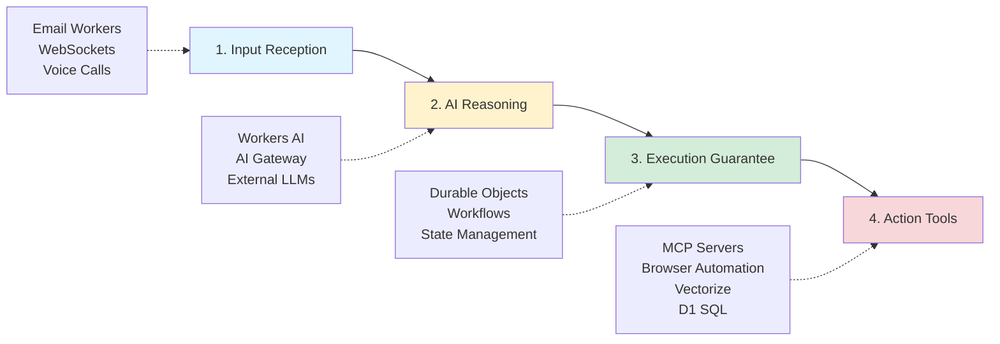

# Cloudflare Platform

Cloudflare's developer platform enables building serverless applications with AI capabilities, durable workflows, and edge compute - all without managing infrastructure.

## Core Products

### Cloudflare Agents
https://agents.cloudflare.com/

Comprehensive platform for building and deploying autonomous AI agents that plan, reason, and execute tasks independently.

**Four-Step Agent Architecture:**

1. **Input Reception** - Capture user data via Email Workers, WebSockets/Workers, or Calls (voice)
2. **AI Reasoning** - Connect to LLMs on Workers AI or external providers through AI Gateway
3. **Execution Guarantee** - Combine Durable Objects (state) with Workflows (orchestration) for reliable operations
4. **Action Tools** - Access external systems through MCP servers, browser automation, Vectorize (vector DB), and D1 (SQL)

**Key Advantages:**

- **Cost efficiency** - Pay only for actual CPU execution time, not wall time (including I/O waits). Traditional GPU utilization averages 20-40%.
- **Long-running connections** - WebSocket hibernation in Durable Objects maintains connections while reducing costs during idle periods
- **Unified platform** - Build entire agent systems without integrating disparate third-party services

### Cloudflare Sandbox
https://sandbox.cloudflare.com/

Containerized execution environment for running commands, managing files, and exposing services via public URLs—all within secure, sandboxed containers.

**Capabilities:**

- **Long-running processes** - Execute extended computational tasks safely
- **Real-time streaming** - Monitor stdout/stderr output live during execution
- **Preview URLs** - Instantly create public URLs for container ports with automatic subdomain routing
- **Code interpreter** - Run Python/JavaScript with parsed visual outputs (charts, tables, images)
- **File system operations** - Perform filesystem tasks and clone Git repositories
- **Interactive terminals** - Full PTY support with xterm-256color emulation
- **Cloud storage mounting** - Integrate S3-compatible buckets as local filesystem paths
- **Custom Docker images** - Add sandbox capabilities to existing Docker images
- **AI coding agents** - Run assistants like Claude Code with preconfigured environments

**Integration:** Use the `@cloudflare/sandbox` npm package within Cloudflare Workers for automated testing, code execution, service exposure, and AI agent deployment.

### Cloudflare Containers
https://containers.cloudflare.com/

Run Docker containers on Cloudflare's global edge network without managing infrastructure. Currently in public beta.

**Key Features:**

- **Simple deployment** - Write a Dockerfile, add `compatibility_flags = ["containers"]` to wrangler.toml, run `wrangler deploy`
- **Global by default** - Deploy to "Region: Earth" with automatic global distribution
- **Docker-native** - Full Dockerfile support with custom images
- **Worker integration** - Use containers alongside Workers, Workflows, Queues, and AI services

**Use Cases:**

- Stateless and stateful routing
- Regional placement
- Workflow and Queue integrations
- AI-generated code execution
- Short-lived workloads

**Beta Limitations:**

- No built-in autoscaling or load balancing (manual scaling in code)
- Not designed for long-running or persistent containers
- Limited orchestration tools for multi-service deployments

**Roadmap:** Planned improvements include utilization-based autoscaling, latency-aware load balancing, increased container limits, and reduced log noise.

Reference: [Cloudflare Containers Documentation](https://developers.cloudflare.com/containers/)

## Workers AI

Run AI models serverlessly at the edge with GPU acceleration across 200+ cities worldwide.

### Capabilities

- **50+ curated open-source models** - Llama, Stable Diffusion, Mistral, and more
- **OpenAI-compatible API** - Drop-in replacement for existing applications
- **Serverless pricing** - Pay only for what you use, no idle infrastructure costs
- **Edge inference** - Low-latency model execution close to users
- **Multiple modalities** - Text generation, image classification, object detection, transcription, TTS, embeddings

### GLM-4.7-Flash Model

New multilingual text generation model (announced Feb 13, 2026) with exceptional capabilities:

- **131,072 token context window** - Handle lengthy documents and complex reasoning
- **Multi-turn tool calling** - AI agents can invoke functions across conversation turns
- **Multilingual support** - Generate content across multiple languages
- **Fast inference** - Optimized for low-latency chatbot and assistant applications
- **Strong instruction-following** - Excellent for code generation and structured tasks

**Access options:**
- Workers AI binding (inside Workers)
- REST API endpoints
- AI Gateway
- Vercel AI SDK via `workers-ai-provider`

### Pricing

- **Rate:** $0.011 per 1,000 Neurons
- **Free tier:** 10,000 Neurons per day (included in Free and Paid plans)
- **Neuron mapping:** Each model's input format (tokens, audio seconds, images) maps to Neurons
- **Third-party billing:** Pay for OpenAI, Anthropic, etc. usage through Cloudflare invoice (small convenience fee)

Reference: [Workers AI Pricing](https://developers.cloudflare.com/workers-ai/platform/pricing/)

## Workflows

Build reliable multi-step applications that chain operations, automatically retry failures, and persist state - running from seconds to weeks without infrastructure management.

### Key Features

- **Durable execution** - Built-in error handling and automatic retries
- **Extended pauses** - Sleep functions lasting seconds to days (`sleep()`)
- **Event-driven** - Pause for external events (approvals, webhooks) before resuming
- **Programmatic control** - Trigger, pause, resume, or terminate instances via API
- **Integrated observability** - Debugging and monitoring built-in

### Architecture

Built on Cloudflare Workers, Workflows execute through durable steps that maintain state throughout execution. This eliminates typical serverless timeout constraints while providing reliability guarantees.

### Use Cases

- **AI applications** - Multi-step agent workflows with retries
- **Data pipelines** - Automated ETL and processing chains
- **User lifecycle management** - Scheduled communications, trial expirations
- **Approval systems** - Human-in-the-loop workflows requiring intervention

### Pricing

Available on both Free and Paid plans.

Reference: [Workflows Documentation](https://developers.cloudflare.com/workflows/)

Announcement: https://x.com/akaphill/status/2019424480322605104

## Libraries and SDKs

### @cloudflare/tanstack-ai

New library (Feb 2026) integrating TanStack AI with Cloudflare infrastructure.

**Configuration modes:**
1. Plain binding (inside Workers)
2. Plain REST (external)
3. AI Gateway binding
4. AI Gateway REST

**Supported features:**
- Chat with tool calling and structured output
- Image generation
- Transcription (speech-to-text)
- Text-to-speech
- Text summarization
- Third-party provider routing (OpenAI, Anthropic, Gemini) through AI Gateway

**Playground:** https://tanstack-ai-playground.threepointone.workers.dev

### workers-ai-provider (v3.1.1)

Vercel AI SDK provider for Workers AI with major improvements.

**New capabilities (v3.1.x):**
- **Transcription** - Speech-to-text with automatic model-specific input handling
- **Text-to-speech** - Voice and speed customization
- **Document reranking** - For RAG pipelines

**Reliability fixes (v3.0.5):**
- Proper token-by-token streaming
- Improved tool calling with preserved conversation history
- Detection of premature stream termination

**Playground:** https://workers-ai-provider-playground.threepointone.workers.dev

Quote from [@threepointone](https://x.com/threepointone/status/2022358006588149882):
> "We spent the past couple of weeks fixing tons of bugs in our libs related to streaming, tool calling, rendering, just everything. It's gone from being janky to very very smooth. Every model shines now."

Reference: [Changelog](https://developers.cloudflare.com/changelog/2026-02-13-glm-47-flash-workers-ai/)

## Cloudflare AI Search

Managed search service for building AI-powered search and RAG (retrieval-augmented generation) applications. Automatically creates continuously updating indexes from your data sources that you can query with natural language.

### Capabilities

- **Automated indexing** - Continuously indexes connected data sources without manual reprocessing
- **Multiple data sources** - Supports websites (via crawling) and R2 buckets for unstructured content
- **Query rewriting** - Transforms input queries using Workers AI LLMs to improve retrieval quality
- **Multitenancy** - Use metadata filtering to create secure, personalized AI assistants from a single instance
- **Similarity caching** - Caches repeated queries for improved latency
- **Conversational search** - NLWeb integration with `/ask` and `/mcp` endpoints

### Recent Features (2026)

- **Granular indexing controls** - Reindex specific files instead of rescanning entire data sources
- **Sitemap specification** - Limit crawler to specific sitemaps for targeted indexing
- **Path filtering** - Include/exclude rules for controlling which content gets indexed
- **Multi-tenant support** - Metadata filtering ensures users only query their authorized data
- **Metrics and monitoring** - Track file indexing, search activity, and top retrievals

### Integration

Primary integration through Cloudflare Workers using native bindings. Works with Vectorize, Workers AI, R2, AI Gateway, and supports third-party providers.

### Pricing

Available on all Cloudflare plans.

Reference: [Cloudflare AI Search Documentation](https://developers.cloudflare.com/ai-search/)

## Moltworker

Self-hosted personal AI agent built on Cloudflare Workers (announced Feb 14, 2026).

**Key question:** Can OpenClaw be deployed to Cloudflare Platform cheaper than Digital Ocean infrastructure/VPS?

Reference: [Moltworker Blog Post](https://blog.cloudflare.com/moltworker-self-hosted-ai-agent/)

## Related Topics

- [[serverless-architecture]]
- [[edge-computing]]
- [[ai-agents]]
- [[durable-execution]]

## Resources

### Official Documentation
- [Workers AI Overview](https://developers.cloudflare.com/workers-ai/)
- [Workers AI Product Page](https://workers.cloudflare.com/product/workers-ai/)
- [Workflows Documentation](https://developers.cloudflare.com/workflows/)
- [AI Gateway Pricing](https://developers.cloudflare.com/ai-gateway/reference/pricing/)

### Community
- [Cloudflare Community - Workers AI](https://community.cloudflare.com/t/workers-ai-workers-ai-updated-pricing/819674)

### Pricing Resources
- [Workers Pricing](https://developers.cloudflare.com/workers/platform/pricing/)
- [AI Gateway Pricing Explained](https://www.truefoundry.com/blog/cloudflare-ai-gateway-pricing-a-complete-breakdown)

## Sources

- [Pricing · Cloudflare Workers AI docs](https://developers.cloudflare.com/workers-ai/platform/pricing/)
- [Pricing · Cloudflare Workers docs](https://developers.cloudflare.com/workers/platform/pricing/)
- [Workers Pricing](https://workers.cloudflare.com/pricing)
- [Overview · Cloudflare Workers AI docs](https://developers.cloudflare.com/workers-ai/)
- [Cloudflare AI Gateway Pricing Explained For 2026](https://www.truefoundry.com/blog/cloudflare-ai-gateway-pricing-a-complete-breakdown)
- [Cloudflare Workers AI - Edge AI Inference Platform](https://workers.cloudflare.com/product/workers-ai/)
- [Workers AI - Workers AI updated pricing - Changelog](https://community.cloudflare.com/t/workers-ai-workers-ai-updated-pricing/819674)
- [Workers AI | Cloudflare](https://www.cloudflare.com/developer-platform/products/workers-ai/)
- [Pricing · Cloudflare AI Gateway docs](https://developers.cloudflare.com/ai-gateway/reference/pricing/)
- [Workers AI updated pricing · Changelog](https://developers.cloudflare.com/changelog/2025-02-20-updated-pricing-docs/)
