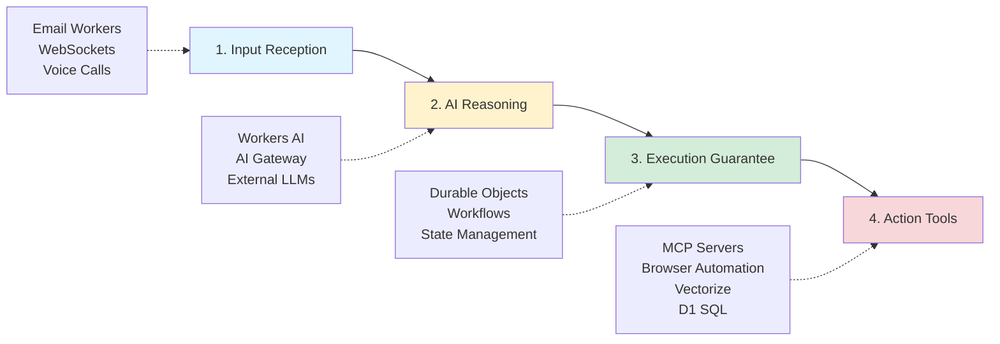

# Cloudflare Agents

Cloudflare Agents are AI systems that can plan out tasks, make decisions, and execute actions on their own without you telling them every step. Think of it like an AI assistant that can figure out how to solve problems and actually do the work, not just answer questions.

Reference: https://agents.cloudflare.com/

## Four-Step Agent Architecture



### 1. Input Reception

Capture user data via multiple channels:
- **Email Workers** - Process incoming emails
- **WebSockets/Workers** - Real-time user interactions
- **Calls** - Voice-based input

### 2. AI Reasoning

Connect to LLMs for decision-making:
- **Workers AI** - 50+ models on Cloudflare's edge
- **AI Gateway** - Route to external providers (OpenAI, Anthropic, etc.)
- **External LLMs** - Direct integration with third-party models

### 3. Execution Guarantee

Ensure reliable, stateful execution:
- **Durable Objects** - Persistent state management
- **Workflows** - Multi-step orchestration with retries
- **State Management** - Maintain context across interactions

### 4. Action Tools

Access external systems and data:
- **MCP Servers** - Model Context Protocol for tool integration
- **Browser Automation** - Web scraping and interaction
- **Vectorize** - Vector database for semantic search
- **D1 SQL** - Relational database queries

## Key Advantages

**Cost Efficiency**
- Pay only for actual CPU execution time, not wall time (including I/O waits)
- Traditional GPU utilization averages 20-40%
- Cloudflare's model eliminates idle time charges

**Long-Running Connections**
- WebSocket hibernation in Durable Objects maintains connections
- Reduces costs during idle periods
- Supports persistent agent sessions

**Unified Platform**
- Build entire agent systems without integrating disparate third-party services
- All primitives (AI, storage, state, networking) in one platform
- Simplified development and deployment

## Example: Simple Agent

```typescript
import { Agent } from '@cloudflare/agents';

export class MyAgent extends Agent {
  async run(input: string) {
    // Reasoning step
    const plan = await this.llm({
      messages: [{ role: 'user', content: input }]
    });

    // Execute with state
    const result = await this.workflow.do('execute plan', async () => {
      // Use tools
      const data = await this.tools.vectorize.query(plan.query);
      return data;
    });

    return result;
  }
}
```

## Related Topics

- [[workers-ai]] - AI models and inference
- [[workflows]] - Durable execution
- [[ai-search]] - RAG and search
- [[durable-objects]] - State management

## Resources

- [Cloudflare Agents](https://agents.cloudflare.com/)
- [Agents SDK Documentation](https://developers.cloudflare.com/agents-sdk/)
