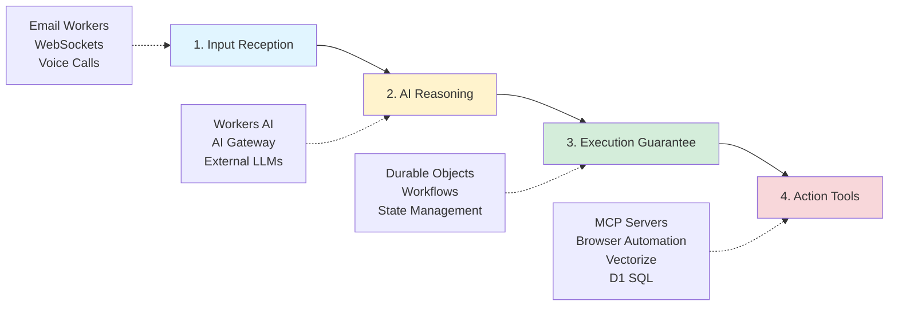

# Cloudflare Agents

Cloudflare Agents are AI systems that can plan out tasks, make decisions, and execute actions on their own without you telling them every step. Think of it like an AI assistant that can figure out how to solve problems and actually do the work, not just answer questions.

Reference: https://agents.cloudflare.com/

## Four-Step Agent Architecture


```mermaid
graph LR
    A[1. Input Reception] --> B[2. AI Reasoning]
    B --> C[3. Execution Guarantee]
    C --> D[4. Action Tools]

    A1[Email Workers<br/>WebSockets<br/>Voice Calls] -.-> A
    B1[Workers AI<br/>AI Gateway<br/>External LLMs] -.-> B
    C1[Durable Objects<br/>Workflows<br/>State Management] -.-> C
    D1[MCP Servers<br/>Browser Automation<br/>Vectorize<br/>D1 SQL] -.-> D

    style A fill:#e1f5ff
    style B fill:#fff3cd
    style C fill:#d4edda
    style D fill:#f8d7da
```

### 1. Input Reception

Capture user data via multiple channels:
- **Email Workers** - Process incoming emails
- **WebSockets/Workers** - Real-time user interactions
- **Calls** - Voice-based input

### 2. AI Reasoning

Connect to LLMs for decision-making:
- **Workers AI** - 50+ models on Cloudflare's edge
- **AI Gateway** - Route to external providers (OpenAI, Anthropic, etc.)
- **External LLMs** - Direct integration with third-party models

### 3. Execution Guarantee

Ensure reliable, stateful execution:
- **Durable Objects** - Persistent state management
- **Workflows** - Multi-step orchestration with retries
- **State Management** - Maintain context across interactions

### 4. Action Tools

Access external systems and data:
- **MCP Servers** - Model Context Protocol for tool integration
- **Browser Automation** - Web scraping and interaction
- **Vectorize** - Vector database for semantic search
- **D1 SQL** - Relational database queries

## Key Advantages

**Cost Efficiency**
- Pay only for actual CPU execution time, not wall time (including I/O waits)
- Traditional GPU utilization averages 20-40%
- Cloudflare's model eliminates idle time charges

**Long-Running Connections**
- WebSocket hibernation in Durable Objects maintains connections
- Reduces costs during idle periods
- Supports persistent agent sessions

**Unified Platform**
- Build entire agent systems without integrating disparate third-party services
- All primitives (AI, storage, state, networking) in one platform
- Simplified development and deployment

## Example: Simple Agent

```typescript
import { Agent } from '@cloudflare/agents';

export class MyAgent extends Agent {
  async run(input: string) {
    // Reasoning step
    const plan = await this.llm({
      messages: [{ role: 'user', content: input }]
    });

    // Execute with state
    const result = await this.workflow.do('execute plan', async () => {
      // Use tools
      const data = await this.tools.vectorize.query(plan.query);
      return data;
    });

    return result;
  }
}
```

## February 2026 SDK Updates

### CodeMode Rewrite (Modular, Runtime-Agnostic)

The Agents SDK was completely rewritten into a modular, runtime-agnostic architecture. This improves how AI models orchestrate tools and makes the SDK portable beyond just Cloudflare Workers.

### Workflows Integration

Agents can now trigger and coordinate with [[workflows]] directly, combining real-time chat with durable multi-step execution.

### `scheduleEvery()` Method

Fixed-interval recurring tasks without cron syntax:

```typescript
export class MyAgent extends Agent {
  async onStart() {
    // Run every 5 minutes
    this.scheduleEvery("5 minutes", async () => {
      await this.checkForUpdates();
    });
  }
}
```

### Readonly Connections

Spectator views can connect to an agent in read-only mode, observing state changes without being able to modify them. Useful for dashboards and monitoring UIs.

### Custom MCP OAuth Providers

Advanced authentication for MCP connections, allowing agents to use custom OAuth providers for secure tool access.

### Retry Utilities

Built-in retry with exponential backoff for resilient tool calls and external API interactions.

### Per-Connection WebSocket Protocol Control

Fine-grained control over protocol messages on a per-connection basis for WebSocket clients.

## Related Topics

- [[workers-ai]] - AI models and inference
- [[workflows]] - Durable execution
- [[ai-search]] - RAG and search
- [[durable-objects]] - State management

## RPC Transport for MCP (v0.6.0)

You can connect an `Agent` to an `McpAgent` in the same Worker using a Durable Object binding instead of an HTTP URL. No network round-trips, no serialization overhead.

```typescript
import { Agent } from "agents";

export class MyAgent extends Agent {
  async onStart() {
    // Pass the DO namespace directly — stays inside the Cloudflare runtime
    await this.addMcpServer("counter", env.MY_MCP);

    // With per-user props
    await this.addMcpServer("counter", env.MY_MCP, {
      props: { userId: "user-123", role: "admin" },
    });
  }
}
```

`addMcpServer` accepts `string | DurableObjectNamespace` — HTTP and RPC paths are type-safe and cannot be mixed.

Key behaviors:
- **Hibernation** — RPC connections survive DO hibernation; binding name and props are persisted to storage and restored on wake-up
- **Deduplication** — calling `addMcpServer` with the same server name returns the existing connection; stable IDs across hibernation restore
- **Smaller internals** — `RPCServerTransport` rewritten from 609 → 245 lines, uses `JSONRPCMessageSchema` from the MCP SDK for validation

> RPC transport is experimental; API may change.

## Hardened JSON Schema Converter (v0.6.0)

The schema converter used by `generateTypes()` and `getAITools()` now handles edge cases that previously crashed in production:

| Fix | Detail |
|-----|--------|
| Depth + circular reference guards | Prevents stack overflows on recursive schemas |
| `$ref` resolution | Supports `#/definitions/...`, `#/$defs/...`, `#` |
| Tuple support | `prefixItems` (2020-12) and array `items` (draft-07) |
| OpenAPI `nullable: true` | Supported across all schema branches |
| Per-tool error isolation | One bad schema can't crash the full `generateTypes()`/`getAITools()` pipeline |
| Missing `inputSchema` fallback | `getAITools()` falls back to `{ type: "object" }` instead of throwing |

## Resources

- [Cloudflare Agents](https://agents.cloudflare.com/)
- [Agents SDK Documentation](https://developers.cloudflare.com/agents-sdk/)
- [Agents SDK v0.6.0 changelog](https://developers.cloudflare.com/changelog/post/2026-02-25-agents-sdk-v060/)
