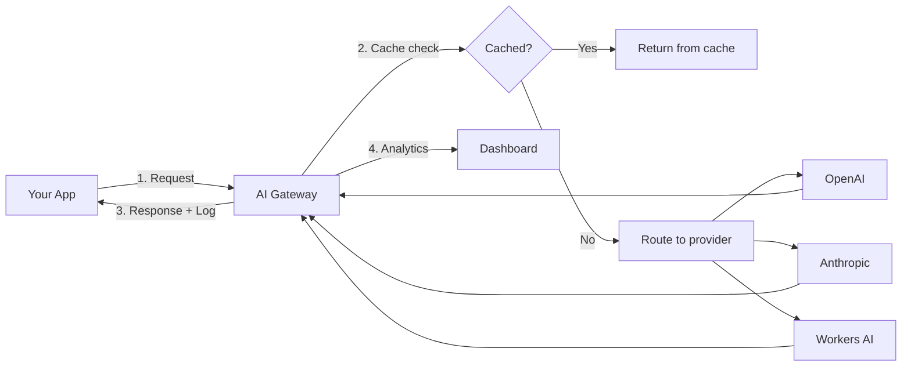

# AI Gateway

AI Gateway is Cloudflare's unified proxy for AI APIs that adds caching, analytics, rate limiting, and failover to any AI provider—completely free. One line of code replaces your API endpoint and instantly gives you observability, cost savings, and reliability without changing your application logic.

## Key Features

**Unified API** - Single OpenAI-compatible endpoint works with 20+ providers. Switch between OpenAI, Anthropic, Google, Workers AI, or others by changing the model parameter.

**Caching** - Serve identical requests from Cloudflare's edge cache, reducing latency by 90% and cutting costs on repeated queries. Cache TTL is configurable per request.

**Analytics & Cost Tracking** - Monitor requests, tokens, latency, errors, and costs across all providers in one dashboard. No instrumentation needed.

**Rate Limiting** - Throttle requests per user, API key, or globally. Prevents runaway costs and abuse.

**Resilience** - Automatic retries on transient failures, model fallback if primary provider is down, and configurable timeouts.

**Multi-Provider Routing** - Route requests to different providers based on user segments, geography, or A/B testing without code changes.

## Quick Setup

### 1. Create Gateway

Dashboard: **AI > AI Gateway > Create Gateway**

Or via API:
```bash
curl -X POST "https://api.cloudflare.com/client/v4/accounts/{account_id}/ai-gateway/gateways" \
  -H "Authorization: Bearer {api_token}" \
  -H "Content-Type: application/json" \
  -d '{"name": "my-gateway"}'
```

### 2. Update Your Code

Replace your base URL with AI Gateway endpoint:

```typescript
// Before
const client = new OpenAI({
  apiKey: process.env.OPENAI_API_KEY,
  baseURL: "https://api.openai.com/v1"
});

// After - just change baseURL
const client = new OpenAI({
  apiKey: process.env.OPENAI_API_KEY,
  baseURL: "https://gateway.ai.cloudflare.com/v1/{account_id}/{gateway_id}/openai"
});

// Or use compat endpoint to switch providers
const client = new OpenAI({
  apiKey: "{cf_api_token}",
  baseURL: "https://gateway.ai.cloudflare.com/v1/{account_id}/{gateway_id}/compat"
});

// Now switch models across providers
await client.chat.completions.create({
  model: "openai/gpt-4o",  // or "anthropic/claude-sonnet-4-5"
  messages: [{ role: "user", content: "Hello!" }]
});
```

### 3. Enable Features

**Caching:**
```typescript
await client.chat.completions.create({
  model: "openai/gpt-4o",
  messages: [...],
  // Cache for 1 hour
  extra_headers: { "cf-aig-cache-ttl": "3600" }
});
```

**Metadata for analytics:**
```typescript
extra_headers: {
  "cf-aig-metadata": JSON.stringify({
    user: "user-123",
    feature: "chat"
  })
}
```

## Architecture



## Supported Providers

- **OpenAI** - GPT-4, GPT-3.5, DALL-E, Whisper
- **Anthropic** - Claude models
- **Google** - Gemini, PaLM
- **Workers AI** - Cloudflare's inference platform
- **Azure OpenAI** - Enterprise OpenAI deployments
- **HuggingFace** - Open models
- **Replicate** - Community models
- **Cohere, Groq, Perplexity** - And 10+ more

Full list: https://developers.cloudflare.com/ai-gateway/providers/

## Use Cases

**Cost Optimization** - Cache frequent queries (RAG retrievals, translations, summaries) and cut API costs by 50-90%.

**Multi-Provider Strategy** - Use GPT-4 for complex tasks, Claude for long context, and Workers AI for cheap batch jobs—all through one gateway.

**Observability** - Track which features/users consume the most tokens. Identify slow or expensive queries.

**Resilience** - Automatic failover from OpenAI to Anthropic if one provider has downtime.

**Rate Limiting** - Prevent bill shock by capping requests per user or globally.

## Dynamic Routes

Dynamic Routes let you configure request routing logic inside AI Gateway itself—no code changes or redeployments needed. Routes can be created via the dashboard UI or REST API (simple JSON structure).

### Use Cases

**A/B testing models** - Split traffic by percentage to compare models head-to-head (e.g. 50% Qwen vs 50% Kimi). The response includes which model was used, so you can measure performance. Changes take effect immediately without touching your app.

**Tiered routing by plan** - Route free users to smaller, cheaper models and paid users to more powerful ones. Pass the user's plan via request headers or metadata, then branch in AI Gateway accordingly.

**Rate-limit-triggered fallback** - Once a paid user hits a rate limit, automatically switch them to a cheaper model (or block entirely) rather than erroring out.

**Complex branching** - Combine the above with nested if/else logic: split paid/free first, then A/B test within each branch using percentages.

### Sticky Sessions (Not Yet Built-in)

AI Gateway doesn't natively support sticky routing (assigning a user to one model and keeping them there across requests). This could be jarring for conversational apps where model-hopping changes behavior mid-session. Workaround: track the assigned model in your own session store and pass it as a header/metadata hint to influence routing.

### Response Metadata

The AI Gateway response includes the model that actually served the request—useful for logging, evaluation, and cost attribution when doing A/B tests.

### Pricing

Dynamic routes are **free**.

## Workers Binding

For Cloudflare Workers, use native binding instead of HTTP:

```toml
# wrangler.jsonc
{
  "ai_gateway": {
    "id": "{gateway_id}",
    "binding": "AI_GATEWAY"
  }
}
```

```typescript
export default {
  async fetch(request, env) {
    // Get provider-specific URL
    const url = env.AI_GATEWAY.getUrl("openai");

    // Or use run() for Workers AI
    const response = await env.AI_GATEWAY.run("@cf/meta/llama-3", {
      prompt: "Hello!"
    });

    return new Response(JSON.stringify(response));
  }
};
```

## Cost Savings Example

```typescript
// Without caching: 1000 identical queries/day
// Cost: 1000 × $0.03 = $30/day = $900/month

// With AI Gateway caching (95% hit rate)
// Cost: 50 × $0.03 = $1.50/day = $45/month
// Savings: $855/month (95% reduction)
```

## Pricing

**Free on all Cloudflare plans.** No request limits, no hidden fees.

## Common Patterns

**Cache embeddings:**
```typescript
// Expensive: $0.0001/1K tokens
// Cache for 7 days since content rarely changes
extra_headers: { "cf-aig-cache-ttl": "604800" }
```

**A/B test models:**
```typescript
// Route 10% traffic to new model via dashboard rules
// No code changes needed
```

**Track per-user costs:**
```typescript
extra_headers: {
  "cf-aig-metadata": JSON.stringify({
    user_id: user.id,
    tier: user.plan  // free/pro/enterprise
  })
}
// View cost breakdown by tier in analytics
```

## Limitations

- Cache is based on exact request match (prompt + model + params must be identical)
- Semantic caching planned but not yet available
- Streaming responses cannot be cached
- Analytics data retained for 30 days

## Related Topics

- [[workers-ai]] - Cloudflare's inference platform
- [[vectorize]] - Vector database for RAG
- [[workers]] - Edge compute for AI apps

## References

- [AI Gateway Docs](https://developers.cloudflare.com/ai-gateway/)
- [Getting Started Guide](https://developers.cloudflare.com/ai-gateway/get-started/)
- [Caching Features](https://developers.cloudflare.com/ai-gateway/features/caching/)
- [Supported Providers](https://developers.cloudflare.com/ai-gateway/usage/providers/)
- [AI Gateway Product Page](https://www.cloudflare.com/developer-platform/products/ai-gateway/)
