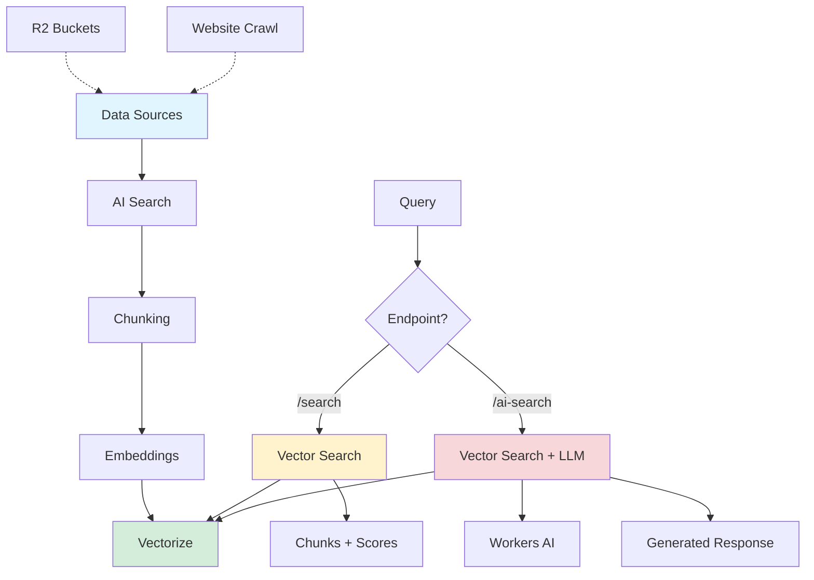

# Cloudflare AI Search

Managed search service for building AI-powered search and RAG (retrieval-augmented generation) applications. Automatically creates continuously updating indexes from your data sources.

## Key Concept: Two API Endpoints

AI Search provides **two separate endpoints** for different use cases:

### `/search` - Plain Vector Similarity Search

**Use when:** You want the automated pipeline but just need raw search results (no AI-generated responses)

```bash
POST /accounts/{ACCOUNT_ID}/autorag/rags/{NAME}/search
```

**What you get:**
- ✅ Automated R2 indexing pipeline
- ✅ Automatic chunking
- ✅ Automatic embedding generation
- ✅ Continuous updates
- ✅ Just matching chunks with scores (no LLM synthesis)

**Example request:**
```json
{
  "query": "your search query",
  "rewrite_query": false,
  "max_num_results": 10,
  "reranking": {
    "enabled": true
  },
  "filters": {
    "folder": "docs/"
  }
}
```

**Response:** Array of matching chunks with metadata and relevance scores.

### `/ai-search` - Full AI Search with Response Generation

**Use when:** You want RAG - retrieve relevant content AND generate an AI response

```bash
POST /accounts/{ACCOUNT_ID}/autorag/rags/{NAME}/ai-search
```

**Additional capabilities:**
- ✅ Everything from `/search`
- ✅ LLM response generation using retrieved context
- ✅ Streaming support
- ✅ Custom system prompts
- ✅ Model selection

**Example request:**
```json
{
  "query": "How do I deploy a Worker?",
  "max_num_results": 5,
  "model": "@cf/meta/llama-3.1-8b-instruct",
  "system_prompt": "You are a helpful Cloudflare assistant.",
  "stream": true
}
```

**Response:** AI-generated answer based on retrieved chunks.

## Use AI Search as "Managed Vectorize"

**Pattern:** Use AI Search's automated pipeline with plain vector search

1. **Set up data source** (R2 bucket or website crawler)
2. **AI Search handles:**
   - Document chunking
   - Embedding generation (using Workers AI)
   - Vector indexing (in Vectorize)
   - Continuous updates
3. **Query via `/search`** for raw similarity results
4. **Optionally enable reranking** for better quality

**Why this works:**
- You get the managed indexing pipeline without building it yourself
- You can still do custom ranking, filtering, or post-processing
- No need to manage chunking strategies or embedding models
- Cheaper than `/ai-search` if you don't need response generation

## Capabilities

### Automated Indexing

- **Continuously indexes** connected data sources without manual reprocessing
- **Multiple sources** - Websites (via crawling) and R2 buckets
- **Granular controls** - Reindex specific files, sitemap specification, path filtering

### Query Enhancement

- **Query rewriting** - Transforms input using Workers AI LLMs (`rewrite_query: true`)
- **Reranking** - Reorders results by semantic relevance (`reranking.enabled: true`)
- **Similarity caching** - Caches repeated queries for lower latency

### Multitenancy

Use metadata filtering to create secure, personalized AI assistants from a single instance:

```json
{
  "query": "user question",
  "filters": {
    "user_id": "user-123",
    "tenant": "acme-corp"
  }
}
```

## Shared Parameters (Both Endpoints)

| Parameter | Type | Default | Description |
|-----------|------|---------|-------------|
| `query` | string | *required* | Search query text |
| `rewrite_query` | boolean | false | Use LLM to rewrite query for better retrieval |
| `max_num_results` | number | 10 | Max results (1-50) |
| `ranking_options.score_threshold` | number | - | Minimum similarity score (0-1) |
| `reranking.enabled` | boolean | false | Enable semantic reranking |
| `reranking.model` | string | - | Reranking model to use |
| `filters` | object | - | Metadata filtering |

## `/ai-search` Only Parameters

| Parameter | Type | Default | Description |
|-----------|------|---------|-------------|
| `model` | string | - | Text generation model |
| `system_prompt` | string | - | Custom system prompt |
| `stream` | boolean | false | Stream response |

## Recent Features (2026)

- **Granular indexing controls** - Reindex specific files
- **Sitemap specification** - Limit crawler to specific sitemaps
- **Path filtering** - Include/exclude rules for indexing
- **Multi-tenant support** - Metadata filtering for secure isolation
- **Metrics and monitoring** - Track file indexing, search activity, top retrievals

## Architecture



## Integration

Primary integration through Cloudflare Workers using native bindings:

```typescript
export default {
  async fetch(request: Request, env: Env) {
    // Plain vector search
    const searchResults = await env.AI_SEARCH.search({
      query: "cloudflare workers",
      max_num_results: 5,
      reranking: { enabled: true }
    });

    // AI search with response generation
    const aiResponse = await env.AI_SEARCH.aiSearch({
      query: "how do I use workers?",
      model: "@cf/meta/llama-3.1-8b-instruct",
      stream: false
    });

    return Response.json({ searchResults, aiResponse });
  }
};
```

## Vectorize vs AI Search

| Feature | Vectorize (Standalone) | AI Search |
|---------|----------------------|-----------|
| **Setup** | Manual chunking, embeddings, indexing | Automated pipeline |
| **Data sources** | You provide vectors | R2 buckets, website crawling |
| **Chunking** | You implement | Automatic |
| **Embeddings** | You generate | Automatic (Workers AI) |
| **Indexing** | Manual upsert | Continuous auto-indexing |
| **Query** | Direct vector query | `/search` or `/ai-search` |
| **Reranking** | DIY | Built-in |
| **Query rewriting** | DIY | Built-in (optional) |
| **Control** | Full control | Less control, easier |

**Use Vectorize directly when:**
- You need custom embedding models
- You have specific chunking requirements
- You want full control over vector operations
- You're building non-search use cases (recommendations, clustering, etc.)

**Use AI Search when:**
- You want search "out of the box"
- You're indexing R2 buckets or websites
- You want automatic reindexing on updates
- You need RAG with minimal code

## Pricing

Available on all Cloudflare plans.

## Related Topics

- [[vectorize]] - Underlying vector database
- [[workers-ai]] - Embedding models and LLMs
- [[workers]] - Integration via bindings

## Resources

- [AI Search Documentation](https://developers.cloudflare.com/ai-search/)
- [AI Search REST API](https://developers.cloudflare.com/ai-search/usage/rest-api/)
- [How AI Search Works](https://developers.cloudflare.com/ai-search/concepts/how-ai-search-works/)
- [AI Search Product Page](https://workers.cloudflare.com/product/ai-search/)
