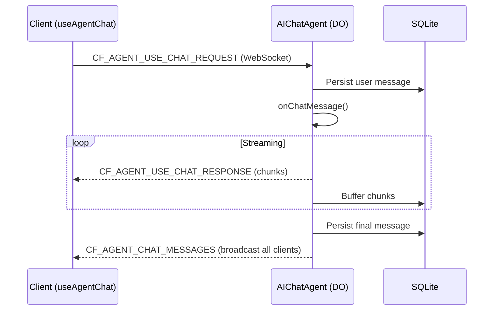

# Chat Agents (AIChatAgent)

Chat agents let you build AI-powered chat interfaces backed by a Cloudflare Durable Object—messages persist automatically in SQLite, streams resume on disconnect, and multiple browser tabs stay in sync in real time.

See also: [[agents]], [[durable-objects]]

Reference: https://developers.cloudflare.com/agents/api-reference/chat-agents/

## Core packages

| Export | Package | Purpose |
|--------|---------|---------|
| `AIChatAgent` | `@cloudflare/ai-chat` | Server-side agent with persistence + streaming |
| `useAgentChat` | `@cloudflare/ai-chat/react` | React hook for chat UI |

```sh
npm install @cloudflare/ai-chat agents ai
```

## How it works



## Minimal setup

### Server

```ts
import { AIChatAgent } from "@cloudflare/ai-chat";
import { createWorkersAI } from "workers-ai-provider";
import { streamText, convertToModelMessages } from "ai";

export class ChatAgent extends AIChatAgent {
  async onChatMessage() {
    const workersai = createWorkersAI({ binding: this.env.AI });
    const result = streamText({
      model: workersai("@cf/meta/llama-3.1-8b-instruct"),
      messages: await convertToModelMessages(this.messages),
    });
    return result.toUIMessageStreamResponse();
  }
}
```

### Client

```tsx
import { useAgent } from "agents/react";
import { useAgentChat } from "@cloudflare/ai-chat/react";

function Chat() {
  const agent = useAgent({ agent: "ChatAgent" });
  const { messages, sendMessage, status } = useAgentChat({ agent });

  return (
    <div>
      {messages.map(msg => (
        <div key={msg.id}>
          <strong>{msg.role}:</strong>
          {msg.parts.map((part, i) =>
            part.type === "text" ? <span key={i}>{part.text}</span> : null
          )}
        </div>
      ))}
      <form onSubmit={e => {
        e.preventDefault();
        const input = e.currentTarget.elements.namedItem("input") as HTMLInputElement;
        sendMessage({ text: input.value });
        input.value = "";
      }}>
        <input name="input" placeholder="Type a message..." />
        <button disabled={status === "streaming"}>Send</button>
      </form>
    </div>
  );
}
```

### wrangler.jsonc

```jsonc
{
  "ai": { "binding": "AI" },
  "durable_objects": {
    "bindings": [{ "name": "ChatAgent", "class_name": "ChatAgent" }]
  },
  "migrations": [{ "tag": "v1", "new_sqlite_classes": ["ChatAgent"] }]
}
```

`new_sqlite_classes` is required — messages and stream buffers are stored in SQLite.

## Server API

### `this.messages`

Current conversation as `UIMessage[]`, loaded from SQLite. Updated automatically after each exchange.

### `maxPersistedMessages`

Caps SQLite storage (oldest messages dropped). Doesn't affect what you send to the LLM.

```ts
maxPersistedMessages = 200;
```

To limit LLM context, use `pruneMessages()` from the AI SDK:

```ts
messages: pruneMessages({
  messages: await convertToModelMessages(this.messages),
  reasoning: "before-last-message",
  toolCalls: "before-last-2-messages",
})
```

### `onChatMessage(onFinish?, options?)`

Override this to handle each message. `options.abortSignal` supports cancellation; `options.body` carries custom client data.

Always forward `abortSignal` to `streamText`—otherwise the LLM keeps running after the user cancels:

```ts
async onChatMessage(_onFinish, options) {
  const result = streamText({
    model: ...,
    messages: await convertToModelMessages(this.messages),
    abortSignal: options?.abortSignal,
  });
  return result.toUIMessageStreamResponse();
}
```

### `persistMessages` / `saveMessages`

```ts
await this.persistMessages(messages);   // Store only
await this.saveMessages(messages);      // Store + trigger onChatMessage
```

## Client API — `useAgentChat` options

| Option | Default | Description |
|--------|---------|-------------|
| `agent` | required | From `useAgent()` |
| `onToolCall` | — | Handle client-side tools |
| `autoContinueAfterToolResult` | `true` | Resume after client tools |
| `resume` | `true` | Resume stream on reconnect |
| `body` | — | Custom data sent with every request |
| `getInitialMessages` | — | Set to `null` to skip HTTP fetch |

Return values: `messages`, `sendMessage`, `clearHistory`, `addToolOutput`, `addToolApprovalResponse`, `setMessages`, `status`.

## Tool patterns

### Server-side (automatic)

```ts
tools: {
  getWeather: tool({
    description: "Get weather for a city",
    inputSchema: z.object({ city: z.string() }),
    execute: async ({ city }) => fetchWeather(city),
  }),
}
```

### Client-side (browser APIs)

Server defines tool without `execute`; client handles via `onToolCall`:

```ts
// Client
const { messages, sendMessage } = useAgentChat({
  agent,
  onToolCall: async ({ toolCall, addToolOutput }) => {
    if (toolCall.toolName === "getLocation") {
      const pos = await new Promise<GeolocationPosition>((res, rej) =>
        navigator.geolocation.getCurrentPosition(res, rej)
      );
      addToolOutput({
        toolCallId: toolCall.toolCallId,
        output: { lat: pos.coords.latitude, lng: pos.coords.longitude },
      });
    }
  },
});
```

### Human-in-the-loop (approval)

```ts
// Server — tool only runs if approved
processPayment: tool({
  inputSchema: z.object({ amount: z.number(), recipient: z.string() }),
  needsApproval: async ({ amount }) => amount > 100,
  execute: async ({ amount, recipient }) => charge(amount, recipient),
})

// Client — render approval UI
msg.parts
  .filter(p => p.type === "tool" && p.state === "approval-required")
  .map(part => (
    <div key={part.toolCallId}>
      <p>Approve {part.toolName}?</p>
      <button onClick={() => addToolApprovalResponse({ id: part.toolCallId, approved: true })}>
        Approve
      </button>
      <button onClick={() => addToolApprovalResponse({ id: part.toolCallId, approved: false })}>
        Reject
      </button>
    </div>
  ))
```

## Data parts (structured streaming)

Attach typed JSON to messages alongside text—progress bars, citations, token usage, etc.

```ts
// Server
const stream = createUIMessageStream({
  execute: async ({ writer }) => {
    writer.merge(result.toUIMessageStream());

    // Reconciliation: same type+id updates in-place
    writer.write({ type: "data-sources", id: "s1", data: { status: "searching" } });
    writer.write({ type: "data-sources", id: "s1", data: { status: "found", results: [...] } });

    // Transient: not persisted, fires onData callback only
    writer.write({ transient: true, type: "data-thinking", data: { startedAt: new Date().toISOString() } });
  },
});

// Client
const { messages } = useAgentChat({
  agent,
  onData(part) {
    if (part.type === "data-thinking") setThinking(true);
  },
});

// Read persistent parts
for (const msg of messages) {
  for (const part of msg.parts) {
    if (part.type === "data-sources") console.log(part.data.results);
  }
}
```

| Pattern | How | Persisted |
|---------|-----|-----------|
| Reconciliation | Same `type` + `id` → updates in-place | Yes |
| Append | No `id` or different `id` | Yes |
| Transient | `transient: true` | No |

## Resumable streaming

Enabled by default. On disconnect, the server keeps streaming and buffering to SQLite. On reconnect, the client replays buffered chunks then resumes live.

Disable: `useAgentChat({ agent, resume: false })`

## Multi-provider support

Works with any AI SDK provider—just swap the model:

```ts
// OpenAI
import { createOpenAI } from "@ai-sdk/openai";
const openai = createOpenAI({ apiKey: this.env.OPENAI_API_KEY });
streamText({ model: openai.chat("gpt-4o"), ... })

// Anthropic
import { createAnthropic } from "@ai-sdk/anthropic";
const anthropic = createAnthropic({ apiKey: this.env.ANTHROPIC_API_KEY });
streamText({ model: anthropic("claude-sonnet-4-5-20250929"), ... })
```

## WebSocket protocol messages

| Message | Direction | Purpose |
|---------|-----------|---------|
| `CF_AGENT_USE_CHAT_REQUEST` | C→S | Send message |
| `CF_AGENT_USE_CHAT_RESPONSE` | S→C | Stream chunks |
| `CF_AGENT_CHAT_MESSAGES` | S→C | Broadcast updated messages |
| `CF_AGENT_CHAT_CLEAR` | Both | Clear conversation |
| `CF_AGENT_CHAT_REQUEST_CANCEL` | C→S | Cancel stream |
| `CF_AGENT_TOOL_RESULT` | C→S | Client tool output |
| `CF_AGENT_TOOL_APPROVAL` | C→S | Approve/reject tool |
| `CF_AGENT_STREAM_RESUMING` | S→C | Stream resumption notice |

## Related Topics

- [[agents]] - Cloudflare Agents SDK overview
- [[durable-objects]] - Underlying state mechanism
- [[workers-ai]] - AI models on the edge
