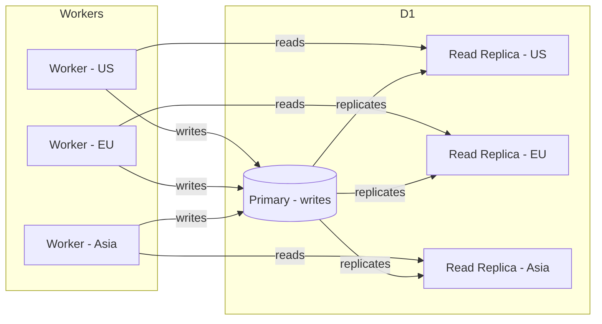

# D1

D1 is Cloudflare's managed SQLite database—a serverless SQL database you can query directly from Workers without spinning up any servers. It scales to zero when idle and follows a traditional "app talks to database over the network" model.

## Architecture

- Each D1 database is a single SQLite file with one **primary** location (internally implemented as a Durable Object)
- All **writes** route to that single primary — D1 is not a distributed write system
- **Reads** are served from auto-created read replicas at Cloudflare PoPs globally
- Single-threaded: queries execute sequentially, one at a time



## Basic Usage

```toml
# wrangler.toml
[[d1_databases]]
binding = "DB"
database_name = "my-db"
database_id = "your-db-id"
```

```ts
// Worker
const result = await env.DB.prepare(
  "SELECT * FROM users WHERE id = ?"
).bind(userId).first();
```

## Transactions

Full SQLite transaction semantics: `BEGIN`, `COMMIT`, `ROLLBACK`. Transactions must complete within a single Worker invocation. No deadlocks (single-threaded), but no write parallelism either.

## Limits

| | Free | Paid |
|---|---|---|
| Row reads | 5M/day | 25B/month included |
| Row writes | 100K/day | 50M/month included |
| Storage | 5 GB total | 5 GB included ($0.75/GB overage) |
| Databases | 10 | 50,000 |
| Max DB size | 500 MB | **10 GB (hard cap)** |
| Queries per invocation | 50 | 1,000 |
| Time Travel (PITR) | 7 days | 30 days |

**Other hard limits:**
- Max columns per table: 100
- Max row/string/BLOB size: 2 MB
- Max SQL statement length: 100 KB

## Migrations

```bash
wrangler d1 migrations create my-db add-users-table
wrangler d1 migrations apply my-db
wrangler d1 migrations list my-db
```

Migrations are plain `.sql` files with sequential version numbers. No auto schema-diffing — you write the SQL yourself.

## Gotchas

1. **10 GB hard cap** — cannot be raised; shard across multiple D1 DBs if needed
2. **Single-threaded writes** — high write concurrency queues up; not for high-throughput transactional workloads
3. **Write latency is regional** — all writes go to one primary; global write-heavy workloads will feel this
4. **No cross-database transactions** — each D1 DB is isolated
5. **100 column limit** — unusual for SQL; wide-table designs hit this fast
6. **Manual migrations** — no schema diffing, hand-write your SQL

## When to Use D1

Good fit:
- Read-heavy global apps (reads hit nearest replica)
- Shared reference data (config, feature flags, product catalog)
- Simple CRUD without per-tenant isolation needs
- Traditional app/DB separation model

Not a good fit:
- Per-user or per-tenant isolated databases → use [[durable-objects]] SQLite instead
- High write throughput → single-threaded writes will bottleneck
- Datasets over 10 GB

## Related

- [[durable-objects]] — per-tenant SQLite colocated with compute, horizontally sharded; how CF AI Gateway is built
- [[workers]] — Workers query D1 via env bindings
