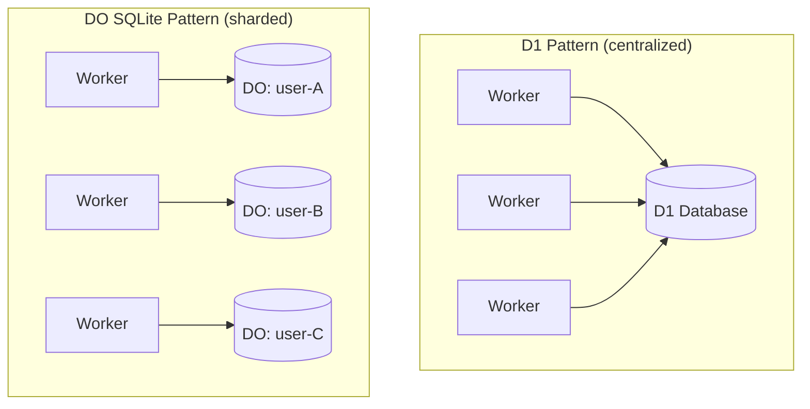

# Durable Objects

Durable Objects (DOs) are Cloudflare's way of giving a single piece of compute its own private state—like a tiny server that lives close to your users and wakes up on demand. Each DO is a single instance with consistent identity, making them perfect for coordination, per-user isolation, and colocated storage.

## DO SQLite vs D1: When to Use Which

This is one of the most important architectural decisions when building on Cloudflare.

| | DO SQLite | D1 |
|---|---|---|
| **Sharding** | Millions of isolated DBs | Single shared DB |
| **Latency** | Fully local (zero network hop) | Slight network overhead |
| **Transactions** | Full ACID transactions | Batch-only, no conditional abort |
| **RPS** | Per-DO (scales horizontally) | Shared limit across all requests |
| **Storage limit** | 10 GB per DO | Per-database limit |
| **Best for** | Per-user/tenant/session | Shared global data |

**Rule of thumb:** D1 is SQLite as a centralized server DB. DO SQLite is SQLite sharded by default with compute colocated.

## Key Reasons to Choose DO SQLite over D1

### 1. Heavy Sharding
When you need hundreds, thousands, or millions of isolated databases—one per user, workspace, or session—DOs are the only practical option. D1 is a single DB; you can't shard it.

### 2. Colocated Compute + Data
With DOs, the logic runs *inside* the same object as the data. Many SQLite queries within a single request have zero network overhead. D1 always adds a network hop between your Worker and the database.

### 3. Per-Tenant Isolation
Each DO gets its own 10 GB SQLite instance. Tenants are physically isolated—one tenant's heavy load doesn't affect another.

### 4. Full Transactions
D1 only supports batching. If you need to conditionally abort a transaction mid-flight, you need DO SQLite.

### 5. Higher Throughput
D1 has shared RPS limits. DOs scale horizontally—each DO handles its own requests independently. This is how Cloudflare AI Search and AI Gateway are built internally.

## Common Patterns

### Per-User DB
```ts
const id = env.MY_DO.idFromName(userId);
const stub = env.MY_DO.get(id);
```
Each user gets their own DO with their own SQLite instance.

### Per-Session / Ephemeral State
Carts, game sessions, collaborative editing rooms—create a DO on demand, use alarms to persist or clean up later.

### Multiplayer / Real-Time
DOs support WebSockets natively. The sync interface lets you skip joins and transactions for multiplayer scenarios.

## When D1 Is Fine

- Shared reference data (product catalog, feature flags, config)
- Low-traffic apps where sharding isn't needed
- You want simple setup without thinking about DO lifecycle

## Architecture Diagram



## Real-World Examples

- **Carts** (cartql.com): Each cart is a DO. Alarms trigger persistence for abandoned cart flows.
- **AI Gateway / AI Search** (Cloudflare internal): Built on DOs for high-throughput, sharded architecture.
- **Per-workspace SaaS**: One DO per workspace, isolated 10 GB SQLite per tenant.

## February 2026 Updates

### `deleteAll()` Clears Alarms

`deleteAll()` now also clears any pending alarms on the Durable Object. Previously, alarms survived a `deleteAll()` call, which could cause unexpected wake-ups on a "clean" object.

Requires a **compatibility flag** to enable -- existing behavior is preserved without the flag.

## Related

- [[agents]] — Agents use DOs for state management and execution guarantees
- [[workers]] — Workers create and interact with DOs via bindings
