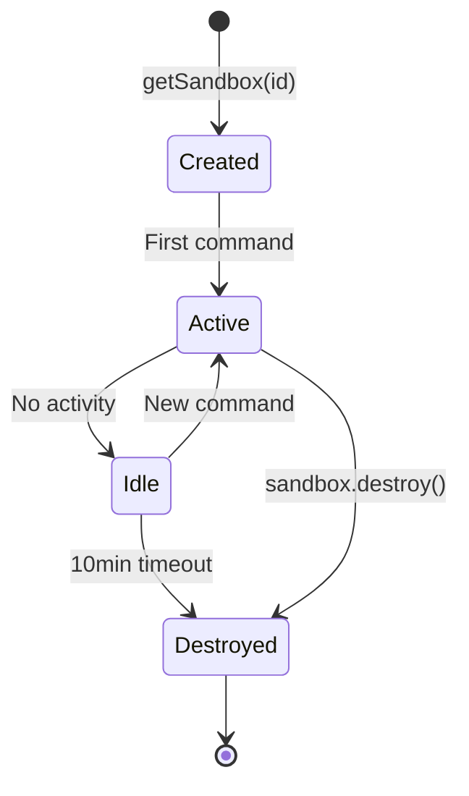

# Cloudflare Sandbox

Cloudflare Sandbox gives you secure, isolated containers where you can run code, execute shell commands, and even expose web services—perfect for building code interpreters, CI/CD systems, or anywhere you need to safely run untrusted code. It's like having a temporary computer that spins up in seconds and disappears when you're done.

Reference: https://sandbox.cloudflare.com/

## Capabilities

**Long-Running Processes**
- Execute extended computational tasks safely
- No time limits typical of serverless functions

**Real-Time Streaming**
- Monitor stdout/stderr output live during execution
- Track progress of long-running operations

**Preview URLs**
- Instantly create public URLs for container ports
- Automatic subdomain routing
- Share running applications without deployment

**Code Interpreter**
- Run Python/JavaScript with parsed visual outputs
- Display charts, tables, images directly
- Perfect for data analysis and visualization

**File System Operations**
- Perform filesystem tasks
- Clone Git repositories
- Manage files programmatically

**Interactive Terminals**
- Full PTY support with xterm-256color emulation
- Connect interactive CLI tools
- Debug running processes

**Cloud Storage Mounting**
- Integrate S3-compatible buckets as local filesystem paths
- Access R2 buckets directly from sandbox

**Custom Docker Images**
- Add sandbox capabilities to existing Docker images
- Bring your own runtime environment

**AI Coding Agents**
- Run assistants like Claude Code with preconfigured environments
- Isolated execution for AI-generated code

## Lifecycle

Sandboxes are ephemeral by design:



- **Idle timeout**: 10 minutes (configurable). After this, all files and processes are gone.
- **State is not persistent** — treat every sandbox as disposable. Mount R2/S3 if you need durable storage.
- **Backups**: `sandbox.createBackup()` / `sandbox.restoreBackup()` for point-in-time snapshots of directories.

## Core API

### Lifecycle

```typescript
const sandbox = await env.SANDBOX.getSandbox("sandbox-id");
await sandbox.destroy();
```

### Command Execution

```typescript
const result = await sandbox.exec("python script.py");
// { stdout, stderr, exitCode }
```

### File Operations

```typescript
await sandbox.writeFile("/app/index.ts", code);
const content = await sandbox.readFile("/app/index.ts");
```

### Preview URLs

```typescript
const port = await sandbox.getPort(8000);
// Returns a public URL exposing that port
```

### Storage Mounting

Mount S3-compatible buckets (R2, S3, GCS) as local filesystem paths — no copying required.

## Integration Example

```typescript
import { Sandbox } from '@cloudflare/sandbox';

export default {
  async fetch(request: Request, env: Env): Promise<Response> {
    const sandbox = await Sandbox.create();

    // Execute code
    const result = await sandbox.run('python', ['-c', 'print("Hello from sandbox")']);

    // Get preview URL for service on port 8080
    const url = await sandbox.getPreviewUrl(8080);

    return Response.json({ result, url });
  }
};
```

## Pricing

Sandbox SDK pricing is determined by the underlying Containers platform. Requires Workers Paid plan ($5/month).

### Compute (included free allotments per month)

| Resource | Included | Overage |
|----------|----------|---------|
| **vCPU** | 375 vCPU-min/mo | $0.000020 / vCPU-second |
| **Memory** | 25 GiB-hours/mo | $0.0000025 / GiB-second |
| **Disk** | 200 GB-hours/mo | $0.00000007 / GB-second |

### Network Egress

| Region | Included | Overage |
|--------|----------|---------|
| North America & Europe | 1 TB/mo | $0.025/GB |
| Oceania, Korea, Taiwan | 500 GB/mo | $0.05/GB |
| Other regions | 500 GB/mo | $0.04/GB |

### Instance Types

| Type | vCPU | RAM | Disk |
|------|------|-----|------|
| lite | 1/16 | 256 MiB | 2 GB |
| standard-1 | 1 | 3 GiB | 5 GB |
| standard-4 | 4 | 12 GiB | 20 GB |

Plus Workers request costs and a Durable Object per sandbox.

### Rough Cost Example

A `lite` sandbox (1/16 vCPU, 256 MiB) running for 10 minutes:
- vCPU: 600s × 0.0625 × $0.000020 = ~$0.00075
- Memory: 600s × 0.25 GiB × $0.0000025 = ~$0.000375
- **Total: ~$0.001 per 10-min session** (plus egress)

### Limits

| Resource | Free | Paid |
|----------|------|------|
| Subrequests (HTTP) | 50/request | 1,000/request |
| WebSocket transport | 1 subrequest for initial connection | Same |
| Idle timeout | 10 min | 10 min (configurable) |

Use WebSocket transport for high-frequency operations to avoid subrequest limits.

## vs Alternatives

| | Cloudflare Sandbox | E2B | Modal |
|---|---|---|---|
| **Isolation** | Containers | Firecracker microVM | gVisor |
| **Best for** | Edge-integrated apps, already on CF | AI agents, portable solutions | ML/GPU workloads |
| **Idle timeout** | 10 min | Up to 24 hours | Long-running |
| **GPU** | No | No | Yes |
| **Lock-in** | High (Cloudflare) | Low | Low |
| **Security** | Good | Excellent (hardware-level) | Excellent |

**Pick Cloudflare** if you're already on Workers and want tight integration. **Pick E2B** for portable agent sandboxes with better isolation. **Pick Modal** if you need GPUs.

## Use Cases

- **Automated testing** — run tests in isolated environments
- **Code execution** — execute user-submitted code safely
- **Service exposure** — quickly expose development services
- **AI agent deployment** — run autonomous coding agents
- **Data analysis** — execute analytical workloads with visualization
- **Code interpreters** — Python/JS execution with rich output (charts, tables)

## Related Topics

- [[containers]] — Long-running container deployment
- [[workers]] — Serverless integration
- [[agents]] — AI agent environments
- [[../agentic-coding/ephemeral-sandboxes]] — General ephemeral sandbox patterns

## Resources

- [Sandbox Documentation](https://developers.cloudflare.com/sandbox/)
- [API Reference](https://developers.cloudflare.com/sandbox/api/)
- [Pricing](https://developers.cloudflare.com/sandbox/platform/pricing/)
- [Limits](https://developers.cloudflare.com/sandbox/platform/limits/)
- [Sandbox SDK (@cloudflare/sandbox)](https://www.npmjs.com/package/@cloudflare/sandbox)
- [GitHub](https://github.com/cloudflare/sandbox-sdk)
