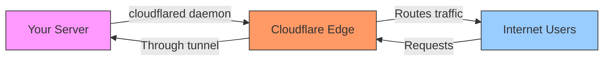
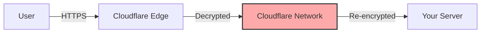

# Cloudflare Tunnel

Cloudflare Tunnel lets you expose services running on your computer or private network to the internet without opening firewall ports or having a public IP address. Your server connects out to Cloudflare, and Cloudflare routes internet traffic back through that secure connection.

## How It Works

Cloudflare Tunnel uses an **outbound-only connection model** to enable bidirectional communication:



1. **Install cloudflared**: Lightweight daemon runs on your server
2. **Establish tunnel**: Creates persistent outbound connections to Cloudflare's global network
3. **Route traffic**: DNS records point to the tunnel, routing requests through Cloudflare
4. **Bidirectional flow**: Traffic flows both ways over the outbound connection

### Security Model

- **No inbound ports**: All connections originate from your infrastructure
- **Firewall-friendly**: Only requires outbound HTTPS (443) access
- **DDoS protection**: Origin servers hidden behind Cloudflare's network
- **IP obfuscation**: Only Cloudflare IPs are publicly visible

## Setup

### Installation

**Standalone binary:**
```bash
# Download cloudflared
curl -L https://github.com/cloudflare/cloudflared/releases/latest/download/cloudflared-linux-amd64 -o cloudflared
chmod +x cloudflared
```

**Docker:**
```bash
docker pull cloudflare/cloudflared
```

**Package managers:**
```bash
# Homebrew (macOS/Linux)
brew install cloudflare/cloudflare/cloudflared

# Debian/Ubuntu
wget -q https://github.com/cloudflare/cloudflared/releases/latest/download/cloudflared-linux-amd64.deb
sudo dpkg -i cloudflared-linux-amd64.deb
```

### Authentication

```bash
cloudflared tunnel login
```

This opens a browser to authenticate with Cloudflare and downloads credentials.

### Create Tunnel

**Via dashboard:**
1. Navigate to Cloudflare Zero Trust dashboard
2. Go to Networks → Tunnels
3. Create new tunnel, name it
4. Install connector (cloudflared) on your server
5. Configure public hostnames

**Via CLI:**
```bash
# Create tunnel
cloudflared tunnel create <tunnel-name>

# Create config file
cat > ~/.cloudflared/config.yml <<EOF
tunnel: <tunnel-id>
credentials-file: /path/to/<tunnel-id>.json

ingress:
  - hostname: app.example.com
    service: http://localhost:8080
  - hostname: ssh.example.com
    service: ssh://localhost:22
  - service: http_status:404
EOF

# Route DNS
cloudflared tunnel route dns <tunnel-name> app.example.com

# Run tunnel
cloudflared tunnel run <tunnel-name>
```

### Run as Service

**Linux (systemd):**
```bash
sudo cloudflared service install
sudo systemctl start cloudflared
sudo systemctl enable cloudflared
```

**Docker Compose:**
```yaml
services:
  cloudflared:
    image: cloudflare/cloudflared:latest
    restart: unless-stopped
    command: tunnel run
    environment:
      - TUNNEL_TOKEN=${TUNNEL_TOKEN}
```

## Use Cases

### Web Applications

Expose local web servers without port forwarding:
```yaml
ingress:
  - hostname: app.example.com
    service: http://localhost:3000
  - hostname: api.example.com
    service: http://localhost:8080
```

### SSH Access

Secure SSH without exposing port 22:
```yaml
ingress:
  - hostname: ssh.example.com
    service: ssh://localhost:22
```

Connect with:
```bash
cloudflared access ssh --hostname ssh.example.com
```

### Private Networks

Connect entire networks using `cloudflared` in WARP mode:
```yaml
tunnel: <tunnel-id>
warp-routing:
  enabled: true
```

### Development Preview

Quick tunnel for testing (no account needed):
```bash
cloudflared tunnel --url http://localhost:3000
```

Generates temporary URL like `https://random-words.trycloudflare.com`

## Integration with Cloudflare Access

Add authentication to tunneled services:

1. **Create Access Policy** in Zero Trust dashboard
2. **Configure identity providers** (Google, GitHub, Okta, etc.)
3. **Apply policy to hostname**

Now users must authenticate before accessing `app.example.com`.

## Tradeoffs and Limitations

### File Size Limits

- **100 MB per request** on free plans
- Impacts services like photo galleries (Immich) or file sharing
- Enterprise plans have higher limits

### Video Streaming Restrictions

Cloudflare ToS restricts video streaming on free/standard plans:

> Unless you are an Enterprise customer, Cloudflare offers specific Paid Services (e.g., Stream, Images, R2) that you must use to serve video and other large files via the CDN.

**Impact on self-hosters:**
- Jellyfin, Plex, Emby streaming may violate ToS
- Risk of account termination
- Applies to continuous high-bandwidth use
- Affects anyone with Cloudflare-managed domains

### TLS Termination

Cloudflare acts as a **TLS termination point**:



**What this means:**
- Traffic is decrypted at Cloudflare
- **Not true end-to-end encryption**
- Cloudflare can see all data in transit
- Required for caching and DDoS protection features

**Security considerations:**
- Trust Cloudflare with your data
- Compliance issues for sensitive data (HIPAA, PCI-DSS)
- Man-in-the-middle exposure if Cloudflare is compromised

### Vendor Lock-in

- Requires Cloudflare DNS
- Depends on Cloudflare availability
- Migration requires reconfiguration

### Bandwidth Costs (Enterprise)

- Free tier is generous but subject to "fair use"
- High bandwidth may require Enterprise plan
- No published bandwidth caps, discretionary enforcement

## Alternatives

### Self-Hosted Reverse Proxies

**Nginx Proxy Manager / Traefik:**
- Full control over TLS certificates
- No file size limits
- Requires public IP or VPN
- More setup complexity

**Pangolin:**
- Self-hosted reverse proxy with similar UX to Cloudflare
- Requires a VPS for public endpoint
- True end-to-end encryption
- No artificial restrictions
- More control, more maintenance

### Mesh VPNs

**Tailscale / Headscale:**
- Peer-to-peer connections
- End-to-end encrypted
- No bandwidth restrictions
- Less convenient for non-technical users (requires Tailscale client)

**ZeroTier:**
- Software-defined networking
- Self-hostable controller (self-hosted mode)
- No central TLS termination

**NetBird:**
- Open-source Tailscale alternative
- WireGuard-based
- Self-hostable

### Hybrid Approach

**VPN + Cloudflare Tunnel:**
- Use VPN (Tailscale) for unrestricted services (Jellyfin, large files)
- Use Cloudflare Tunnel for public-facing web apps
- Best of both worlds but more complex

**Cloudflare Tunnel + R2:**
- Store large files in Cloudflare R2
- Serve via R2 public URLs or Workers
- Keeps within ToS, incurs storage/egress costs

## Best Practices

### Security

- **Enable Access policies** for sensitive services
- **Use service tokens** for machine-to-machine access
- **Rotate credentials** periodically
- **Monitor tunnel health** via dashboard or API

### Performance

- **Run multiple connectors** for high availability (same tunnel)
- **Choose nearest regions** when creating tunnels
- **Enable caching** for static assets
- **Use compression** in Cloudflare settings

### Observability

```bash
# Check tunnel status
cloudflared tunnel info <tunnel-name>

# View tunnel connections
cloudflared tunnel list

# Monitor logs
journalctl -u cloudflared -f
```

### Configuration Management

Store config in version control:
```bash
# Export tunnel config
cloudflared tunnel info <tunnel-name> --output json

# Backup credentials
cp ~/.cloudflared/*.json /secure/backup/location/
```

## When to Use Cloudflare Tunnel

**Good fit:**
- ✅ Web applications with small to medium payloads
- ✅ Development preview environments
- ✅ SSH/RDP access for small teams
- ✅ Services behind CGNAT/restrictive networks
- ✅ Need DDoS protection and global edge
- ✅ Want integrated Access/SSO

**Not ideal:**
- ❌ Video streaming services (Jellyfin, Plex)
- ❌ Large file transfers (>100MB regularly)
- ❌ Sensitive data requiring E2E encryption
- ❌ High-bandwidth applications
- ❌ Services you can't risk losing access to if account is terminated

## Related Topics

- [[cloudflare/workers|Cloudflare Workers]] - Edge computing with tunnels
- [[cloudflare/workers-ai|Workers AI]] - Run AI models at the edge
- [[cloudflare/ai-search|AI Search]] - Search with vector embeddings

## References

**Official Documentation:**
- [Cloudflare Tunnel Docs](https://developers.cloudflare.com/cloudflare-one/networks/connectors/cloudflare-tunnel/)
- [Create a Tunnel (Dashboard)](https://developers.cloudflare.com/cloudflare-one/networks/connectors/cloudflare-tunnel/get-started/create-remote-tunnel/)
- [cloudflared GitHub](https://github.com/cloudflare/cloudflared)

**Community Discussions:**
- [Bandwidth/filesize restrictions for Cloudflare Tunnels?](https://community.cloudflare.com/t/bandwidth-filesize-restrictions-for-cloudflare-tunnels/277158)
- [100 MB limit per request](https://community.cloudflare.com/t/100-mb-limit-per-request/287573)
- [Clarifying TOS](https://community.cloudflare.com/t/clarifying-tos/538782)

**Alternative Perspectives:**
- [I stopped using Cloudflare Tunnels for everything](https://www.xda-developers.com/i-stopped-using-cloudflare-tunnels-for-everything-and-heres-what-i-use-instead/) - XDA analysis of limitations and alternatives
