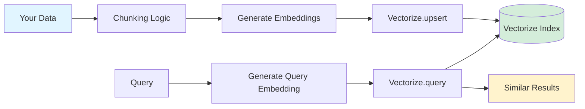

# Cloudflare Vectorize

Vectorize stores AI embeddings (high-dimensional vectors) and lets you search for similar items, like finding documents related to a question or products similar to what a user likes. It powers semantic search and recommendation systems without you managing database infrastructure.

## Overview

Vectorize is a serverless vector database that stores and queries high-dimensional embeddings. It's the underlying storage for [[ai-search]] and can be used directly for custom vector operations.

## When to Use Vectorize Directly

**Use Vectorize when:**
- You need custom embedding models
- You have specific chunking requirements
- You want full control over vector operations
- You're building non-search use cases (recommendations, clustering, anomaly detection)
- You need custom metadata schemas

**Use AI Search instead when:**
- You're indexing R2 buckets or websites
- You want automated chunking and embedding pipeline
- You need RAG with minimal code
- You want automatic reindexing on updates

## Basic Operations

### Create Index

```typescript
// wrangler.toml
[[vectorize]]
binding = "VECTORIZE"
index_name = "my-embeddings"
```

### Insert Vectors

```typescript
export default {
  async fetch(request: Request, env: Env): Promise<Response> {
    // Generate embeddings
    const embeddings = await env.AI.run(
      '@cf/baai/bge-base-en-v1.5',
      { text: ['Hello world', 'Cloudflare is great'] }
    );

    // Insert vectors
    await env.VECTORIZE.upsert([
      {
        id: '1',
        values: embeddings.data[0],
        metadata: { text: 'Hello world' }
      },
      {
        id: '2',
        values: embeddings.data[1],
        metadata: { text: 'Cloudflare is great' }
      }
    ]);

    return Response.json({ success: true });
  }
};
```

### Query Vectors

```typescript
export default {
  async fetch(request: Request, env: Env): Promise<Response> {
    // Generate query embedding
    const queryEmbedding = await env.AI.run(
      '@cf/baai/bge-base-en-v1.5',
      { text: 'greeting' }
    );

    // Search similar vectors
    const results = await env.VECTORIZE.query(queryEmbedding.data[0], {
      topK: 5,
      returnMetadata: true,
      filter: { category: 'greetings' }
    });

    return Response.json(results);
  }
};
```

## Metadata Filtering

Filter queries using metadata:

```typescript
const results = await env.VECTORIZE.query(embedding, {
  topK: 10,
  filter: {
    category: 'documentation',
    date: { $gte: '2026-01-01' }
  }
});
```

## Architecture



## Vectorize vs AI Search

See detailed comparison in [[ai-search#vectorize-vs-ai-search]].

**Summary:**
- **Vectorize** - Raw vector database, full control, manual pipeline
- **AI Search** - Managed service, automated pipeline, less control

## Related Topics

- [[ai-search]] - Managed search built on Vectorize
- [[workers-ai]] - Embedding generation
- [[workers]] - Integration via bindings

## Resources

- [Vectorize Documentation](https://developers.cloudflare.com/vectorize/)
- [Vectorize Best Practices](https://developers.cloudflare.com/vectorize/best-practices/)
- [Query Vectors Guide](https://developers.cloudflare.com/vectorize/best-practices/query-vectors/)
