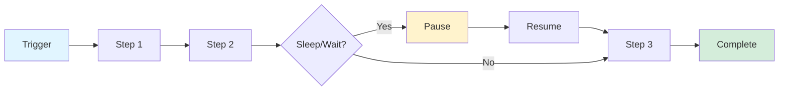

# Cloudflare Workflows

Build reliable multi-step applications that chain operations, automatically retry failures, and persist state - running from seconds to weeks without infrastructure management.

## Key Features

- **Durable execution** - Built-in error handling and automatic retries
- **Extended pauses** - Sleep functions lasting seconds to days (`sleep()`)
- **Event-driven** - Pause for external events (approvals, webhooks) before resuming
- **Programmatic control** - Trigger, pause, resume, or terminate instances via API
- **Integrated observability** - Debugging and monitoring built-in

## Architecture

Built on Cloudflare Workers, Workflows execute through durable steps that maintain state throughout execution. This eliminates typical serverless timeout constraints while providing reliability guarantees.



## Use Cases

- **AI applications** - Multi-step agent workflows with retries
- **Data pipelines** - Automated ETL and processing chains
- **User lifecycle management** - Scheduled communications, trial expirations
- **Approval systems** - Human-in-the-loop workflows requiring intervention

## Example: Multi-Step Workflow

```typescript
import { WorkflowEntrypoint, WorkflowStep, WorkflowEvent } from 'cloudflare:workers';

export class MyWorkflow extends WorkflowEntrypoint {
  async run(event: WorkflowEvent, step: WorkflowStep) {
    // Step 1: Process data
    const data = await step.do('fetch data', async () => {
      const response = await fetch('https://api.example.com/data');
      return response.json();
    });

    // Step 2: Sleep for 1 hour
    await step.sleep('wait for processing', '1 hour');

    // Step 3: Send notification
    await step.do('send notification', async () => {
      await fetch('https://api.example.com/notify', {
        method: 'POST',
        body: JSON.stringify(data)
      });
    });

    return { status: 'completed', data };
  }
}
```

## Queues vs Workflows

| Feature | Queues | Workflows |
|---------|--------|-----------|
| **Best for** | Single-step async jobs | Multi-step processes |
| **Complexity** | Simple fan-out, buffering | Complex conditional logic |
| **Duration** | Seconds to minutes | Seconds to weeks |
| **State** | Stateless | Stateful |
| **Delivery** | At-least-once | Exactly-once per step |
| **Control** | Fire-and-forget | Pause, resume, terminate |

**Use together:** Queues as high-throughput entry point → Workflows for complex processing

## Pricing

Available on both Free and Paid plans.

## Related Topics

- [[workers]] - Workers runtime
- [[agents]] - AI agent workflows
- [[durable-objects]] - Stateful coordination

## Resources

- [Workflows Documentation](https://developers.cloudflare.com/workflows/)
- [Announcement](https://x.com/akaphill/status/2019424480322605104)
