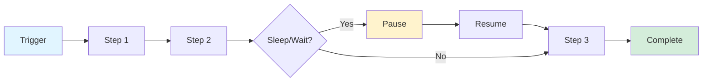

# Cloudflare Workflows

Build reliable multi-step applications that chain operations, automatically retry failures, and persist state - running from seconds to weeks without infrastructure management.

## Key Features

- **Durable execution** - Built-in error handling and automatic retries
- **Extended pauses** - Sleep functions lasting seconds to days (`sleep()`)
- **Event-driven** - Pause for external events (approvals, webhooks) before resuming
- **Programmatic control** - Trigger, pause, resume, or terminate instances via API
- **Integrated observability** - Debugging and monitoring built-in

## Architecture

Built on Cloudflare Workers, Workflows execute through durable steps that maintain state throughout execution. This eliminates typical serverless timeout constraints while providing reliability guarantees.



## Use Cases

- **AI applications** - Multi-step agent workflows with retries
- **Data pipelines** - Automated ETL and processing chains
- **User lifecycle management** - Scheduled communications, trial expirations
- **Approval systems** - Human-in-the-loop workflows requiring intervention

## Example: Multi-Step Workflow

```typescript
import { WorkflowEntrypoint, WorkflowStep, WorkflowEvent } from 'cloudflare:workers';

export class MyWorkflow extends WorkflowEntrypoint {
  async run(event: WorkflowEvent, step: WorkflowStep) {
    // Step 1: Process data
    const data = await step.do('fetch data', async () => {
      const response = await fetch('https://api.example.com/data');
      return response.json();
    });

    // Step 2: Sleep for 1 hour
    await step.sleep('wait for processing', '1 hour');

    // Step 3: Send notification
    await step.do('send notification', async () => {
      await fetch('https://api.example.com/notify', {
        method: 'POST',
        body: JSON.stringify(data)
      });
    });

    return { status: 'completed', data };
  }
}
```

## Configuration (Wrangler)

Workflows are configured via a `[[workflows]]` binding in your `wrangler.toml` / `wrangler.jsonc`.

```toml
[[workflows]]
name = "my-workflow"      # Workflow name
binding = "MY_WORKFLOW"  # env.MY_WORKFLOW
class_name = "MyWorkflow" # exported class extending WorkflowEntrypoint
```

Notes:

- `binding` becomes the name you call from other handlers (`env.MY_WORKFLOW.create()`, `env.MY_WORKFLOW.get(id)`).
- You can bind to a Workflow defined in a different Worker by adding `script_name` in the workflow binding ("cross-script calls").
- In TypeScript projects, `wrangler types` will generate an `Env` type that includes the Workflow binding.

Sources: https://developers.cloudflare.com/workflows/get-started/guide/ • https://developers.cloudflare.com/workflows/build/workers-api/

## Triggering + instance control

You can trigger and manage Workflows from:

- a `fetch` handler (HTTP)
- a Queue consumer (`queue` handler)
- a Cron trigger (`scheduled` handler)
- inside Durable Objects

Instance basics (Workers binding API):

- Create: `const instance = await env.MY_WORKFLOW.create({ id, params })`
- Status: `await (await env.MY_WORKFLOW.get(id)).status()`
- Control: `pause()`, `resume()`, `terminate()`, `restart()`, `sendEvent(...)`

The status returned by `instance.status()` can include values like `queued`, `running`, `paused`, `waiting` (sleep/event), `errored`, and `complete`.

Sources: https://developers.cloudflare.com/workflows/build/trigger-workflows/ • https://developers.cloudflare.com/workflows/build/events-and-parameters/

## Steps, retries, sleeping, and events

### Step primitives

- `step.do(name, [config], fn)` runs code and persists its returned (serializable) state.
- `step.sleep(name, duration)` sleeps for a relative duration (supports human units like `"1 hour"`).
- `step.sleepUntil(name, timestamp)` sleeps until a specific date/time.
- `step.waitForEvent(name, { type, timeout })` blocks waiting for an external event.

### Retry defaults + customization

If you don’t supply a retry config, `step.do` defaults to (as documented):

- retries: limit 5, delay 10s, exponential backoff
- timeout: 10 minutes

You can override per-step retry/timeout via the optional `WorkflowStepConfig`.

### Forcing a non-retryable failure

Throw `NonRetryableError` inside `step.do` to stop retries and fail the instance immediately.

Sources: https://developers.cloudflare.com/workflows/build/workers-api/ • https://developers.cloudflare.com/workflows/build/sleeping-and-retrying/

## “Rules of Workflows” (practical gotchas)

- **Make external side effects idempotent**: steps may retry, so check-before-write/charge/etc.
- **Keep steps granular**: separate unrelated API/binding calls so failures retry the smallest unit.
- **Don’t rely on in-memory variables across steps**: Workflows can hibernate; persist state by returning it from `step.do`.

Source: https://developers.cloudflare.com/workflows/build/rules-of-workflows/

## Limits (high-signal)

A few notable limits (see full table):

- Max steps per workflow: **1024**
- Max `step.sleep` duration: **365 days**
- Max persisted state per step: **1 MiB**
- Event payload size: **1 MiB**
- Instances in `waiting` state (sleep/retry/event) **do not count** toward concurrency limits

Source: https://developers.cloudflare.com/workflows/reference/limits/

## Queues vs Workflows

| Feature | Queues | Workflows |
|---------|--------|-----------|
| **Best for** | Single-step async jobs | Multi-step processes |
| **Complexity** | Simple fan-out, buffering | Complex conditional logic |
| **Duration** | Seconds to minutes | Seconds to weeks |
| **State** | Stateless | Stateful |
| **Delivery** | At-least-once | Exactly-once per step |
| **Control** | Fire-and-forget | Pause, resume, terminate |

**Use together:** Queues as high-throughput entry point → Workflows for complex processing

## Pricing

Available on both Free and Paid plans.

## Related Topics

- [[workers]] - Workers runtime
- [[agents]] - AI agent workflows
- [[durable-objects]] - Stateful coordination

## Resources

- [Workflows Documentation](https://developers.cloudflare.com/workflows/)
- [Announcement](https://x.com/akaphill/status/2019424480322605104)
