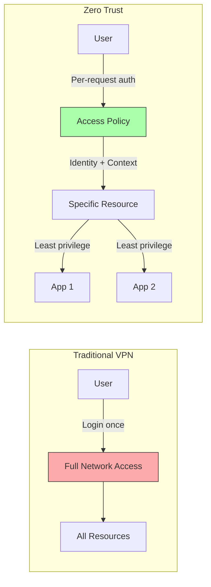
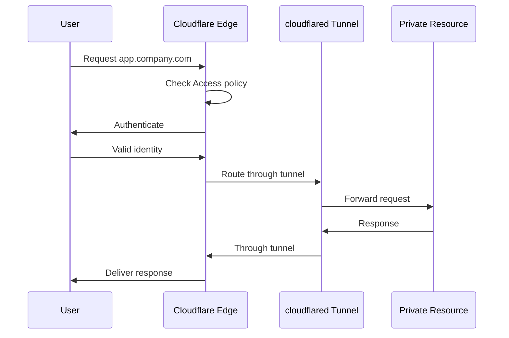
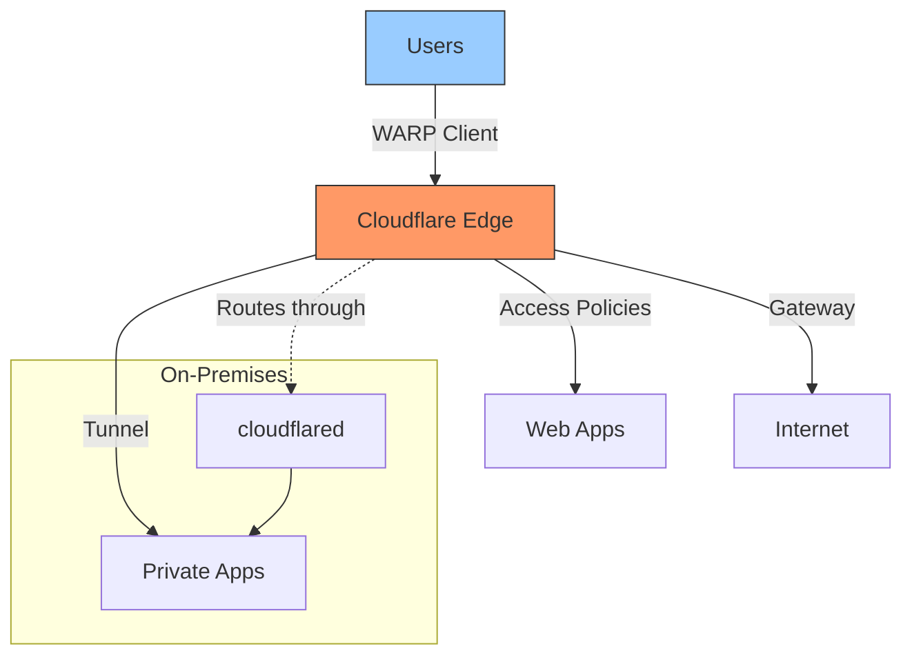
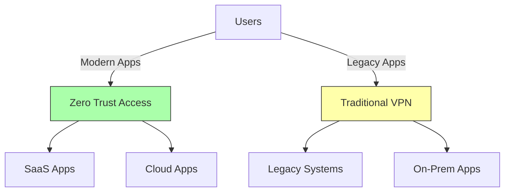
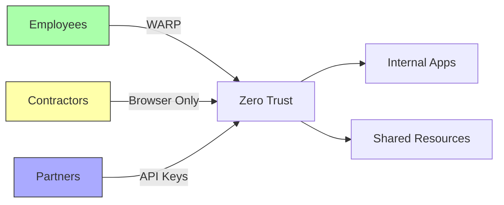

# Cloudflare Zero Trust

Zero Trust means nobody gets access by default—not even people inside your network. Every person and device must prove who they are before accessing any resource, making it way more secure than traditional VPNs that trust anyone who logs in once.

## Core Principle

**Traditional Security:** Trust everything inside the network perimeter
**Zero Trust:** Assume breach, verify every request regardless of origin



## Architecture Components

### 1. Cloudflare Access (ZTNA)

Zero Trust Network Access for applications and resources.

**What it does:**
- Verifies user identity for every request
- Checks device posture (security status)
- Enforces granular access policies
- Works for web apps, SSH, RDP, and non-HTTP services

**Example policy:**
```json
{
  "name": "Engineering Resources",
  "decision": "allow",
  "include": [
    {"email_domain": "company.com"},
    {"group": "engineering"}
  ],
  "require": [
    {"warp": true},
    {"device_posture": "compliant"}
  ],
  "applications": ["github.company.com", "jenkins.company.com"]
}
```

### 2. Cloudflare Gateway

Secure web gateway for filtering and inspection.

**Capabilities:**
- DNS filtering (block malicious domains)
- HTTP/HTTPS inspection (scan for threats)
- Network traffic filtering
- Data Loss Prevention (DLP)
- Browser isolation for risky sites

### 3. Cloudflare Tunnel

Secure connector for private resources (replaces inbound firewall rules).

**How it works:**


**Benefits:**
- No public IP needed for private resources
- No inbound firewall rules required
- Only outbound connections from your network
- Built-in DDoS protection

### 4. WARP Client

Device client for secure connectivity.

**Architecture:**
```
Device with WARP
    ├── DNS Proxy (DNS-over-HTTPS)
    ├── Tunnel (WireGuard or MASQUE)
    └── Traffic Routing
            ├── Split Tunneling (selective routing)
            └── Full Tunnel (all traffic)
```

**Use cases:**
- Route all traffic through Cloudflare Gateway (filtering)
- Connect to private networks via Tunnel
- Enforce device posture checks
- Replace traditional VPN clients

**WARP-to-WARP:** Create private networks between devices running WARP (phone ↔ laptop, no physical network needed).

## Zero Trust vs Traditional VPN

| Aspect | Traditional VPN | Cloudflare Zero Trust |
|--------|-----------------|----------------------|
| **Security Model** | Trust inside perimeter | Never trust, always verify |
| **Access Scope** | Full network after login | Per-application, least privilege |
| **Authentication** | Login once | Every request |
| **Device Check** | Rarely enforced | Continuous validation |
| **Attack Surface** | Broad (full network) | Minimal (specific apps only) |
| **User Experience** | Slow, frustrating | Seamless, low-latency |
| **Onboarding** | Slow, capacity limits | Fast, scales instantly |
| **Support Tickets** | Many (connection issues) | 80% fewer |
| **Cost** | Hardware + bandwidth | Cloud service pricing |

## Key Benefits

### Security Improvements

**1. Least Privilege Access**
- Users only access specific applications they need
- No lateral movement if credentials compromised
- Attackers can't "get inside" the entire network

**2. Identity-Based Policies**
- Authenticate based on who, not where
- Granular controls per user/group/app
- Context-aware (device, location, time, risk)

**3. Continuous Validation**
- Check identity on every request
- Verify device health continuously
- Revoke access instantly if posture changes

### Operational Benefits

**1. Performance**
- Cloudflare's global network (300+ cities)
- Low-latency access from anywhere
- No VPN bottlenecks or capacity limits

**2. Scalability**
- Instant onboarding (no VPN setup)
- No hardware provisioning
- Supports rapid growth without capacity planning

**3. Reduced IT Burden**
- 80% fewer remote access support tickets
- 60% faster employee onboarding (example: eTeacher Group)
- No VPN infrastructure to maintain

## Implementation Components

### Access Policies

Define who can access what, under which conditions:

```yaml
# Example: Require WARP + MFA for admin panel
- name: Admin Panel
  decision: allow
  include:
    - email_domain: company.com
    - group: admins
  require:
    - warp: true
    - mfa: true
    - country: [US, CA, UK]
  exclude:
    - email: contractor@external.com
```

### Device Posture Checks

Verify device security before granting access:

- **OS version:** Require updated operating systems
- **Disk encryption:** FileVault (macOS), BitLocker (Windows)
- **Firewall enabled:** Host firewall active
- **Applications installed:** Endpoint security software present
- **Serial number checks:** Whitelist specific devices

### Identity Providers

Integrate with existing authentication:

- **SSO Providers:** Okta, Azure AD, Google Workspace, OneLogin
- **SAML 2.0** and **OAuth 2.0** support
- **Social logins:** GitHub, LinkedIn (for contractors)
- **OTP/MFA:** Hardware keys, authenticator apps

## Common Architectures

### 1. Replace VPN Entirely



**Use when:**
- Modern workforce (remote/hybrid)
- Cloud-first applications
- Want to eliminate VPN infrastructure

### 2. Hybrid: Zero Trust + VPN

Keep VPN for legacy apps, use Zero Trust for modern:



**Use when:**
- Gradual migration
- Some apps can't integrate with Access
- Compliance requires specific VPN for certain resources

### 3. Zero Trust for Contractors/Partners



**Use when:**
- Third-party access needs
- Don't want contractors on VPN
- Need granular per-user permissions

## Setup Guide

### Basic Configuration

**1. Connect identity provider**
```bash
# Via dashboard: Zero Trust → Settings → Authentication
# Add provider: Azure AD, Okta, Google Workspace, etc.
```

**2. Create an Access application**
```bash
# Zero Trust → Access → Applications → Add Application
# Choose: Self-hosted, SaaS, or SSH/RDP

Application domain: app.company.com
Identity providers: Your IdP
Policies: Define who can access
```

**3. Install cloudflared tunnel**
```bash
# On server hosting private app
cloudflared tunnel login
cloudflared tunnel create app-tunnel
cloudflared tunnel route dns app-tunnel app.company.com

# Configure tunnel
cat > ~/.cloudflared/config.yml <<EOF
tunnel: <tunnel-id>
credentials-file: /path/to/<tunnel-id>.json
ingress:
  - hostname: app.company.com
    service: http://localhost:8080
  - service: http_status:404
EOF

# Run as service
cloudflared service install
```

**4. Deploy WARP to user devices**
```bash
# Download from: https://1.1.1.1
# Configure via MDM or manual enrollment

# Enroll device
cloudflare-warp teams-enroll <your-team-name>
```

### Device Posture Check

```bash
# Zero Trust → Settings → WARP Client → Device Posture

# Example checks:
- OS Version: macOS >= 14.0
- Disk Encryption: Enabled
- Firewall: Enabled
- Domain Joined: company.local
```

### Split Tunneling

Route only specific traffic through WARP:

```bash
# Zero Trust → Settings → WARP Client → Split Tunnels

# Exclude (don't route through WARP):
- 192.168.0.0/16 (home network)
- 10.0.0.0/8 (office network)
- netflix.com (streaming, direct)

# Include (only route these through WARP):
- company.internal
- *.company.com
```

## Use Cases

### Remote Workforce

**Problem:** Employees working from anywhere need secure access
**Solution:** WARP client + Access policies + Gateway filtering

**Benefits:**
- Secure from any location
- No performance degradation
- Continuous security checks

### Contractor Access

**Problem:** Need to grant limited access without VPN credentials
**Solution:** Browser-based Access with time-limited policies

**Benefits:**
- No VPN setup for contractors
- Granular per-application access
- Easy to revoke access

### Hybrid Cloud

**Problem:** Apps split between on-premises and cloud
**Solution:** Tunnel for on-prem + Access for cloud apps

**Benefits:**
- Unified access control
- No complex networking
- Single authentication flow

### SSH/RDP Access

**Problem:** Securing administrative access to servers
**Solution:** Access for Infrastructure with short-lived certificates

**Benefits:**
- No bastion hosts needed
- Audit logs for all access
- MFA enforced

## Security Features

### Threat Protection

- **DNS filtering:** Block malicious domains at DNS level
- **HTTP inspection:** Scan for malware in downloads
- **Browser isolation:** Render risky sites in remote browser
- **AV scanning:** Inspect file uploads/downloads
- **Shadow IT discovery:** Detect unsanctioned SaaS usage

### Data Loss Prevention (DLP)

```yaml
# Example DLP policy
policy:
  name: Block Credit Cards
  action: block
  detection:
    - pattern: credit_card_number
    - pattern: ssn
  scope:
    - file_uploads
    - http_posts
    - email_attachments
```

### Audit & Compliance

- **Access logs:** Every authentication attempt
- **Activity logs:** All resource access
- **Gateway logs:** DNS/HTTP requests
- **Alerts:** Real-time security notifications
- **Integrations:** Forward logs to SIEM (Splunk, Datadog, etc.)

## Pricing Tiers

### Free Plan
- Up to 50 users
- WARP client
- Gateway DNS filtering
- Basic Access policies

### Standard Plan
- $7/user/month
- Advanced Access features
- Gateway HTTP filtering
- Browser isolation
- DLP

### Enterprise Plan
- Custom pricing
- Dedicated support
- Advanced DLP
- Custom integrations
- SLA guarantees

## Comparison to Alternatives

### vs Tailscale

| Feature | Cloudflare Zero Trust | Tailscale |
|---------|----------------------|-----------|
| **Approach** | Edge-based ZTNA | Mesh VPN (WireGuard) |
| **Access Control** | Identity + device + context | ACLs per device |
| **User Management** | IdP integration | Centralized admin |
| **Performance** | Cloudflare's global edge | Peer-to-peer direct |
| **Filtering** | Gateway + DLP included | Requires separate tools |
| **Best For** | Enterprise, web apps | Developer tools, infrastructure |

### vs Traditional VPN

| Feature | Cloudflare Zero Trust | Traditional VPN |
|---------|----------------------|------------------|
| **Access Model** | Per-application | Full network |
| **Authentication** | Continuous | Login once |
| **Infrastructure** | Cloud service | On-premises hardware |
| **Scalability** | Unlimited | Hardware limits |
| **Cost Model** | Per-user subscription | CapEx + OpEx |

## Migration Strategy

### Phase 1: Pilot (Weeks 1-2)

1. Set up Zero Trust account
2. Connect identity provider
3. Deploy Access for 1-2 pilot applications
4. Enroll 10-20 pilot users with WARP

### Phase 2: Expand (Weeks 3-6)

1. Add more applications to Access
2. Roll out WARP to more users
3. Configure Gateway DNS filtering
4. Set up device posture checks

### Phase 3: Full Migration (Weeks 7-12)

1. Migrate all applications to Access
2. Deploy WARP to entire organization
3. Enable full Gateway inspection
4. Implement DLP policies
5. Decommission VPN

### Phase 4: Optimize (Ongoing)

1. Refine policies based on usage
2. Add new applications as needed
3. Monitor security events
4. Tune performance settings

## Best Practices

### Access Policies

- **Start with least privilege:** Grant minimal access, expand as needed
- **Use groups, not individuals:** Easier to manage at scale
- **Require MFA:** Especially for sensitive resources
- **Check device posture:** Enforce security baselines
- **Time-bound contractor access:** Auto-expire after project

### Tunnel Management

- **One tunnel per environment:** Dev, staging, prod
- **High availability:** Run multiple replicas (2-4)
- **Monitor tunnel health:** Set up alerts for disconnections
- **Secure credentials:** Rotate tunnel tokens regularly

### WARP Deployment

- **Split tunnel by default:** Don't route all traffic unless needed
- **Managed deployment:** Use MDM (Jamf, Intune, etc.)
- **User education:** Explain why WARP is required
- **Graceful rollout:** Start with volunteers, then expand

### Logging & Monitoring

- **Forward logs to SIEM:** Centralize security data
- **Set up alerts:** Suspicious login patterns, policy violations
- **Regular audits:** Review access logs monthly
- **Compliance reports:** Document security posture

## Troubleshooting

### Common Issues

**WARP won't connect:**
- Check firewall allows UDP 2408, TCP 443
- Verify team name is correct
- Ensure device meets posture requirements

**Can't access application:**
- Check Access policy includes user
- Verify WARP is connected (if required)
- Check device posture (encryption, OS version)
- Review Access logs for deny reason

**Slow performance:**
- Check split tunnel configuration
- Verify nearest Cloudflare PoP is being used
- Review Gateway inspection rules (excessive scanning)
- Consider excluding heavy traffic (streaming)

## Related Topics

- [[tunnels]] - Cloudflare Tunnel setup and configuration
- [[workers]] - Deploy edge applications
- [[workers-ai]] - AI-powered security policies

## References

**Official Documentation:**
- [Cloudflare Zero Trust Overview](https://developers.cloudflare.com/cloudflare-one/)
- [Zero Trust Architecture](https://developers.cloudflare.com/reference-architecture/implementation-guides/zero-trust/)
- [Access Documentation](https://www.cloudflare.com/zero-trust/products/access/)
- [WARP Client](https://developers.cloudflare.com/cloudflare-one/connections/connect-devices/warp/)

**Implementation Guides:**
- [Building Zero Trust for Startups](https://developers.cloudflare.com/reference-architecture/design-guides/zero-trust-for-startups/)
- [Zero Trust for SaaS](https://developers.cloudflare.com/reference-architecture/design-guides/zero-trust-for-saas/)
- [How to Replace Your VPN](https://developers.cloudflare.com/learning-paths/replace-vpn/)

**Comparisons & Analysis:**
- [VPN Replacement](https://www.cloudflare.com/zero-trust/solutions/vpn-replacement/)
- [Why Replace Your VPN](https://developers.cloudflare.com/learning-paths/replace-vpn/concepts/why-vpn/)
- [I finally understand Cloudflare Zero Trust tunnels](https://david.coffee/cloudflare-zero-trust-tunnels/)
