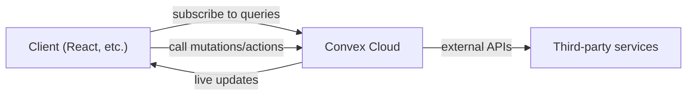
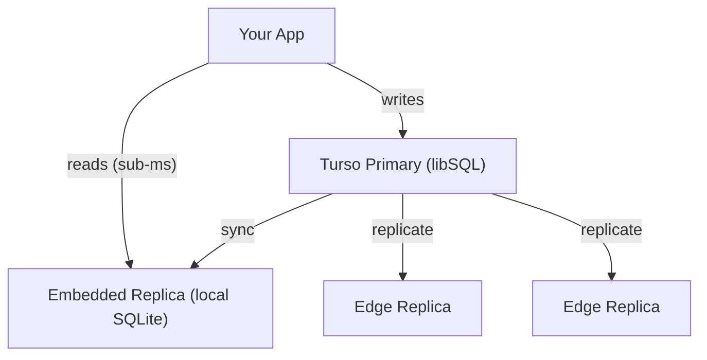
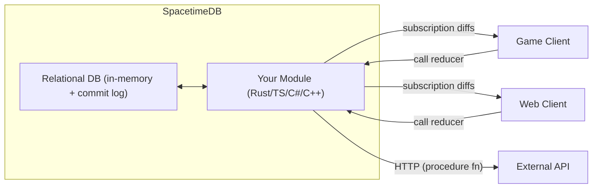

# Databases

A quick tour of modern database options that blur the line between "just a database" and "your entire backend." Each of these takes a different stance on where your logic lives, how data syncs, and what you stop managing.

## Convex

Convex is a reactive backend-as-a-service where your database, server functions, and real-time sync are one unified system. You write TypeScript functions that run on Convex's servers, and clients automatically get live-updating query results with zero manual WebSocket plumbing.

### Key Ideas

- **Reactive queries** -- clients subscribe to query functions; results update automatically when underlying data changes
- **Mutations and actions** -- mutations are deterministic ACID transactions against the DB; actions can call external APIs and are non-deterministic
- **Schema validation** -- optional TypeScript-first schema definitions with runtime enforcement
- **File storage** -- built-in file storage and serving (no separate S3 bucket)
- **Scheduled functions** -- cron-like scheduling and one-off delayed execution built in
- **Auth integration** -- first-class support for Clerk, Auth0, etc.

### Architecture

All server logic (queries, mutations, actions) is deployed to Convex and runs in their V8-based runtime. The database is a document-relational model -- documents in tables with indexes and references, not raw JSON blobs.

### When to Reach For It

- Prototyping or shipping fast with real-time needs
- Apps where live collaboration or live dashboards are core
- Teams that want zero infrastructure management

### Trade-offs

- Vendor lock-in (no self-host option yet)
- Query language is "write a JS function" rather than SQL
- Pricing scales with function execution and storage

---

## SQLite / libSQL

SQLite is the most deployed database in the world -- it runs inside your process with no separate server. libSQL is an open-source fork of SQLite (by the Turso team) that adds features SQLite intentionally won't: replication, branching, and a server mode.

### SQLite Strengths

- **Embedded** -- single file, zero config, no daemon
- **Incredibly fast** for read-heavy and single-writer workloads
- **ACID transactions** with WAL mode for concurrent readers
- **Everywhere** -- phones, browsers (via WASM), edge functions, CLI tools, embedded devices

### libSQL Additions

- **Replication** -- embedded replicas that sync from a primary (local reads, remote writes)
- **Server mode** -- `sqld` exposes libSQL over HTTP and WebSockets
- **Extensions** -- vector search, WASM-based user-defined functions
- **Branching** -- fork a database for preview environments or testing

### Turso

[Turso](https://turso.tech) is the managed platform for libSQL. Think of it as "SQLite at the edge."

- Databases replicated to edge locations globally
- Embedded replicas -- your app bundles a local SQLite file that syncs from Turso, giving sub-millisecond reads
- Per-database or per-tenant architecture (great for multi-tenant SaaS)
- Free tier: 500 databases, 9 GB storage, 25M row reads/month

### Architecture

### When to Reach For It

- Edge/serverless deployments (Cloudflare Workers, Fly.io, etc.)
- Multi-tenant apps where each tenant gets their own DB
- Anywhere you want SQLite's simplicity with replication

### Trade-offs

- Single-writer model (writes go to primary)
- Not a fit for heavy concurrent write workloads
- libSQL diverges from upstream SQLite -- you're on a fork

---

## SpacetimeDB 2.0

SpacetimeDB merges your database and server into a single binary. You write server logic as "modules" (in Rust, TypeScript, C#, or C++) that run *inside* the database, and clients get auto-generated SDKs with real-time state sync. It was built for games and real-time apps where latency matters most.

### Key Ideas

- **Modules** -- your backend logic runs inside the database process, not in a separate server. No network hop between "app server" and "DB"
- **Reducers** -- function as async RPCs; clients call them to mutate state, and the database validates + applies changes transactionally
- **Subscriptions** -- clients subscribe to SQL queries and receive a live stream of row-level diffs when state changes
- **Client codegen** -- auto-generates typed client SDKs (TypeScript, C#, Rust, C++) from your module's schema
- **Row-level security** -- server-side filtering before subscription data reaches clients
- **Procedure functions** (new in 2.0) -- modules can make HTTP calls to external APIs

### 2.0 Highlights

- **Postgres wire protocol** -- connect with `psql` and existing Postgres tooling
- **TypeScript modules** out of beta
- **Unreal Engine 5** and **C++ module** support
- **Performance**: 170k tx/s (Rust modules), 100k+ tx/s (TypeScript modules)
- **Simplified pricing** with a free tier on Maincloud

### Architecture

State lives in memory for speed, with a write-ahead commit log for durability and recovery.

### When to Reach For It

- Multiplayer games and real-time collaborative apps
- Scenarios where latency between app logic and DB is a bottleneck
- Projects that want to eliminate backend infrastructure entirely

### Trade-offs

- Young ecosystem -- still reaching 2.0 stable
- Unconventional model (logic-inside-DB) has a learning curve
- Self-hosting is an option, but managed cloud (Maincloud) is early
- In-memory state means instance size limits matter

---

## Comparison

| | Convex | SQLite / libSQL | SpacetimeDB |
|---|---|---|---|
| **Model** | Document-relational | Relational (SQL) | Relational (SQL) |
| **Server logic** | TypeScript functions on their cloud | You bring your own server | Modules run inside the DB |
| **Real-time sync** | Built-in reactive queries | DIY (or Turso embedded replicas) | Built-in subscriptions |
| **Self-hostable** | No | Yes (SQLite/libSQL/sqld) | Yes |
| **Best for** | Rapid prototyping, live apps | Edge, embedded, multi-tenant | Games, real-time, low-latency |
| **Languages** | TypeScript | Any (it's a library) | Rust, TS, C#, C++ |
| **Maturity** | Production | Battle-tested (SQLite) / newer (libSQL) | Early (2.0 preview) |
