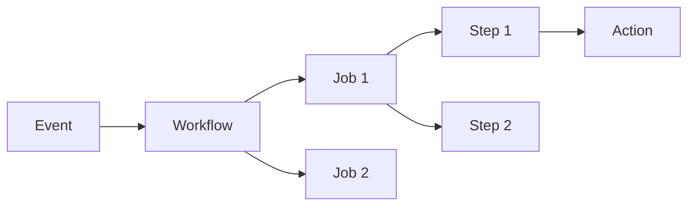

# GitHub Actions

GitHub Actions is a CI/CD platform that allows you to automate workflows directly in your GitHub repository. Workflows are triggered by events (push, PR, schedule, manual dispatch) and execute jobs on GitHub-hosted or self-hosted runners.

## Core Concepts



**Key Components:**
- **Workflow**: Automated process defined in `.github/workflows/*.yml`
- **Event**: Trigger that starts a workflow (push, pull_request, schedule, workflow_dispatch)
- **Job**: Set of steps that execute on the same runner
- **Step**: Individual task that runs commands or actions
- **Action**: Reusable unit of code (from marketplace or custom)
- **Runner**: Server that executes workflows (GitHub-hosted or self-hosted)

## Basic Workflow Structure

```yaml
name: CI Pipeline

# Events that trigger the workflow
on:
  push:
    branches: [main, develop]
  pull_request:
    branches: [main]
  workflow_dispatch:  # Manual trigger

# Environment variables available to all jobs
env:
  NODE_VERSION: '20.x'

jobs:
  build:
    runs-on: ubuntu-latest

    # Set explicit permissions (principle of least privilege)
    permissions:
      contents: read
      pull-requests: write

    steps:
      - name: Checkout code
        uses: actions/checkout@v4

      - name: Setup Node.js
        uses: actions/setup-node@v4
        with:
          node-version: ${{ env.NODE_VERSION }}
          cache: 'npm'

      - name: Install dependencies
        run: npm ci

      - name: Run tests
        run: npm test

      - name: Build
        run: npm run build
```

## Different Ways to Use GitHub Actions

### 1. Marketplace Actions

Use pre-built actions from the GitHub Marketplace:

```yaml
steps:
  # Pin to specific commit SHA for security
  - uses: actions/checkout@8ade135a41bc03ea155e62e844d188df1ea18608  # v4.1.0

  # Or use semantic version (less secure)
  - uses: actions/setup-python@v5
    with:
      python-version: '3.11'
```

### 2. Composite Actions

Combine multiple steps into a reusable action. Store in `.github/actions/`:

```yaml
# .github/actions/setup-app/action.yml
name: 'Setup Application'
description: 'Install dependencies and setup environment'

inputs:
  node-version:
    description: 'Node.js version'
    required: false
    default: '20.x'

runs:
  using: "composite"
  steps:
    - name: Setup Node.js
      uses: actions/setup-node@v4
      with:
        node-version: ${{ inputs.node-version }}
        cache: 'npm'
      shell: bash

    - name: Install dependencies
      run: npm ci
      shell: bash

    - name: Cache build artifacts
      uses: actions/cache@v4
      with:
        path: |
          node_modules
          .next/cache
        key: ${{ runner.os }}-build-${{ hashFiles('package-lock.json') }}
      shell: bash
```

**Usage:**

```yaml
steps:
  - uses: actions/checkout@v4
  - uses: ./.github/actions/setup-app
    with:
      node-version: '20.x'
```

**When to use composite actions:**
- Group common steps used across multiple workflows
- Present as a single "step" in workflow output
- Need to share within a single repository
- Want to package steps with actions together

### 3. Reusable Workflows

Create entire workflows that can be called from other workflows:

```yaml
# .github/workflows/reusable-deploy.yml
name: Reusable Deploy

on:
  workflow_call:
    inputs:
      environment:
        required: true
        type: string
      region:
        required: false
        type: string
        default: 'us-east-1'
    secrets:
      AWS_ACCESS_KEY_ID:
        required: true
      AWS_SECRET_ACCESS_KEY:
        required: true
    outputs:
      deployment-url:
        description: "URL of deployed application"
        value: ${{ jobs.deploy.outputs.url }}

jobs:
  deploy:
    runs-on: ubuntu-latest
    environment: ${{ inputs.environment }}
    outputs:
      url: ${{ steps.deploy.outputs.url }}

    steps:
      - uses: actions/checkout@v4
      - name: Deploy to AWS
        id: deploy
        run: |
          echo "Deploying to ${{ inputs.environment }} in ${{ inputs.region }}"
          echo "url=https://app-${{ inputs.environment }}.example.com" >> $GITHUB_OUTPUT
```

**Calling a reusable workflow:**

```yaml
# .github/workflows/main.yml
name: Main Pipeline

on:
  push:
    branches: [main]

jobs:
  deploy-staging:
    uses: ./.github/workflows/reusable-deploy.yml
    with:
      environment: staging
      region: us-west-2
    secrets:
      AWS_ACCESS_KEY_ID: ${{ secrets.AWS_ACCESS_KEY_ID }}
      AWS_SECRET_ACCESS_KEY: ${{ secrets.AWS_SECRET_ACCESS_KEY }}

  deploy-production:
    needs: deploy-staging
    uses: ./.github/workflows/reusable-deploy.yml
    with:
      environment: production
    secrets: inherit  # Pass all secrets
```

**When to use reusable workflows:**
- Share entire CI/CD pipelines across repositories
- Each step appears separately in workflow output
- Need multiple jobs in the reusable unit
- Want organization-wide standardization

### 4. Matrix Strategies

Test across multiple versions/platforms in parallel:

```yaml
jobs:
  test:
    runs-on: ${{ matrix.os }}
    strategy:
      fail-fast: false
      matrix:
        os: [ubuntu-latest, macos-latest, windows-latest]
        node-version: [18.x, 20.x, 22.x]
        exclude:
          # Exclude specific combinations
          - os: macos-latest
            node-version: 18.x

    steps:
      - uses: actions/checkout@v4
      - uses: actions/setup-node@v4
        with:
          node-version: ${{ matrix.node-version }}
      - run: npm ci
      - run: npm test
```

### 5. Container Jobs

Run jobs inside Docker containers:

```yaml
jobs:
  test:
    runs-on: ubuntu-latest
    container:
      image: node:20-alpine
      env:
        NODE_ENV: test
      volumes:
        - my_docker_volume:/volume_mount

    services:
      postgres:
        image: postgres:16
        env:
          POSTGRES_PASSWORD: postgres
        options: >-
          --health-cmd pg_isready
          --health-interval 10s
          --health-timeout 5s
          --health-retries 5

    steps:
      - uses: actions/checkout@v4
      - run: npm ci
      - run: npm test
```

### 6. Conditional Execution

Control when steps or jobs run:

```yaml
jobs:
  deploy:
    if: github.ref == 'refs/heads/main' && github.event_name == 'push'
    runs-on: ubuntu-latest
    steps:
      - name: Deploy to production
        if: success()  # Only if previous steps succeeded
        run: ./deploy.sh

      - name: Rollback on failure
        if: failure()
        run: ./rollback.sh

      - name: Notify team
        if: always()  # Run regardless of success/failure
        run: ./notify.sh
```

## Best Practices

### Performance Optimization

**1. Cache Dependencies Aggressively**

```yaml
- name: Cache node modules
  uses: actions/cache@v4
  with:
    path: |
      ~/.npm
      node_modules
    key: ${{ runner.os }}-node-${{ hashFiles('**/package-lock.json') }}
    restore-keys: |
      ${{ runner.os }}-node-
```

**2. Use Artifacts for Inter-Job Data Sharing**

```yaml
jobs:
  build:
    runs-on: ubuntu-latest
    steps:
      - run: npm run build
      - uses: actions/upload-artifact@v4
        with:
          name: build-output
          path: dist/
          retention-days: 1  # Short retention for CI artifacts

  deploy:
    needs: build
    runs-on: ubuntu-latest
    steps:
      - uses: actions/download-artifact@v4
        with:
          name: build-output
          path: dist/
```

**3. Keep Jobs Focused and Fast**

- Split large workflows into multiple focused jobs
- Use matrix strategies for parallel execution
- Fail fast when appropriate: `fail-fast: true`
- Use lightweight Docker images (alpine-based)

**4. Optimize Checkout**

```yaml
- uses: actions/checkout@v4
  with:
    fetch-depth: 1  # Shallow clone for faster checkout
    submodules: false  # Skip if not needed
```

### Code Organization

**1. Use Environments with Protection Rules**

```yaml
jobs:
  deploy-production:
    runs-on: ubuntu-latest
    environment:
      name: production
      url: https://app.example.com
    steps:
      - run: ./deploy.sh
```

Configure environment protection rules in repo settings:
- Required reviewers before deployment
- Wait timer (e.g., 5 minutes)
- Deployment branches (e.g., only `main`)

**2. Centralize Configuration**

```yaml
env:
  NODE_VERSION: '20.x'
  PYTHON_VERSION: '3.11'

jobs:
  test:
    runs-on: ubuntu-latest
    steps:
      - uses: actions/setup-node@v4
        with:
          node-version: ${{ env.NODE_VERSION }}
```

**3. Use Workflow Templates**

Create organization-wide templates in `.github/workflow-templates/`:

```yaml
# .github/workflow-templates/node-ci.yml
name: Node.js CI

on:
  push:
    branches: [$default-branch]
  pull_request:
    branches: [$default-branch]

jobs:
  test:
    runs-on: ubuntu-latest
    steps:
      - uses: actions/checkout@v4
      - uses: actions/setup-node@v4
      - run: npm ci
      - run: npm test
```

## Security Best Practices

### 1. Explicit Permissions (Principle of Least Privilege)

**Always set explicit permissions at the workflow or job level:**

```yaml
# Workflow level (applies to all jobs)
permissions:
  contents: read
  pull-requests: write
  issues: write

jobs:
  test:
    # Job level (overrides workflow level)
    permissions:
      contents: read
    runs-on: ubuntu-latest
    steps:
      - run: npm test
```

**Default permissions are too broad.** Restrict to only what's needed:

```yaml
permissions:
  contents: read        # Read repository contents
  pull-requests: write  # Comment on PRs
  issues: write         # Create/update issues
  checks: write         # Update check runs
  statuses: write       # Update commit statuses
  deployments: write    # Create deployments
  packages: write       # Publish packages
  id-token: write       # Request OIDC token
```

### 2. Pin Actions to Full Commit SHA

**❌ Don't:**

```yaml
- uses: actions/checkout@v4  # Tag can be moved
- uses: actions/checkout@main  # Branch can be updated
```

**✅ Do:**

```yaml
# Pin to commit SHA with comment showing version
- uses: actions/checkout@8ade135a41bc03ea155e62e844d188df1ea18608  # v4.1.0
```

**Why:** Tags and branches are mutable. An attacker could push malicious code to a popular action and compromise your workflow.

### 3. Use OIDC Instead of Long-Lived Secrets

**Traditional approach (less secure):**

```yaml
- name: Configure AWS credentials
  run: |
    aws configure set aws_access_key_id ${{ secrets.AWS_ACCESS_KEY_ID }}
    aws configure set aws_secret_access_key ${{ secrets.AWS_SECRET_ACCESS_KEY }}
```

**OIDC approach (recommended):**

```yaml
jobs:
  deploy:
    runs-on: ubuntu-latest
    permissions:
      id-token: write  # Required for OIDC
      contents: read

    steps:
      - uses: actions/checkout@8ade135a41bc03ea155e62e844d188df1ea18608

      - name: Configure AWS credentials
        uses: aws-actions/configure-aws-credentials@v4
        with:
          role-to-assume: arn:aws:iam::123456789012:role/GitHubActionsRole
          aws-region: us-east-1
```

**Benefits of OIDC:**
- No long-lived secrets to rotate
- Short-lived tokens (only for job duration)
- Automatic token generation by GitHub
- Fine-grained trust policies (specific repos/branches)

**AWS Trust Policy Example:**

```json
{
  "Version": "2012-10-17",
  "Statement": [
    {
      "Effect": "Allow",
      "Principal": {
        "Federated": "arn:aws:iam::123456789012:oidc-provider/token.actions.githubusercontent.com"
      },
      "Action": "sts:AssumeRoleWithWebIdentity",
      "Condition": {
        "StringEquals": {
          "token.actions.githubusercontent.com:aud": "sts.amazonaws.com",
          "token.actions.githubusercontent.com:sub": "repo:org/repo:ref:refs/heads/main"
        }
      }
    }
  ]
}
```

### 4. Secrets Management

**Store secrets in GitHub Secrets:**

```yaml
- name: Deploy
  run: ./deploy.sh
  env:
    API_KEY: ${{ secrets.API_KEY }}  # Encrypted by GitHub
    DATABASE_URL: ${{ secrets.DATABASE_URL }}
```

**Best practices:**
- Rotate secrets regularly (30-90 days)
- Use environment-specific secrets (dev, staging, prod)
- Never hardcode secrets in code or logs
- Use descriptive names: `PROD_AWS_ACCESS_KEY_ID`
- Delete unused secrets immediately
- Use environment protection rules for production secrets

**Secret scopes (from most to least restrictive):**
1. **Environment secrets**: Only available to specific environment
2. **Repository secrets**: Available to all workflows in repo
3. **Organization secrets**: Available to selected repos in org

### 5. Self-Hosted Runner Security

**⚠️ CRITICAL: Never use self-hosted runners with public repositories**

Anyone can fork your repo and run malicious code on your infrastructure.

**Best practices for self-hosted runners:**

```yaml
jobs:
  build:
    runs-on: [self-hosted, linux, x64, production]  # Use custom labels
    steps:
      - uses: actions/checkout@v4
```

- **Run in ephemeral environments**: Use Docker containers or VMs that are destroyed after each job
- **Assign custom labels**: Route sensitive jobs to specific runners
- **Use runner groups**: Control access at organization level
- **Network isolation**: Restrict outbound access
- **No secrets in public repos**: Even with self-hosted runners
- **Monitor runner activity**: Check logs for suspicious behavior

**Ephemeral runner example (Docker):**

```bash
docker run --rm \
  -e RUNNER_TOKEN=$TOKEN \
  -e RUNNER_NAME=$NAME \
  -e RUNNER_WORKDIR=/tmp/runner \
  myrunner:latest
```

### 6. Prevent Script Injection

**❌ Vulnerable to injection:**

```yaml
- name: Comment on PR
  run: |
    gh pr comment ${{ github.event.pull_request.number }} \
      --body "${{ github.event.pull_request.title }}"
```

If PR title contains `"; rm -rf / #`, it could execute arbitrary commands.

**✅ Use intermediate environment variables:**

```yaml
- name: Comment on PR
  env:
    PR_TITLE: ${{ github.event.pull_request.title }}
  run: |
    gh pr comment ${{ github.event.pull_request.number }} \
      --body "$PR_TITLE"
```

**✅ Or use GitHub Script action:**

```yaml
- uses: actions/github-script@v7
  with:
    script: |
      github.rest.issues.createComment({
        issue_number: context.issue.number,
        owner: context.repo.owner,
        repo: context.repo.repo,
        body: context.payload.pull_request.title
      })
```

### 7. Audit and Monitor

**Enable security features:**
- **Dependabot**: Keep actions up to date
- **Code scanning**: Use CodeQL for security analysis
- **Secret scanning**: Detect accidentally committed secrets
- **Audit logs**: Monitor workflow execution (Enterprise only)

```yaml
name: Security Audit

on:
  schedule:
    - cron: '0 0 * * 0'  # Weekly

jobs:
  audit:
    runs-on: ubuntu-latest
    permissions:
      contents: read
    steps:
      - uses: actions/checkout@v4
      - run: npm audit --audit-level=high
```

## Common Patterns

### Monorepo with Path Filtering

```yaml
on:
  push:
    paths:
      - 'packages/api/**'
      - 'packages/shared/**'
      - '!**/*.md'

jobs:
  test-api:
    if: contains(github.event.head_commit.modified, 'packages/api')
    runs-on: ubuntu-latest
    steps:
      - uses: actions/checkout@v4
      - run: npm test --workspace=packages/api
```

### Deployment with Approval

```yaml
jobs:
  deploy:
    runs-on: ubuntu-latest
    environment:
      name: production
      url: https://prod.example.com
    steps:
      - uses: actions/checkout@v4
      - name: Deploy
        run: ./deploy.sh

      - name: Smoke test
        run: curl -f https://prod.example.com/health

      - name: Notify success
        if: success()
        run: |
          curl -X POST ${{ secrets.SLACK_WEBHOOK_URL }} \
            -H 'Content-Type: application/json' \
            -d '{"text":"✅ Production deployment successful"}'
```

### Scheduled Cleanup

```yaml
name: Cleanup Old Artifacts

on:
  schedule:
    - cron: '0 2 * * *'  # Daily at 2 AM UTC
  workflow_dispatch:

jobs:
  cleanup:
    runs-on: ubuntu-latest
    permissions:
      actions: write
    steps:
      - uses: actions/github-script@v7
        with:
          script: |
            const artifacts = await github.rest.actions.listArtifactsForRepo({
              owner: context.repo.owner,
              repo: context.repo.repo,
            });

            const oldDate = new Date();
            oldDate.setDate(oldDate.getDate() - 7);

            for (const artifact of artifacts.data.artifacts) {
              if (new Date(artifact.created_at) < oldDate) {
                await github.rest.actions.deleteArtifact({
                  owner: context.repo.owner,
                  repo: context.repo.repo,
                  artifact_id: artifact.id,
                });
              }
            }
```

## Troubleshooting

### Debug Workflows

**Enable debug logging:**

1. Set repository secrets:
   - `ACTIONS_RUNNER_DEBUG`: `true`
   - `ACTIONS_STEP_DEBUG`: `true`

2. Use debug output in steps:

```yaml
- name: Debug info
  run: |
    echo "::debug::This is a debug message"
    echo "::notice::This is a notice"
    echo "::warning::This is a warning"
    echo "::error::This is an error"
```

### Check Workflow Syntax

```bash
# Install actionlint
brew install actionlint

# Check workflow files
actionlint .github/workflows/*.yml
```

### Common Issues

**1. Permission Denied**
```yaml
# Add required permissions
permissions:
  contents: write  # For git push
  pull-requests: write  # For PR comments
```

**2. Secret Not Available**
```yaml
# Secrets aren't available in pull_request from forks
on:
  pull_request_target:  # Use with caution - only for trusted code
```

**3. Cache Miss**
```yaml
# Use more specific cache keys
key: ${{ runner.os }}-${{ hashFiles('**/package-lock.json') }}
restore-keys: |
  ${{ runner.os }}-
```

## Resources and References

- [GitHub Actions Documentation](https://docs.github.com/en/actions)
- [GitHub Actions Security Best Practices](https://blog.gitguardian.com/github-actions-security-cheat-sheet/)
- [Awesome GitHub Actions](https://github.com/sdras/awesome-actions)

## Sources

- [GitHub Actions: Best Practices | Exercism's Docs](https://exercism.org/docs/building/github/gha-best-practices)
- [Tutorials for GitHub Actions - GitHub Docs](https://docs.github.com/en/actions/tutorials)
- [GitHub Actions best practices guide | Datree.io](https://www.datree.io/resources/github-actions-best-practices)
- [OpenID Connect - GitHub Docs](https://docs.github.com/en/actions/concepts/security/openid-connect)
- [Security hardening for GitHub Actions - KodeKloud Notes](https://notes.kodekloud.com/docs/GitHub-Actions/Security-Guide/Security-hardening-for-GitHub-Actions)
- [7 GitHub Actions Security Best Practices - StepSecurity](https://www.stepsecurity.io/blog/github-actions-security-best-practices)
- [Best Practices for Managing Secrets in GitHub Actions | Blacksmith](https://www.blacksmith.sh/blog/best-practices-for-managing-secrets-in-github-actions)
- [Reusing workflow configurations - GitHub Actions](https://docs.github.com/en/actions/concepts/workflows-and-actions/reusing-workflow-configurations)
- [Composite Actions vs Reusable Workflows | Blogmarks](https://chris48s.github.io/blogmarks/posts/2021/composite-actions-reusable-workflows/)
- [Creating a composite action - GitHub Docs](https://docs.github.com/actions/creating-actions/creating-a-composite-action)
