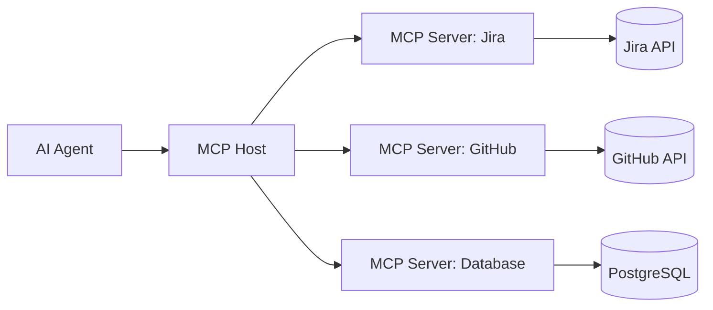
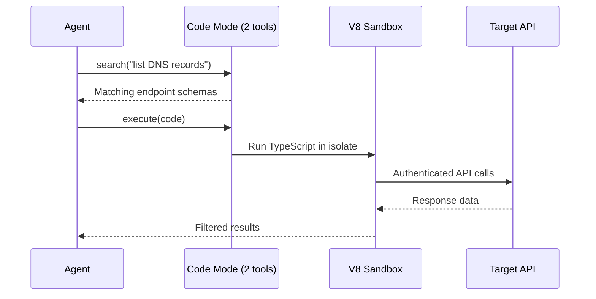
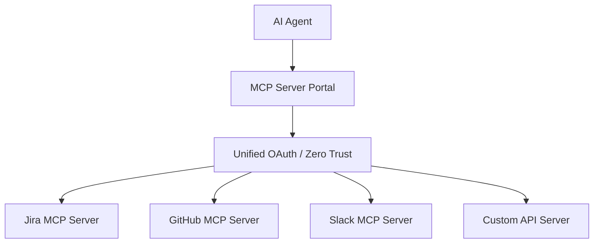

# MCP (Model Context Protocol)

MCP is a standard way for AI agents to talk to external tools and services — like a universal plug for connecting an LLM to anything: databases, APIs, browsers, project management tools, email, and more. Think of it as USB-C for AI integrations.

## How MCP Works

An MCP server exposes **tools** (functions the agent can call) and **resources** (data the agent can read). The agent's host connects to one or more MCP servers and presents their tools to the LLM.

## The Token Problem

Every MCP server's tool definitions get loaded into the LLM's context window. A server with 50 tools might consume thousands of tokens just in tool descriptions — before the agent does anything.

| Scenario | Tokens consumed |
|---|---|
| Single small MCP server (5 tools) | ~500 |
| Cloudflare API (2,500+ endpoints) as MCP tools | ~1.17M |
| 10 MCP servers combined | Easily 50K+ |

This bloats context fast, especially when connecting multiple servers.

## Code Mode

Code Mode is a technique (pioneered by Cloudflare) that replaces individual tool definitions with just **two tools**: `search()` and `execute()`. Instead of describing every operation as a separate tool, the LLM writes TypeScript code against a typed SDK and runs it in a sandbox.

### How It Works

1. **search()** — the agent queries an OpenAPI spec to discover relevant endpoints
2. **execute()** — the agent writes TypeScript that calls those endpoints, runs in a sandboxed V8 isolate

### Why It Works So Well

LLMs are better at **writing code** to call APIs than at calling tools directly. They've seen millions of real-world code examples in training data but have limited exposure to synthetic tool-calling formats.

### Token Savings

| Approach | Tokens | Reduction |
|---|---|---|
| Full MCP tools (2,500 endpoints) | ~1.17M | — |
| Code Mode (2 tools) | ~1,000 | 99.9% |
| Simple tasks | — | ~32% savings |
| Complex batch operations | — | ~81% savings |

### Security

Code runs in lightweight V8 isolates (not containers):
- No file system access
- No environment variables (prevents prompt injection leaks)
- External fetches disabled by default
- MCP servers accessed via authenticated bindings only
- Isolates start in milliseconds

## MCP Server Portals

Cloudflare MCP Server Portals let you compose **multiple MCP servers behind a single URL** with unified auth and access control. Instead of configuring 10 separate MCP connections, you expose one gateway.

### Portal + Code Mode

The real power is combining both: Portals consolidate multiple servers behind one URL, and Code Mode compresses all their tools into ~1,000 tokens. This means an agent can access dozens of services without context window bloat.

| Setup | Connections | Tokens |
|---|---|---|
| 10 separate MCP servers | 10 | 50K+ |
| Portal (no Code Mode) | 1 | 50K+ |
| Portal + Code Mode | 1 | ~1,000 |

## Variants

- **[[webmcp|WebMCP]]** — browser-side spec where websites expose tools directly in HTML/JS, no separate server needed
- **Remote MCP** — MCP servers hosted on the internet (vs. local stdio servers), using SSE or HTTP transport
- **Code Mode** — server-side optimization replacing tool lists with a code execution sandbox

## References

- [Code Mode: give agents an entire API in 1,000 tokens](https://blog.cloudflare.com/code-mode-mcp/)
- [Code Mode: the better way to use MCP](https://blog.cloudflare.com/code-mode/)
- [Introducing MCP Server Portals](https://blog.cloudflare.com/zero-trust-mcp-server-portals/)
- [MCP Server Portals docs](https://developers.cloudflare.com/cloudflare-one/access-controls/ai-controls/mcp-portals/)
- [Code Mode API reference](https://developers.cloudflare.com/agents/api-reference/codemode/)
