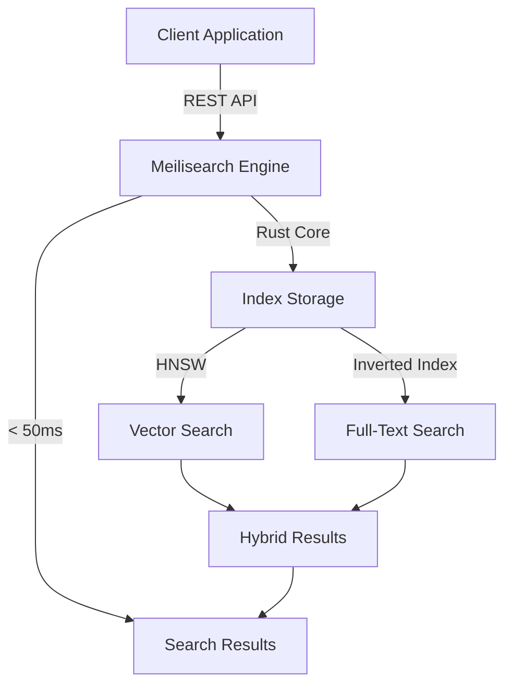
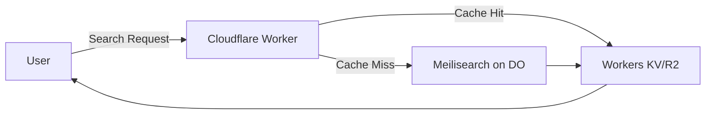

# Meilisearch

Meilisearch is a super-fast search engine that gives you Google-like search results in under 50 milliseconds with almost no setup. It's designed for website search bars and user-facing searches, not for digging through logs or complex analytics.

## Key Features

### Speed & Performance
- **Sub-50ms response times** out of the box
- Built in Rust for maximum performance
- Optimized for running locally, reducing latency
- Minimal memory footprint (290MB vs 1.3GB for Elasticsearch on small datasets)

### Search Capabilities
- **Hybrid search**: Combines semantic and full-text search
- **Typo tolerance**: Returns relevant results even with misspellings
- **Search-as-you-type**: Real-time results while typing
- **Multi-language support**: Works across many languages
- **Geosearch**: Location-based search queries
- **Filtering & sorting**: Customizable ranking and result filtering

### AI-Powered Features (2026)
- **Meilisearch Chat**: Conversational AI interface via `/chat` endpoint
- Hybrid search with semantic understanding
- No separate vector database needed

## Architecture



### Scalability (2026 Updates)
- **Dynamic sharding**: Add shards as data/traffic grows
- **Federated search**: Query across all shards while maintaining speed
- Horizontal scaling without architecture redesign
- Not as distributed as Elasticsearch, but handles considerable data efficiently

### Enterprise Features
- **SAML-based SSO**: Centralized authentication
- **Identity and Access Management**: Secure enterprise deployments
- **API key management**: Fine-grained access control

## Quick Start

### Installation

```bash
# macOS
brew install meilisearch

# Docker
docker run -p 7700:7700 getmeili/meilisearch

# Direct download
curl -L https://install.meilisearch.com | sh
```

### Basic Usage

```bash
# Start Meilisearch
meilisearch --master-key="YOUR_MASTER_KEY"
```

### Adding Documents

```javascript
// Add documents to an index
const documents = [
  { id: 1, title: 'Introduction to Rust', category: 'programming' },
  { id: 2, title: 'Advanced TypeScript', category: 'programming' },
  { id: 3, title: 'Database Design Patterns', category: 'databases' }
]

const task = await index.addDocuments(documents)
console.log(task.uid) // Check task status
```

### Searching

```javascript
// Simple search with typo tolerance
const results = await index.search('databse') // Typo: 'databse' instead of 'database'
// Still returns "Database Design Patterns"

// Advanced search with filters
const results = await index.search('programming', {
  filter: 'category = programming',
  limit: 10,
  offset: 0
})
```

### Authentication

```bash
# Protected routes require API key
curl -X GET 'http://localhost:7700/indexes' \
  -H 'Authorization: Bearer YOUR_MASTER_KEY'
```

## API Overview

### RESTful Design
- Path parameters use curly braces: `GET /indexes/{index_uid}`
- All routes returning multiple resources are paginated (20 results/page default)
- Use `limit` and `offset` query parameters for pagination

### Common Endpoints

```bash
# Health check (no auth required)
GET /health

# List indexes
GET /indexes

# Add/update documents
POST /indexes/{index_uid}/documents

# Search
POST /indexes/{index_uid}/search

# Get tasks/status
GET /tasks/{task_uid}
```

## Meilisearch vs Elasticsearch

| Feature | Meilisearch | Elasticsearch |
|---------|-------------|---------------|
| **Use Case** | Front-facing instant search | Log analysis, back-facing search |
| **Setup** | Single command, works immediately | Requires cluster topology knowledge |
| **Performance** | Sub-50ms out-of-the-box | Slow until tuned, fast at scale |
| **Memory** | ~290MB (small datasets) | ~1.3GB (small datasets) |
| **Scalability** | Good for moderate data | Excellent for billions of documents |
| **Configuration** | Minimal required | Extensive tuning needed |
| **Best For** | User-facing search, small-medium apps | Large-scale, distributed systems |

**Choose Meilisearch when:**
- You need instant search with minimal setup
- Simplicity and ease of use are priorities
- Your dataset fits on a single server or modest cluster
- You want < 50ms response times without tuning

**Choose Elasticsearch when:**
- You're working with billions of documents
- You need advanced distributed capabilities
- You have resources for complex configuration
- Log aggregation and analytics are primary use cases

## Use Cases

- **E-commerce product search**: Fast, typo-tolerant product discovery
- **Documentation sites**: Instant code/docs search
- **Content platforms**: Blog posts, articles, media search
- **Internal tools**: Employee directories, knowledge bases
- **SaaS applications**: User-facing search features

## Integration Examples

### JavaScript/TypeScript

```typescript
import { MeiliSearch } from 'meilisearch'

const client = new MeiliSearch({
  host: 'http://localhost:7700',
  apiKey: 'YOUR_API_KEY'
})

const index = client.index('movies')

// Instant search as user types
const searchMovies = async (query: string) => {
  const results = await index.search(query, {
    attributesToHighlight: ['title'],
    limit: 5
  })
  return results.hits
}
```

### Python

```python
import meilisearch

client = meilisearch.Client('http://localhost:7700', 'YOUR_API_KEY')
index = client.index('movies')

# Add documents
index.add_documents([
  {'id': 1, 'title': 'The Matrix', 'year': 1999},
  {'id': 2, 'title': 'Inception', 'year': 2010}
])

# Search with filters
results = index.search('matrix', {'filter': 'year > 1995'})
```

## Best Practices

1. **Index design**: Keep indexes focused on specific content types
2. **Ranking rules**: Customize ranking for your use case (default is good for most)
3. **Typo tolerance**: Enabled by default, adjust if needed for technical terms
4. **Filtering**: Use filterable attributes for category/tag filtering
5. **Pagination**: Use `limit` and `offset` for large result sets
6. **Monitoring**: Track task queue and index stats for performance

## Cloud Deployment: Cloudflare vs Digital Ocean

Since Meilisearch runs easily in Docker, deploying it to cloud platforms is straightforward—but some platforms are better suited than others.

### Digital Ocean: ⭐ **EASY** (Recommended for Meilisearch)

Digital Ocean is **exceptionally easy** for Meilisearch deployment:

**Option 1: 1-Click Marketplace App** (Easiest)
```bash
# Just click "Deploy to DigitalOcean" from marketplace
# 🎯 Takes ~2 minutes from click to running instance
```

Features:
- ✅ Pre-configured Droplet with Meilisearch installed
- ✅ Auto-configuration script on first SSH connection
- ✅ Instant SSL/domain setup
- ✅ Automatic API key generation
- ✅ Ready for production out-of-the-box

**Option 2: Docker on Droplet**
```bash
# Create a Droplet, then run:
docker run -d \
  -p 7700:7700 \
  -e MEILI_MASTER_KEY="your-secure-key" \
  -v /meilisearch/data:/meili_data \
  getmeili/meilisearch

# 🎯 Takes ~5-10 minutes including Droplet creation
```

**Option 3: App Platform (Containers)**
- Deploy container directly to managed platform
- Auto-scaling, zero-downtime deployments
- Persistent volume for data storage
- Built-in monitoring and logs

**Why Digital Ocean wins:**
- Official [meilisearch-digitalocean](https://github.com/meilisearch/meilisearch-digitalocean) repo with deployment scripts
- Meilisearch team actively supports DO deployment
- Persistent storage is straightforward (volumes/block storage)
- Predictable pricing: $6/month (basic Droplet) + storage costs
- Full control over configuration and resources

### Cloudflare: ⚠️ **LIMITED** (Not Ideal for Meilisearch)

Cloudflare has container support (launched 2025), but it's **not ideal for Meilisearch**:

**Cloudflare Containers (Workers Containers)**
```bash
# Theoretically possible, but...
npx wrangler deploy --container
```

**Issues:**
- ⚠️ Containers take **several minutes to provision** globally
- ⚠️ Stateful apps like Meilisearch need persistent storage (R2? Durable Objects?)
- ⚠️ Cold starts defeat the purpose of sub-50ms search
- ⚠️ Not designed for long-running stateful services
- ⚠️ More expensive at scale compared to dedicated VPS

**What Cloudflare IS good for:**
- ✅ Deploying search **frontend/UI** that connects to Meilisearch hosted elsewhere
- ✅ Webhook handlers for Meilisearch (e.g., [ghost-meilisearch](https://fanyangmeng.blog/ghost-meilisearch-cloudflare-worker/))
- ✅ API proxy/cache layer in front of Meilisearch
- ✅ Global CDN for search results (with Workers KV/R2 as cache)

**Better Cloudflare Architecture:**


### Comparison Table

| Feature | Digital Ocean | Cloudflare |
|---------|--------------|------------|
| **Ease of Setup** | ⭐⭐⭐⭐⭐ (1-Click) | ⭐⭐ (Complex) |
| **Persistent Storage** | ✅ Native volumes | ⚠️ Requires R2/DO workarounds |
| **Cold Starts** | ✅ None (always running) | ⚠️ Several minutes to provision |
| **Best For** | Running Meilisearch itself | Search frontends/proxies |
| **Time to Deploy** | 2-10 minutes | 10-30 minutes (if you make it work) |
| **Monthly Cost** | $6+ (predictable) | Pay-per-use (variable) |
| **Official Support** | ✅ Dedicated repo & docs | ⚠️ Limited examples |
| **Maintenance** | Low (managed or Droplet) | Medium (custom setup) |

### Other Hosting Options

**Meilisearch Cloud** (Official)
- Fully managed by Meilisearch team
- Starting at $30/month (Build plan)
- No DevOps required, automatic updates
- Best for production apps needing SLA

**Railway** ([railway.com/deploy/meilisearch](https://railway.com/deploy/meilisearch-1))
- One-click deployment like Digital Ocean
- Managed infrastructure, auto-scaling
- $5+ per month

**Elestio** ([elest.io](https://elest.io/open-source/meilisearch))
- Fully managed with monitoring, backups, SSL
- Deploy in minutes, no DevOps needed
- Starting ~$10/month

### Verdict

**For running Meilisearch itself:**
1. **Digital Ocean** (best balance of ease + control)
2. **Meilisearch Cloud** (easiest, but costs more)
3. **Railway/Elestio** (good alternatives)
4. ❌ **Cloudflare** (not suited for stateful search engines)

**For search infrastructure:**
- Host Meilisearch on Digital Ocean
- Use Cloudflare Workers for frontend/proxy/caching
- Best of both worlds: fast, cheap, globally distributed

## Limitations

- Not designed for massive distributed deployments (use Elasticsearch for that)
- Less mature ecosystem compared to Elasticsearch
- Limited advanced analytics capabilities
- Smaller community and plugin ecosystem

## Related Concepts

- [[elasticsearch]]: Comparison and when to use each
- [[full-text-search]]: Core search algorithms and techniques
- [[vector-search]]: Semantic search and embeddings
- [[api-design]]: RESTful API patterns

## Sources

- [Meilisearch Official Site](https://www.meilisearch.com/)
- [Meilisearch January 2026 updates](https://www.meilisearch.com/blog/January-2026-updates)
- [Meilisearch vs Elasticsearch](https://www.meilisearch.com/blog/meilisearch-vs-elasticsearch)
- [Meilisearch API Documentation](https://www.meilisearch.com/docs/reference/api/overview)
- [GitHub - meilisearch/meilisearch](https://github.com/meilisearch/meilisearch)
- [First impressions of Meilisearch comparison to Elasticsearch](https://www.peterbe.com/plog/first-impressions-of-meilisearch-and-how-it-compares-to-elasticsearch)
- [How to Build an AI-Driven Search Experience using Meilisearch](https://www.freecodecamp.org/news/how-to-build-an-ai-driven-search-experience-using-meilisearch/)
- [Cloudflare Containers Overview](https://developers.cloudflare.com/containers/)
- [Cloudflare Containers Coming 2025](https://blog.cloudflare.com/cloudflare-containers-coming-2025/)
- [Deploy Meilisearch webhook with Cloudflare Workers](https://fanyangmeng.blog/ghost-meilisearch-cloudflare-worker/)
- [GitHub - meilisearch-digitalocean](https://github.com/meilisearch/meilisearch-digitalocean)
- [How To Deploy Meilisearch on Ubuntu 22.04 - DigitalOcean](https://www.digitalocean.com/community/tutorials/how-to-deploy-and-configure-meilisearch-on-ubuntu-22-04)
- [Meilisearch DigitalOcean Marketplace](https://marketplace.digitalocean.com/apps/meilisearch)
- [Meilisearch Cloud Pricing](https://www.meilisearch.com/pricing)
- [Deploy Meilisearch on Railway](https://railway.com/deploy/meilisearch-1)
- [Elestio Meilisearch Hosting](https://elest.io/open-source/meilisearch)
