# Mermaid Diagrams

Text-based diagramming and charting tool that renders in Markdown. Supported in GitHub, GitLab, Obsidian, and many other platforms.

## Supported Diagram Types

| Type | Use Case | Syntax |
|------|----------|--------|
| **Flowchart** | Process flows, algorithms | `graph TD` / `graph LR` |
| **Sequence** | Interactions between actors | `sequenceDiagram` |
| **Class** | UML class diagrams | `classDiagram` |
| **State** | State machines | `stateDiagram-v2` |
| **Entity Relationship** | Database schemas | `erDiagram` |
| **Gantt** | Project timelines | `gantt` |
| **Pie** | Proportions | `pie` |
| **Git Graph** | Git branching | `gitGraph` |
| **User Journey** | User experience flows | `journey` |
| **Quadrant** | 2x2 matrices | `quadrantChart` |
| **Timeline** | Chronological events | `timeline` |

## Common Diagrams

### Flowchart
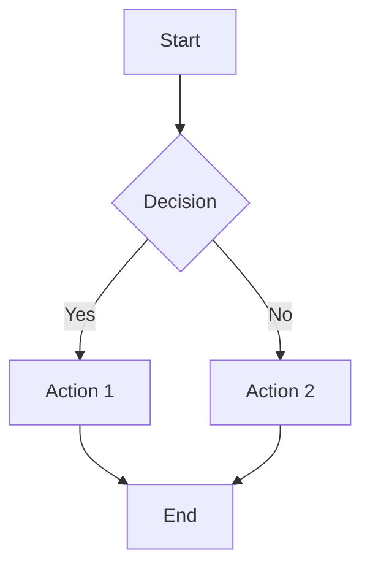

**Syntax:**
- `graph TD` = top-down, `graph LR` = left-right
- `[ ]` = rectangle, `{ }` = diamond, `(( ))` = circle
- `-->` = arrow, `-.->` = dotted, `==>` = thick

### Sequence Diagram
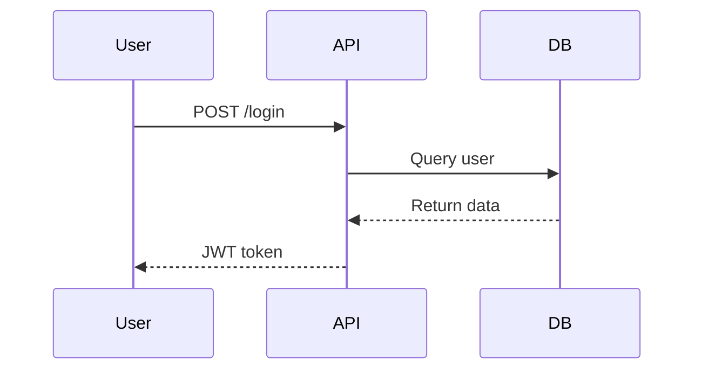

**Syntax:**
- `->>` = solid arrow, `-->>` = dashed response
- `activate`/`deactivate` for lifelines
- `Note over` for annotations

### Class Diagram
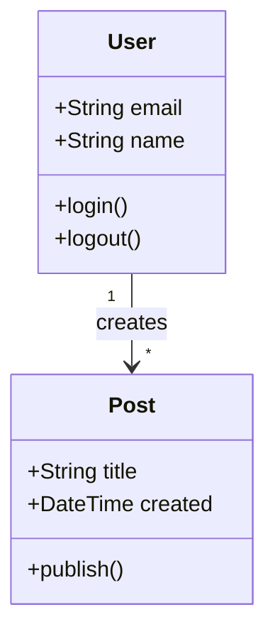

**Syntax:**
- `+` = public, `-` = private, `#` = protected
- `-->` = association, `--|>` = inheritance
- `"1" --> "*"` = cardinality

### State Diagram
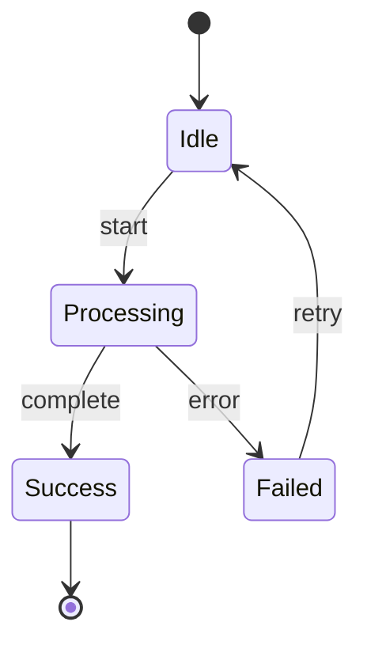

### Entity Relationship
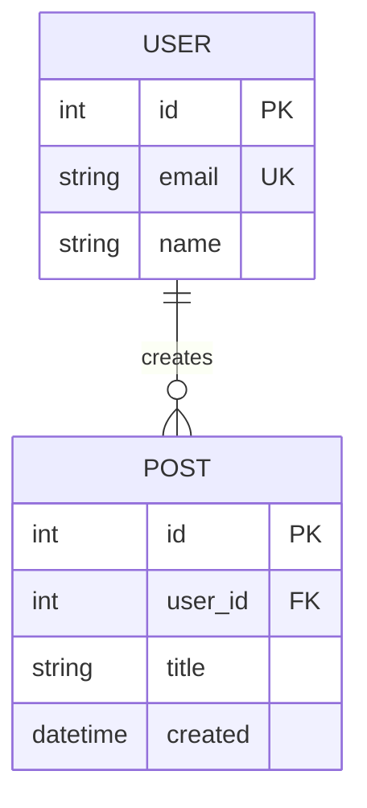

**Relationships:**
- `||--||` = one to one
- `||--o{` = one to many
- `}o--o{` = many to many
- `PK` = primary key, `FK` = foreign key

### Gantt Chart
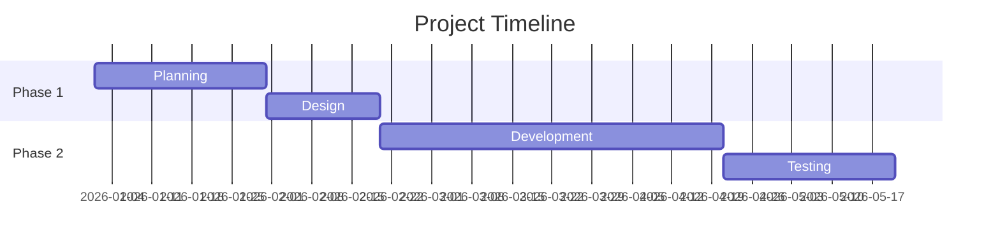

### Git Graph
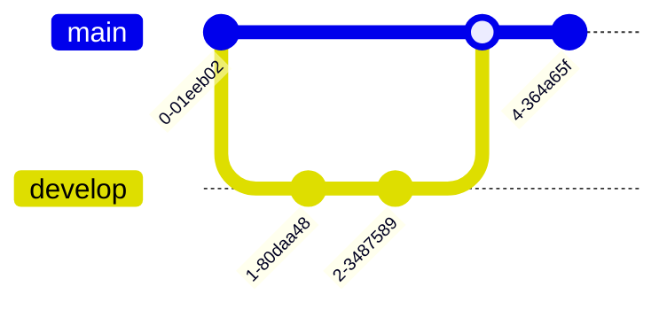

## Tips

### Styling
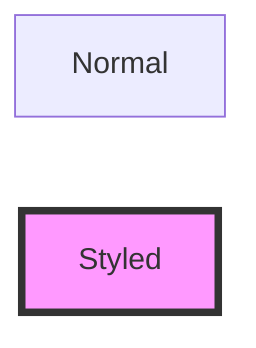

### Subgraphs
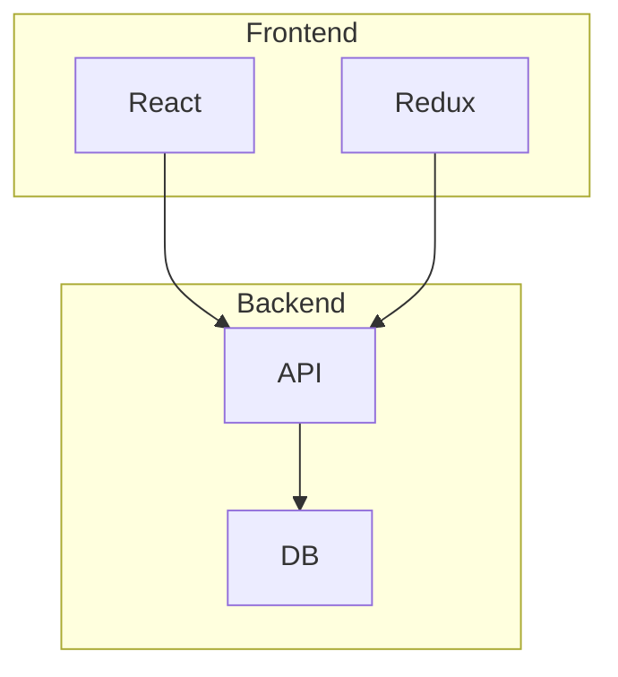

### Links and Tooltips
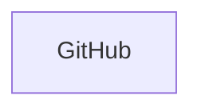

## Platform Support

### GitHub
- Native support in `.md` files and comments
- Wrap in triple backticks with `mermaid` language tag
- Max 50KB per diagram

### Obsidian
- Native support via triple backticks
- Live preview rendering
- Export to PNG/SVG

### Common Issues
- **Too complex**: Break into multiple diagrams
- **Syntax errors**: Use [Mermaid Live Editor](https://mermaid.live) to validate
- **Not rendering**: Check platform support and version

## Use Cases

**Architecture docs:**
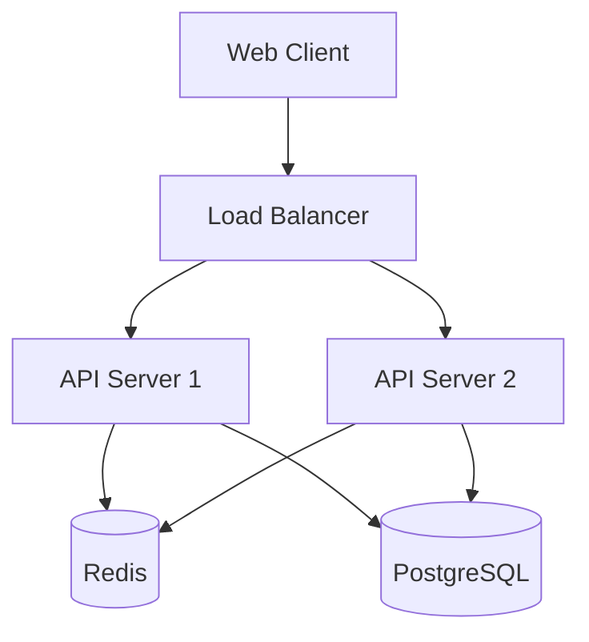

**API flows:**
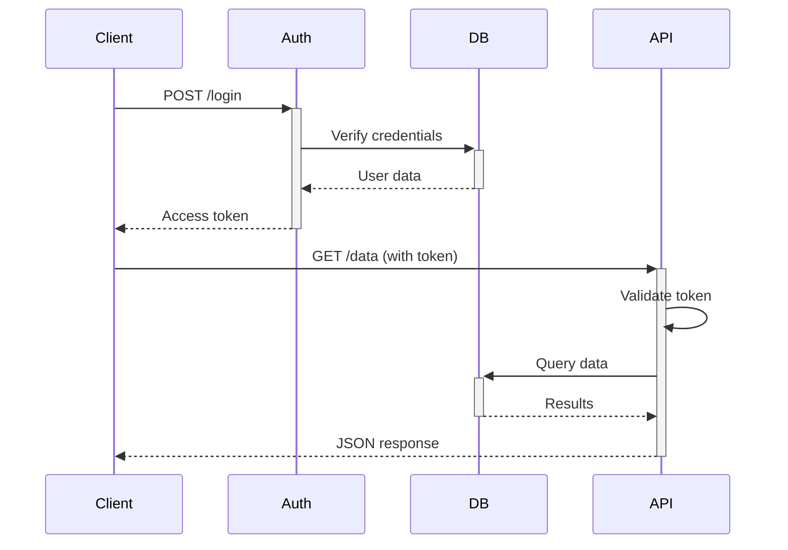

**State machines:**
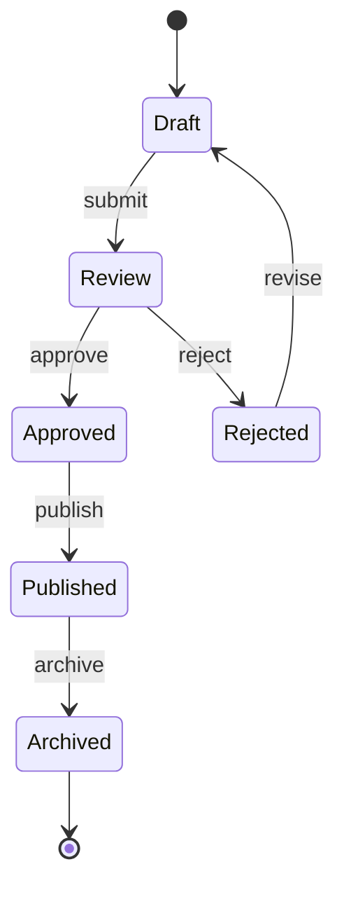

## Quick Reference

| Need | Diagram Type |
|------|--------------|
| Algorithm logic | Flowchart |
| API interactions | Sequence |
| Code structure | Class |
| Workflow states | State |
| Data model | ER Diagram |
| System architecture | Flowchart with subgraphs |
| Project schedule | Gantt |

## Related Topics

- [[documentation]] - General documentation practices
- [[architecture]] - System design patterns
- [[project-structure]] - Code organization

## References

- [Mermaid Official Docs](https://mermaid.js.org/)
- [GitHub Mermaid Support](https://docs.github.com/en/get-started/writing-on-github/working-with-advanced-formatting/creating-diagrams)
- [Mermaid Live Editor](https://mermaid.live) - Test and validate diagrams
