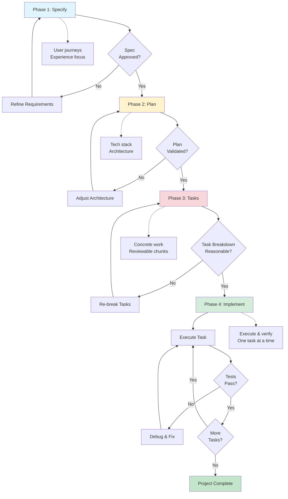

# Writing PRDs for AI-Coded Projects

Best practices for writing Product Requirement Documents (PRDs) that work effectively with AI coding agents like Claude Code, Cursor, and GitHub Copilot.

## Five Core Principles

### 1. Start with Vision, Let AI Draft Details
- Begin with high-level product brief (what/why, not how)
- Have AI expand into detailed specification
- Use **Plan Mode** (read-only) to refine before implementation
- Focus on user experience and success criteria first
- Review and correct AI's draft before proceeding

**Plan Mode workflow:**
1. Describe what you want to build at high level
2. Let agent explore codebase and draft plan (read-only)
3. Have agent question you about ambiguities
4. Review for architecture, security, testing gaps
5. Only after plan approval, exit Plan Mode to implement

### 2. Structure Like a Professional Document
- Treat spec as executable artifact, not notes
- Cover all six essential areas (see below)
- Use clear sections with markdown formatting
- Include concrete code examples, not just prose
- Integrate into version control and CI/CD

**Format tip:** Use `## Objective`, `## Commands`, `## Boundaries` sections that AI can easily parse.

### 3. Break Into Modular Prompts
- **Avoid the "curse of instructions"**: Too many requirements at once reduces adherence
- Feed AI one focused task at a time, not entire spec
- Create section summaries (Extended TOC) for large specs
- Use sub-agents for different domains when complexity grows
- Refresh context per major task instead of accumulating stale info

**Why modular?** Research shows model performance drops significantly with 10+ simultaneous requirements.

### 4. Build In Self-Checks and Constraints
- Use three-tier boundary system (see below)
- Include self-verification steps in prompts
- Add conformance tests that must pass
- Inject your domain expertise and known pitfalls
- Use LLM-as-a-Judge for subjective quality checks

**Human expertise matters:** Document edge cases, library gotchas, and architecture decisions only you know.

### 5. Test, Iterate, and Evolve
- Test continuously, not just at the end
- Update spec when requirements change or gaps found
- Use version control for spec file itself
- Monitor and log agent actions for debugging
- Treat each project as learning for better specs next time

**Living document:** The spec drives implementation, but also gets refined by implementation learnings.

## Six Essential Areas

Based on GitHub analysis of 2,500+ agent configuration files:

1. **Executable Commands**
   - Include full command syntax with flags
   - Document all CLI tools and their usage
   - Provide common workflows and sequences

2. **Testing Details**
   - Specify testing frameworks
   - Define coverage expectations
   - Include test running commands

3. **Project Structure**
   - Explicit directory organization
   - File naming conventions
   - Module/component architecture

4. **Coding Conventions**
   - Language-specific style guides
   - Linting and formatting rules
   - Naming conventions

5. **Documentation Standards**
   - Code comment expectations
   - README structure
   - API documentation format

6. **Development Workflow**
   - Git branching strategy
   - Code review process
   - Deployment procedures

## Three-Tier Boundary System

Instead of flat "don't do X" lists, use graduated boundaries:

### ✅ Always Do (No Permission Needed)
Actions the agent should take automatically:
- Run tests before commits
- Follow naming conventions in style guide
- Log errors to monitoring service
- Apply auto-formatting and linting
- Update relevant documentation

### ⚠️ Ask First (Human Approval Required)
High-impact changes requiring review:
- Modifying database schemas
- Adding new dependencies or packages
- Changing CI/CD configuration
- Removing or disabling tests
- Refactoring core architecture

### 🚫 Never Do (Hard Stops)
Categorically forbidden actions:
- Commit secrets, API keys, or credentials
- Edit `node_modules/`, `vendor/`, or generated files
- Remove failing tests to make builds pass
- Use `--no-verify` or skip pre-commit hooks
- Force-push to protected branches

**Why three tiers?** More nuanced than binary rules. Agents know when to act, when to pause, when to stop.

## Spec-Driven Development Workflow

Four-phase gated process where spec is the central artifact:



### Phase 1: Specify
- Provide high-level description (what/why)
- Focus on user journeys and experience
- Agent generates detailed specification
- Review and refine before proceeding

### Phase 2: Plan
- Provide tech stack, architecture, constraints
- Agent generates technical implementation plan
- Can request multiple plan variations
- Validate plan catches all requirements

### Phase 3: Tasks
- Agent breaks spec + plan into concrete work items
- Each task should be small, reviewable, testable
- Like TDD: tasks are acceptance criteria
- Review task breakdown before implementation

### Phase 4: Implement
- Agent executes tasks one-by-one or in parallel
- Review focused changes per task
- Verify each phase before proceeding to next
- Iterate on failures without moving forward

**Benefit:** Prevents "house of cards code" by catching issues early with built-in checkpoints.

## Managing Large Specs

### Extended Table of Contents
For specs over ~500 lines, create hierarchical summary:
- Each section gets 1-2 sentence summary
- Reference tags point to full details
- Agent carries "mental map" without full context
- Pull in detailed sections only when needed

Example:
```markdown
## Spec TOC
- Security (§4.2): Use HTTPS, protect API keys, validate inputs
- Database (§5.1): PostgreSQL with Prisma, schema versioning required
- Testing (§6.3): Jest + Playwright, 80% coverage, run on pre-commit
```

### Context Management Strategies
- **Modular specs**: Separate files for frontend/backend/infrastructure
- **Retrieval (RAG)**: Embed spec sections, retrieve on-demand
- **Sub-agents**: Specialized agents with domain-specific spec portions
- **Refresh context**: Start new sessions for major task switches
- **In-line TODOs**: Use code comments as mini-specs for focused work

### Single vs Multi-Agent

| Aspect | Single Agent | Multi-Agent |
|--------|--------------|-------------|
| **Best for** | Small-medium projects, isolated modules | Large codebases, parallel features |
| **Strengths** | Simpler setup, easier to debug | Higher throughput, specialization |
| **Challenges** | Context overload, slower iteration | Coordination overhead, conflicts |
| **Tips** | Use spec summaries, refresh often | Limit to 2-3 agents, clear boundaries |

**Warning:** Multi-agent is mentally taxing. Start with single agent, add parallel agents only when bottlenecked.

## Key PRD Sections

### 1. Problem Statement
- Clear, concise description of problem
- Why it needs solving
- Who it affects

### 2. Objectives & Success Metrics
- Specific, measurable goals
- Success thresholds (especially for AI features)
- KPIs and acceptance criteria

### 3. User Stories
- Concrete scenarios
- Acceptance criteria for each story
- Edge cases and error conditions

### 4. Technical Requirements
- Architecture decisions
- Technology stack
- Dependencies and integrations
- Performance requirements

### 5. Constraints
- Technical limitations
- Time/resource constraints
- Compatibility requirements
- Security/compliance needs

### 6. Project Structure
```
project-root/
├── src/
│   ├── components/
│   ├── services/
│   └── utils/
├── tests/
├── docs/
└── config/
```

### 7. Testing Strategy
- Unit test approach
- Integration test plan
- E2E test scenarios
- Coverage targets

### 8. Common Commands
```bash
# Development
npm run dev
npm run build

# Testing
npm test
npm run test:coverage

# Deployment
npm run deploy:staging
npm run deploy:prod
```

## Quality Control and Self-Checks

### Self-Verification Prompts
Instruct agent to validate its own work:
```markdown
After implementation, review against spec and confirm:
- [ ] All requirements from spec are addressed
- [ ] Tests pass and coverage meets threshold
- [ ] No security vulnerabilities introduced
- [ ] Code follows style guide examples
- [ ] Edge cases from spec are handled
```

### LLM-as-a-Judge
Use second agent (or separate prompt) to review first agent's output:
- Check adherence to architectural patterns
- Evaluate code readability and maintainability
- Flag style guide violations
- Identify missing error handling
- Assess security risks

**Pattern:** Code agent writes → Judge agent reviews → Code agent revises

### Conformance Testing
Create language-independent test suites from spec:
- YAML-based expected inputs/outputs
- Acts as contract any implementation must satisfy
- More rigorous than ad-hoc unit tests
- Reusable across implementations

Example:
```yaml
# conformance/api-tests.yaml
- name: "Create user with valid data"
  input: {email: "test@example.com", name: "Test"}
  expect: {status: 201, id: "string"}
```

### Testing in the Spec
Include test plan or actual test cases:
- Sample inputs with expected outputs
- Unit test templates the agent should follow
- Success criteria as executable tests
- Dedicated test agent can continuously verify

**Pro tip:** Robust test suite gives agents "superpowers" - they validate and iterate quickly.

## Project-Specific Configuration

### For Claude Code
Use `CLAUDE.md` files to specify:
- Coding conventions
- Directory structure
- Workflow preferences
- Tool usage patterns
- Three-tier boundaries (Always/Ask/Never)

### For Cursor
Use `.cursorrules` files to enforce:
- Project-wide conventions
- Code style guidelines
- AI coding behavior

### For GitHub Copilot
Use `agents.md` to define specialized personas:
- `@docs-agent` for technical writing
- `@test-agent` for QA and testing
- `@security-agent` for code review
- Each has focused spec for its domain

## PRD Template Structure

```markdown
# [Project Name] PRD

## Problem Statement
What problem are we solving? Who is affected?

## Objectives & Success Metrics
- Goal 1: [Metric/threshold]
- Goal 2: [Metric/threshold]
- Success criteria: [Measurable outcomes]

## User Stories
### Story 1: [Title]
As a [user type], I want [goal] so that [benefit].

**Acceptance Criteria:**
- [ ] Criterion 1
- [ ] Criterion 2
- [ ] Edge case handling

## Technical Requirements
- Architecture: [Description]
- Tech Stack: [Specific versions - e.g., React 18, Node 20, PostgreSQL 15]
- Dependencies: [List with versions]
- Performance: [Requirements]
- Security: [Requirements]

## Project Structure
```
project-root/
├── src/
│   ├── components/
│   ├── services/
│   └── utils/
├── tests/
├── docs/
└── config/
```

## Code Style
[Include actual code example showing your style]
```typescript
// Example: Preferred patterns
export const createUser = async (data: UserInput): Promise<User> => {
  // Use explicit typing, async/await, early returns
  if (!data.email) throw new ValidationError('Email required')
  return await db.users.create(data)
}
```

## Commands
```bash
# Development
npm run dev              # Start dev server on port 3000
npm run build           # Compile TypeScript, output to dist/

# Testing
npm test                # Run Jest tests
npm run test:coverage   # Must pass 80% threshold

# Linting
npm run lint --fix      # Auto-fix ESLint errors
```

## Testing Strategy
- Unit tests: Jest, 80% coverage minimum
- Integration tests: Supertest for API endpoints
- E2E tests: Playwright for critical user flows
- Run on: Pre-commit hook (husky)

## Boundaries

### ✅ Always Do
- Run tests before commits
- Follow naming conventions above
- Log errors to monitoring service

### ⚠️ Ask First
- Database schema changes
- Adding dependencies
- Modifying CI/CD config

### 🚫 Never Do
- Commit secrets or API keys
- Edit node_modules/ or vendor/
- Use --no-verify to skip hooks

## Development Workflow
1. Create feature branch from main
2. Implement with tests
3. Run full test suite
4. Create PR with description
5. Address review feedback
6. Squash and merge

## Self-Verification Checklist
After implementation, verify:
- [ ] All spec requirements addressed
- [ ] Tests pass and coverage meets threshold
- [ ] No security vulnerabilities
- [ ] Follows code style example
- [ ] Edge cases handled

## Conformance Tests
[Optional: Reference to test suite that must pass]
- See: `conformance/api-tests.yaml`
- All cases must pass before merge

## Constraints
- Technical: Must support Safari 15+, mobile responsive
- Timeline: MVP in 3 weeks
- Resources: Solo developer, no backend changes allowed
```

## Common Pitfalls to Avoid

### Vague Specifications
**Problem:** "Build something cool" or "Make it work better"
**Solution:** Be specific about inputs, outputs, constraints, and success criteria

Example:
- ❌ "You are a helpful coding assistant"
- ✅ "You are a test engineer writing React component tests using Jest. Follow these examples and never modify source code."

### Context Overload
**Problem:** Dumping 50 pages of docs and hoping AI figures it out
**Solution:** Use hierarchical summaries, RAG, or modular specs to surface only relevant context

### The Curse of Instructions
**Problem:** 10+ simultaneous requirements cause model to ignore some
**Solution:** Break into sequential, simple instructions. One task focus, relevant info only.

### Skipping Human Review
**Problem:** Committing AI code that passes tests but is fragile
**Solution:** Review all critical paths. Don't commit code you couldn't explain to someone else.

**"House of cards" metaphor:** AI code can look solid but collapse under edge cases.

### Conflating Prototyping with Production
**Problem:** Shipping "vibe coding" (rapid prototypes) to production
**Solution:** Distinguish exploration mode from production mode. Production requires specs, tests, review.

### The Lethal Trifecta
Three properties that make AI agents dangerous:
1. **Speed:** Works faster than you can review
2. **Non-determinism:** Same input, different outputs
3. **Cost:** Encourages corner-cutting on verification

**Mitigation:** Spec and review process must account for all three. Don't let speed outpace verification.

### Missing Core Areas
**Problem:** Spec doesn't cover commands, testing, structure, style, workflow, or boundaries
**Solution:** Use the six-area checklist as sanity check before implementation

## Best Practices

### Do's
✅ Keep it concise and scannable (under 500 lines)
✅ Use bullet points and checklists
✅ Include concrete code examples (not just prose)
✅ Specify exact commands with flags
✅ Update as project evolves (living document)
✅ Make acceptance criteria measurable
✅ Document common workflows and edge cases
✅ Use Plan Mode to refine before implementing
✅ Break large tasks into modular prompts
✅ Include three-tier boundaries (Always/Ask/Never)
✅ Add self-verification steps
✅ Test continuously, not just at end
✅ Inject your domain expertise and known gotchas
✅ Version control the spec file itself

### Don'ts
❌ Write novel-length specs without summaries
❌ Use vague or ambiguous language
❌ Skip technical constraints
❌ Forget to update after decisions
❌ Omit testing requirements
❌ Leave success metrics undefined
❌ Assume AI knows your conventions
❌ Pile 10+ requirements in one prompt
❌ Skip human review of critical paths
❌ Let AI speed outpace your verification
❌ Conflate rapid prototyping with production code
❌ Ignore the six essential areas
❌ Commit AI code you can't explain

## Examples

### Good: Specific and Actionable
```markdown
## Testing Requirements
- Use Jest for unit tests
- Maintain 80% code coverage minimum
- Run tests with: `npm test -- --coverage`
- All new features must include tests
```

### Bad: Vague and Unclear
```markdown
## Testing
We should have good test coverage.
```

## Related Topics

- [[CLAUDE.md]] - Project-specific AI configuration
- [[documentation]] - General documentation practices
- [[project-structure]] - Organizing codebases

## References

- [How to write a good spec for AI agents](https://addyosmani.com/blog/good-spec/) - Comprehensive guide on five core principles for AI agent specs
- [GitHub agent configuration analysis](https://addyosmani.com/blog/good-spec/) - Analysis of 2,500+ agent configuration files
- [PRD best practices for AI agents](https://medium.com/@haberlah/how-to-write-prds-for-ai-coding-agents-d60d72efb797)
- [ChatPRD: Writing PRDs for Cursor](https://www.chatprd.ai/resources/PRD-for-Cursor)
- [Creator Economy: Living PRD template](https://creatoreconomy.so/p/my-prd-template-how-to-write-with-ai)
