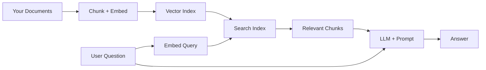

# RAG (Retrieval-Augmented Generation)

RAG lets you ask an LLM questions about your own documents — instead of relying on what the model was trained on, it searches your files first and feeds the relevant bits into the prompt.

## How It Works



### Pipeline stages

1. **Load** — read files (markdown, PDF, etc.)
2. **Chunk** — split into pieces (e.g. 512 tokens with overlap)
3. **Embed** — convert chunks to vectors (semantic meaning)
4. **Index** — store vectors in a searchable structure
5. **Query** — embed the user question, find nearest chunks
6. **Generate** — send retrieved chunks + question to LLM

---

## LlamaIndex

The go-to Python/TypeScript framework for building RAG pipelines. Handles all the plumbing: loading, chunking, embedding, indexing, retrieval, and synthesis.

### Quickstart — local markdown folder

```python
from llama_index.core import SimpleDirectoryReader, VectorStoreIndex

docs = SimpleDirectoryReader("./my-notes/").load_data()
index = VectorStoreIndex.from_documents(docs)

query_engine = index.as_query_engine()
response = query_engine.query("What does the project say about memory?")
print(response)
```

Reads all `.md` files, chunks, embeds, and makes them queryable — in ~5 lines.

### Persist index to disk (avoid re-embedding on every run)

```python
from llama_index.core import StorageContext, load_index_from_storage

# Save
index.storage_context.persist("./index_store")

# Load later
storage_context = StorageContext.from_defaults(persist_dir="./index_store")
index = load_index_from_storage(storage_context)
```

### Key features

| Feature | Details |
|---------|---------|
| `SimpleDirectoryReader` | Reads markdown, PDF, txt, etc. from a folder |
| Hybrid retrieval | Semantic + BM25 keyword search combined |
| Agentic retrieval | Agent decides how to query vs naive top-k |
| Sub-indexes | Route questions across multiple doc collections |
| LlamaParse | Cloud parser for complex PDFs/tables |
| 100+ integrations | OpenAI, Anthropic, local models, Weaviate, Qdrant, etc. |

### Agentic retrieval

Beyond simple Q&A, agents can:
- Decide whether to search, summarize, or compare
- Query multiple indexes and synthesize results
- Do multi-step reasoning across documents

```python
from llama_index.core.agent import ReActAgent
from llama_index.core.tools import QueryEngineTool

tool = QueryEngineTool.from_defaults(query_engine, name="research_docs",
    description="Search research notes")
agent = ReActAgent.from_tools([tool], verbose=True)
agent.chat("Compare the memory approaches discussed in the notes")
```

### Tradeoffs

**Pros:**
- Purpose-built for doc search / RAG
- Works fully locally, no cloud required
- Huge ecosystem

**Cons:**
- You own chunking strategy, embedding model, vector DB choices
- More setup than a hosted solution
- Complex retrieval patterns require tuning

---

## Chunking Strategy Matters

Bad chunking = bad retrieval. Common approaches:

| Strategy | When to use |
|----------|-------------|
| Fixed size (512 tokens) | Simple, good default |
| Sentence-aware | Better for prose, avoids mid-sentence splits |
| Markdown-aware | Split on `##` headings — good for structured notes |
| Hierarchical | Store both chunk + parent doc, retrieve at different granularities |

For markdown notes, **split on headings** is usually best — keeps context coherent.

---

## Vector DB Options

| DB | Best for |
|----|---------|
| **In-memory** (default) | Prototyping, small corpora |
| **Chroma** | Local persistent, easy setup |
| **Qdrant** | Production, self-hostable, fast |
| **Weaviate** | Hybrid search, GraphQL API |
| **Pinecone** | Managed cloud, no ops |
| **pgvector** | Already using Postgres |

---

## vs Mem0 / Zep for Document Search

Mem0 and Zep are **agent memory layers** — designed to store facts extracted from conversations. Using them for document corpus search means:
- Manually chunking and inserting every file as a "memory"
- Fighting APIs not designed for this
- Missing hybrid retrieval, chunking strategies, etc.

LlamaIndex is built for exactly this from the ground up. See [[ai-memory]] for when Mem0/Zep are the right choice (persistent user/agent memory across conversations).

---

## References

- [LlamaIndex docs](https://developers.llamaindex.ai/python/framework/understanding/rag/)
- [Agentic Retrieval Guide](https://www.llamaindex.ai/blog/rag-is-dead-long-live-agentic-retrieval)
- [LlamaIndex in Python - Real Python](https://realpython.com/llamaindex-examples/)
