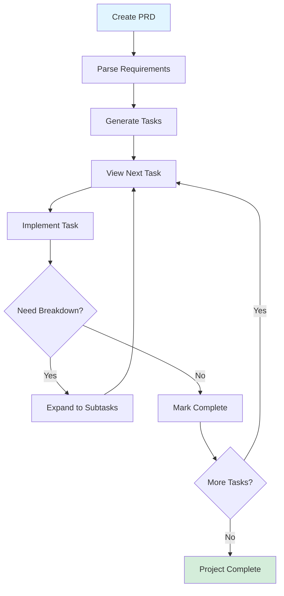

# Taskmaster

An AI-powered task-management system designed for AI-driven development workflows. Works with Cursor, Lovable, Windsurf, Roo, Claude Code, and other AI code editors.

## Overview

Taskmaster is an MCP (Model Control Protocol) server that manages AI-driven development by offloading task planning, parsing PRDs, and task expansion to an AI-powered workflow while keeping control in your editor or CLI.

## Key Benefits

### Performance Optimization
- **Token efficiency**: Choose tool loading modes
  - `all` mode: 36 tools (~21K tokens)
  - `standard` mode: 15 tools (~10K tokens)
  - `core` mode: 7 tools (~5K tokens)

### Integration
- **Native MCP support**: Especially smooth with Claude Code (no context switching needed)
- **No API key required** for Claude Code CLI
- **Multiple AI providers**: Claude, GPT, Gemini, etc.

### Workflow Management
- **Focus**: AI works on single, well-defined tasks
- **Control**: Keep task management in your editor
- **Scalability**: Adjust complexity as project evolves

## Core Features

### Task Management
- Parse PRDs into actionable tasks
- Track status across multiple categories
- Expand tasks into subtasks with dependencies
- Move tasks between workflow stages
- Generate complexity reports

### AI Configuration
- **Main model**: Primary task processing
- **Research model**: Information gathering
- **Fallback model**: Backup if main/research fail

### Task Operations
- Task generation from PRDs
- Status tracking
- Subtask expansion
- Complexity adjustment
- Dependency management
- Project analysis

## Typical Workflow

1. **Create PRD** (Product Requirements Document)
2. **Parse requirements** → Generate tasks
3. **View next task** → Get focused assignment
4. **Implement** → Work on single task
5. **Expand as needed** → Break into subtasks
6. **Move to completion** → Track progress

## Setup

### Quick Installation (Cursor 1.0+)
One-click installation via deeplink with MCP server support.

### Configuration
1. Add MCP configuration to editor-specific paths
2. Set environment variables for API keys
3. Optional: Configure preferred AI models

### Initialization
- **Chat command**: "Initialize taskmaster-ai in my project"
- **CLI**: `task-master init`

## Integration with Claude Code

Taskmaster has excellent Claude Code support:
- Works through Claude Code CLI
- No API key required for Claude usage
- Native MCP support (no context switching)
- Can generate PRDs with `prd-taskmaster` tool

## Use Cases

### With PRD Generation
Use `prd-taskmaster` to generate detailed, engineer-focused PRDs that work seamlessly with Taskmaster's task breakdown.

### TDD Workflow
Guides development to follow Test-Driven Development with quality gates throughout.

### Agent-Based Development
Coordinates multiple AI agents working on different aspects of a project.

## Related Tools

- [[codex]] - Alternative AI development tool
- [[claude-code]] - CLI interface for Claude

## Sources

- [GitHub - claude-task-master](https://github.com/eyaltoledano/claude-task-master)
- [Taskmaster on Glama](https://glama.ai/mcp/servers/@eyaltoledano/claude-task-master)
- [Setup Tutorial](https://pageai.pro/blog/claude-code-taskmaster-ai-tutorial)
- [Workflow Article](https://www.linkedin.com/pulse/orchestrating-ai-development-my-task-master-claude-code-kagalwala-xibwc)
- [Vibe Coding Workflow](https://samelogic.com/blog/claude-task-master-just-fixed-our-vibe-coding-workflow-heres-what-happened)
- [Task Master MCP Guide](https://skywork.ai/skypage/en/task-master-mcp-server-ai-engineers/1977587123365548032)
